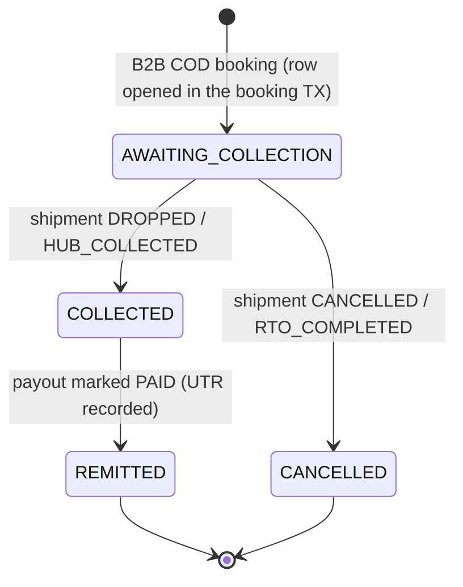
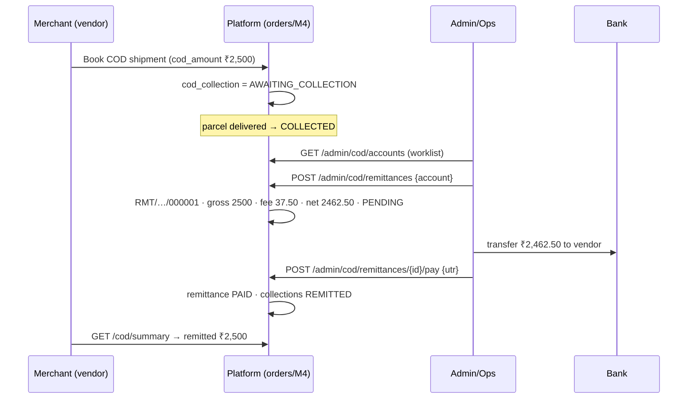

# COD Remittance — Design & Real-World Flow

**Status:** Platform → merchant remittance **BUILT & verified**. DA/rider cash-collection layer **NOT built (documented gap, §7–§8).**
**Module:** M4 (orders). **Branch:** `f-b2b-portal` (local). **Last updated:** 2026-07-27.

This doc explains what COD remittance is in our platform, every table we introduced, how the money
actually moves in the real world (merchant → buyer → rider → us → merchant), what is built today,
and — importantly — the **rider collection + cash reconciliation flow that is still missing** and how
Delhivery does it.

---

## 1. What "COD" means here (and what changed)

There are **three completely separate money flows** in a shipment. Keeping them separate is the whole
point of this design — the old code conflated "COD" with "the sender pays the shipping fee in cash".

| Flow | Who pays whom | Amount | Status |
|---|---|---|---|
| **Shipping fee** | vendor → **us** | `total_price_paise` | Existing. B2B = billed to the credit line. Unchanged. |
| **Declared value** | (nobody) | `declared_value_paise` | Existing. Insurance/valuation only. |
| **COD collection** | buyer → **us** → vendor | `cod_amount_paise` | **NEW.** The goods' price the buyer pays on delivery, which we collect and remit to the vendor. |

**What we removed:** the old "consumer COD" (a B2C/C2C sender paying the *shipping fee* in cash at
pickup) is **withdrawn** — retail booking is prepaid-only now.

**What we added:** real **B2B COD** — a merchant (vendor) ships goods to *their* buyer, we collect the
goods' value from the buyer on delivery, hold it, and **remit** it to the merchant on a cycle, net of a
COD handling fee. Shipping is still billed to the merchant's credit line; COD is orthogonal to it.

> A single B2B COD order therefore has **two** money movements: (a) we charge the merchant our shipping
> fee on credit, and (b) we collect ₹X from the buyer and later pay ₹X − fee back to the merchant.

---

## 2. Tables introduced (migration `orders/V4_25__cod_remittance.sql`)

### 2.1 `shipments.cod_amount_paise` (new column)
`BIGINT NULL`. The goods' value to collect from the buyer. **NULL ⇒ ordinary (non-COD) shipment.**
Distinct from `total_price_paise` (shipping) and `declared_value_paise` (insurance). Set only at B2B
booking when the merchant flags the order COD.

### 2.2 `cod_collection` — the buyer-collect ledger (one row per COD shipment)

| Column | Meaning |
|---|---|
| `id` | PK |
| `shipment_id` (unique) | the COD shipment |
| `shipment_ref` | human ref, denormalised for lists |
| `b2b_account_id` | the vendor owed this money |
| `amount_paise` | goods' value to collect from the buyer |
| `state` | `AWAITING_COLLECTION` → `COLLECTED` → `REMITTED`; or `CANCELLED` |
| `collected_at` | when the buyer paid (set on delivery) |
| `remittance_id` | the payout batch this was included in (nullable) |
| `created_at` / `updated_at` | audit |

### 2.3 `cod_remittance` — a payout batch to one vendor

| Column | Meaning |
|---|---|
| `id` | PK |
| `reference` | `RMT/2026-27/000001` (from `cod_remittance_seq`) |
| `b2b_account_id` | vendor being paid |
| `gross_paise` | Σ of the collections in the batch |
| `fee_paise` | COD handling fee we retain |
| `net_paise` | `gross − fee` — what actually lands in the vendor's bank |
| `collection_count` | how many parcels' COD this covers |
| `state` | `PENDING` → `PAID`; or `FAILED` |
| `utr` | bank transfer reference, recorded when marked paid |
| `period_start` / `period_end` | covers collections from…to |
| `notes`, `created_by`, `paid_at`, timestamps | audit |

---

## 3. Collection lifecycle (what's built)

- **Opened at booking:** the B2B booking transaction writes the `cod_collection` row as
  `AWAITING_COLLECTION`, alongside the shipment.
- **Advanced by the delivery lifecycle:** `CodCollectionListener` is a
  `@TransactionalEventListener(AFTER_COMMIT)` on the existing `ShipmentTransitioned` event.
  `DROPPED`/`HUB_COLLECTED` → `COLLECTED`; `CANCELLED`/`RTO_COMPLETED` → `CANCELLED`. It runs in its own
  transaction after the state change commits, and is a no-op for non-COD shipments.
- **Paid out:** admin batches all `COLLECTED`-and-unremitted collections into a `cod_remittance`, then
  marks it paid → collections become `REMITTED`.

> ⚠️ **Correctness caveat (see §7):** today the flip to `COLLECTED` is driven *purely by the delivery
> state* — it **assumes** the rider collected exactly `amount_paise` in cash. There is currently **no
> record of what the rider actually collected, in what mode, or whether they've deposited it.** That's
> the missing layer this doc is really about.

---

## 4. Remittance flow — verified end-to-end (platform → merchant)

**Verified live** (2026-07-27, dev DB): booked ₹2,500 COD → `AWAITING`; delivery → `COLLECTED`; admin
created `RMT/2026-27/000001` (gross 250000, fee 3750 = 1.5%, net 246250, `PENDING`); marked paid with a
UTR → `PAID`, collection `REMITTED`; vendor summary showed ₹2,500 remitted; worklist cleared.

---

## 5. APIs

**Vendor (own account only — the account is resolved from the caller, never a request param):**
- `GET /api/v1/cod/summary` — position: awaiting-collection, available-to-remit, in-remittance, remitted.
- `GET /api/v1/cod/collections?state=` — the ledger rows.
- `GET /api/v1/cod/remittances` — payout history.
- `GET /api/v1/cod/remittances/{id}` — one payout with its collections.

**Admin (ADMIN only; POSTs require an `Idempotency-Key` header — the global filter gates all `/api/v1` POSTs):**
- `GET /api/v1/admin/cod/accounts` — vendors with a payout-available balance (worklist).
- `GET /api/v1/admin/cod/collections?accountId=&state=` — any vendor's collections.
- `GET /api/v1/admin/cod/remittances?state=` — all payouts (e.g. `?state=PENDING`).
- `POST /api/v1/admin/cod/remittances {b2b_account_id}` — batch a vendor's available COD.
- `POST /api/v1/admin/cod/remittances/{id}/pay {utr}` — confirm the bank transfer.

**Fee:** `cod.remittance-fee-percent` (default **1.5%**) + `cod.remittance-fee-flat-paise` (default 0),
stored on each remittance so the historical fee is auditable regardless of later config changes.

**Screens today:** business `/ship` (COD toggle + amount), business `/remittances` (position + ledger +
payouts), admin `/cod` (worklist → create → mark paid).

---

## 6. The real-world flow, end to end

1. **Merchant books a COD order** on the portal, entering "Collect ₹X on delivery."
2. We pick up, fly, and deliver the parcel like any other.
3. **At the doorstep, the rider collects ₹X from the buyer** (cash, or a UPI/QR link).
4. The rider's collected cash accumulates as **"cash in hand."**
5. **The rider deposits** the day's cash at the hub / to an agent / to the bank.
6. Ops **reconciles** the deposit against what the rider was supposed to collect (expected vs deposited).
7. Once collected (and, ideally, reconciled), the COD is **eligible for remittance**.
8. On a cycle, we **remit** the merchant's collected COD, **net of the COD fee**, with a bank UTR.

**Steps 1–2, 7–8 are built. Steps 3–6 — the rider collection and cash reconciliation — are the gap.**

---

## 7. The gap you asked about: how do we know what each rider must collect, and what they actually did?

Today the platform infers "collected" from the **delivery state alone**. That is fine for the *merchant*
remittance ledger, but it does **not** answer the operational questions:

- **What does the rider see they must collect?** → nothing yet. No per-rider COD manifest / amount-per-parcel.
- **What did the rider actually collect (amount + mode: cash / UPI)?** → not recorded.
- **How much cash is each rider holding right now?** → not tracked (no "cash in hand").
- **Did the rider deposit it, and does it reconcile?** → no deposit/reconciliation flow, no short/excess handling.

So a rider could mark a parcel delivered without collecting, and the system would still show it
`COLLECTED` and remit the merchant — **the platform would be out of pocket.** This layer must exist before
real COD money moves.

### How Delhivery does it (the flow we should mirror)

- The **rider app** shows a delivery run; each COD shipment shows **"Collect ₹X"**.
- On delivery the rider collects **cash** or has the buyer pay via **UPI/QR / a prepaid link**, then
  **"Mark Delivered"** captures the **amount collected + mode**. (UPI can auto-reconcile via the gateway;
  cash becomes the rider's liability.)
- Cash accrues as the rider's **"cash in hand"** balance.
- At end of route/day the rider **deposits cash** (hub cashier, bank, or a cash-collection agent). Ops
  confirms the deposit; **expected vs deposited** is reconciled per rider.
- **Discrepancies** (short/excess) are flagged and recovered from / credited to the rider.
- **Merchant remittance** runs on a schedule (T+2 / weekly) on the **collected (and reconciled)** COD.

---

## 8. Proposed DA collection + reconciliation layer (to build)

This slots *before* the existing `COLLECTED → REMITTED` step. The delivery DA is already known (the
delivery-OTP transition records the DA as the actor), so we can attribute each collection to a rider.

### 8.1 Extend `cod_collection`
Add: `collected_by_da_id` (rider who collected), `collected_amount_paise` (what was actually taken — may
differ from `amount_paise`), `collection_mode` (`CASH` | `UPI` | `PREPAID_LINK`), `deposit_id` (the cash
deposit that cleared it).

Then **`COLLECTED` is set by the rider's collection record, not by the bare delivery event** — and a COD
parcel cannot be marked delivered without recording the collection (for `CASH`/`UPI`).

### 8.2 New table `da_cash_deposit` (rider → platform reconciliation)

| Column | Meaning |
|---|---|
| `id` | PK |
| `da_id` | rider |
| `shift_date` | the day being settled |
| `expected_paise` | Σ cash the rider should have collected |
| `deposited_paise` | what they actually handed in |
| `state` | `PENDING` → `RECONCILED` \| `SHORT` \| `EXCESS` |
| `deposited_at`, `reconciled_by`, `reference` | audit |

(UPI/prepaid-link collections auto-reconcile via the gateway and don't count toward the rider's cash
liability.)

### 8.3 New APIs

**Rider app:**
- `GET /api/v1/da/{daId}/cod/pending` — today's deliveries with **COD to collect** (amount per parcel).
- `POST .../deliveries/{ref}/collect {amount, mode}` — record the collection at "Mark Delivered".
- `GET /api/v1/da/{daId}/cash-summary` — **cash in hand** (collected cash not yet deposited).
- `POST /api/v1/da/{daId}/cash-deposit {amount, reference}` — declare a deposit.

**Ops/hub console:**
- Per-rider **cash reconciliation** worklist; confirm deposits; view **short/excess discrepancies**.

### 8.4 Remittance gate (decision)
Either **(a)** remit merchants only on COD that's been **rider-reconciled** (safest — no platform float
risk), or **(b)** remit on schedule and carry the rider-collection risk ourselves (faster merchant payout,
needs a rider-liability/credit control). **Recommended: (a) for the pilot.**

### 8.5 Rider screens (Driver App)
"COD to collect ₹X" on each delivery card · "Cash in hand ₹Y" · "Deposit cash." These belong in the
Driver App (RN/Expo) planned for the Sept 1 pilot.

---

## 9. Open decisions

1. **Remittance trigger:** reconciled-only vs schedule-and-carry-risk (§8.4). *Recommend reconciled-only.*
2. **Collection modes for v1:** cash only, or cash + UPI/QR at the door? UPI removes rider cash risk.
3. **Remittance cadence:** on-demand (admin) today; add an automated T+2 / weekly job?
4. **Fee model:** flat + 1.5% today. Per-merchant negotiated fee later?
5. **RTO/partial:** COD is cancelled on RTO today. Partial-collection / re-attempt handling?

---

## 10. Summary

| Layer | What | Status |
|---|---|---|
| Merchant ledger + payout (platform → merchant) | `cod_collection`, `cod_remittance`, vendor + admin APIs, fee, UTR | **BUILT & verified** |
| Booking + delivery hook | `cod_amount_paise`, collection opened at booking, advanced on delivery/cancel | **BUILT** |
| Consumer COD | withdrawn (retail prepaid-only) | **BUILT** |
| **Rider collection (what to collect, actual collected, mode)** | per-rider COD manifest + collection capture | **GAP — §8** |
| **Rider cash reconciliation (cash-in-hand, deposit, short/excess)** | `da_cash_deposit`, ops reconciliation | **GAP — §8** |
| Driver App COD screens | collect / cash-in-hand / deposit | **GAP — §8.5** |
