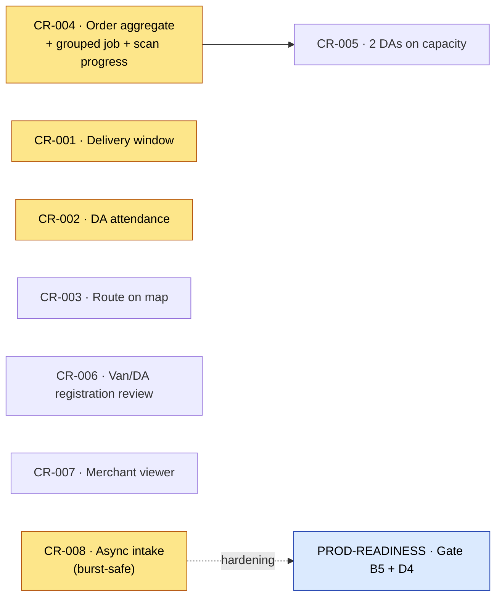

# Godspeed — Change-Requests Register (living)

**Purpose.** One durable backlog of every feature/change requested by internal & ops stakeholders,
round by round. Each request carries a **verdict** (is it implemented today?), **code evidence**, a
**recommended approach**, **effort**, and **priority** — so we can keep building features on the go
while hardening for prod (see [`PROD-READINESS-PLAN.md`](./PROD-READINESS-PLAN.md)).

**How to use.**
- Add each new stakeholder round as a **new dated section at the top**, same columns.
- Never delete a row — mark it `Done` / `Superseded` / `Won't do` and link its branch/PR.
- Priorities feed the "on-the-go changes" that interleave into the prod-readiness gates.

**Legend.** Effort `S` (≤2d) · `M` (3–8d) · `L` (>8d / cross-module).
Verdict `NO` / `PARTIAL` / `YES`. Status `Open` / `In progress` / `Done`.

---

## Round 2 — Engineering / capacity · logged 2026-08-17

| ID | Request | Verdict today | Effort | Priority | Status |
|----|---------|:-------------:|:------:|:--------:|:------:|
| CR-008 | **Async booking intake** (`202` + queue) so an order burst delays, not drops | **NO** | M | High | Open |

---

### CR-008 — Async booking intake (burst = delay, not loss)

**Verdict: NO.** Order intake is **fully synchronous**. `B2cShipmentController` /
`B2bShipmentController` return `BookingResponse` directly — no `202 Accepted`, no `@Async`, no queue.
There is also **no `server.tomcat.*` or `spring.datasource.hikari.*` tuning** anywhere, so the app
runs on Spring defaults:

- Tomcat worker threads **200**, accept queue (`acceptCount`) **100**, connection-timeout **20s**.
- HikariCP DB pool **10**.

Because a booking is DB-heavy, effective concurrency ≈ **the pool (10)**, not 200 — the other
threads block waiting for a connection (Hikari waits ~30s then throws `500`). **Estimated current
capacity ~10–30 orders/sec** (untested — pending the Gate D4 load test).

**Under a burst (e.g. 20k simultaneous):** ~10 process, ~190 block then `500`, ~100 wait in the
accept queue, and the **remaining ~19,700 are refused (TCP reset)** — i.e. **loss at the door**.
Idempotency keys (`IdempotencyFilter`) make a client *retry* safe, but nothing retries
automatically. Note: everything *after* commit is already durable (events publish AFTER_COMMIT to
durable queues + DLQ) → downstream is delay-not-loss; only **intake** can drop.

**Recommended approach.** Split intake from fulfilment:
1. Booking endpoint validates cheaply (auth, schema, serviceability), **enqueues the booking command
   to RabbitMQ (durable)**, and returns **`202 Accepted` + a booking-request/tracking id**.
2. A consumer processes commands at a **DB-safe rate**; the client polls / gets a webhook for the
   final `shipmentRef` + payment outcome.
3. Reuse the existing idempotency key as the command dedupe key so retries never double-book.

A 20k burst then just **fills the queue = pure delay, zero loss** (durable messages; RabbitMQ
buffers 20k small messages trivially). This decouples *arrival rate* from *DB commit rate* —
exactly the "delay not loss" behaviour we want.

**Pairs with** pool/thread tuning + a load-tested capacity target — see
[`PROD-READINESS-PLAN.md`](./PROD-READINESS-PLAN.md) Gate B5 (tuning) and Gate D4 (burst load test).
Cheapest wins first: (1) tune Hikari pool + Tomcat threads (free, config) → ~50–100/sec; (2) bigger
Postgres/Render ($450) → ~200–500/sec (**Postgres is the true ceiling; RabbitMQ is not the
bottleneck for orders/sec**); (3) this async intake → burst-safe; (4) multi-instance needs PgBouncer.
**Effort M · Priority High.**

---

## Round 1 — Internal presentation review · logged 2026-08-17

| ID | Request | Verdict today | Effort | Priority | Status |
|----|---------|:-------------:|:------:|:--------:|:------:|
| CR-001 | Customer UI: "as soon as possible" → show the **entire delivery window** | PARTIAL | S–M | High | Open |
| CR-002 | **DA attendance** issue | PARTIAL | M | High | Open |
| CR-003 | Show the DA the **sequence of stops on a map** | PARTIAL (possible) | S | Medium | Open |
| CR-004 | DA sees **Order ID**; one pickup with N shipment-refs = **one job + scan progress** | **NO** | **L** | **High** | Open |
| CR-005 | If capacity is insufficient for a pickup, **assign 2 DAs** | NO | L | Medium | Open (needs CR-004) |
| CR-006 | Review the **van & DA registration** module | Review | S (review) | Medium | Open |
| CR-007 | **Per-merchant performance viewer** | NO (per-merchant) | M | Medium | Open |

---

### CR-001 — Customer delivery window ("ASAP → entire window")

**Verdict: PARTIAL.** The ASAP-vs-window choice exists for **pickup**, not **delivery**.
- Pickup already offers ASAP + 2-hour slots: `orders/.../dto/BookingRequest.java` (`pickupSlotDate`,
  `pickupSlotStartHour`; "both null = ASAP"), rendered by
  `oneday-web/apps/customer/lib/pickup-slots.ts` (Today/Tomorrow, 07:00–21:00 IST).
- **Delivery** has no customer-facing window — it's a server-side SLA commitment only
  (`slaDeadline` / `publicPromiseAt` / `etaPromised`); `DeliveryType` is just `INTERCITY`/`SAME_CITY`.
  `ShipmentInfo` notes `slaDeadline` is "nullable until M10's commitment timestamp is wired."

**Recommended approach.** Surface the already-computed promise as **"Delivered by <date/time>"** on
the customer booking screen and the tracking page; keep **ASAP the default**. No new slot engine for
v1 — just expose the existing commitment fields and finish wiring the M10 commitment timestamp.
**Effort S–M · Priority High** (the stakeholder called this the top customer-facing item).

### CR-002 — DA attendance

**Verdict: PARTIAL.** There is no explicit check-in/out or attendance record; presence is *implicit*.
- First GPS ping flips `OFFLINE/ABSENT → IDLE` (`dispatch/.../DaStatusServiceImpl.java`), making the
  DA assignable; `AbsentDaDetectionJob` marks `ABSENT` after ~15 min GPS silence.
- The roster is **loaded, not self-reported** (`ShiftLoadJob` ← `DaDirectoryPort`).
- The only manual action is `/dispatch/da/{daId}/arrived` — a cron-rendezvous confirmation, **not**
  shift attendance.

**Recommended approach.** Add an explicit **shift check-in / check-out** endpoint + an **append-only
attendance record** (start/end, geo-stamp), surfaced in the Station-Manager console. Decouple
*assignability* from *attendance* so ops can see who actually showed up vs who is merely pinging.
**Effort M · Priority High.**

### CR-003 — DA route sequence on a map

**Verdict: PARTIAL, and yes — a whole-route view is possible for free.** The DA already gets an
ordered stop list with coordinates.
- `GET /dispatch/da/{daId}/tasks` → `DaTaskView` ordered by `queuePosition`, each carrying
  `taskLat`/`taskLon`, explicitly designed for a free "Open in Maps" `geo:` deeplink
  (`dispatch/.../service/DaTaskView.java`). Continuously re-sequenced by `QueueReorderService`.
- What's missing is the *entire-route* view (today it's one deeplink per stop).

**Recommended approach.** Build a **Google/Apple Maps directions URL with ordered waypoints**
(origin + intermediate waypoints + destination) so one tap opens the whole planned route — free, no
Maps-API cost. **Caveat:** consumer deeplinks cap at ~9–10 waypoints, so chunk long routes; a solved
road **polyline** (like vans get via `RoutePlanStopResponse`) would need the paid Directions API —
defer. **Effort S · Priority Medium.**

### CR-004 — Order aggregate + grouped DA job + scan progress ⭐

> **The biggest change, and the one the stakeholder flagged as most relevant.**

**Verdict: NO.** There is **no "order" aggregate** — the `Shipment` is the atomic top-level unit.
- `B2bBookingRequest` is **one parcel per request** (`B2bBookingServiceImpl.persistB2b`).
- Bulk upload creates **N independent, unlinked shipments** (one cart item → one `bookSettled` each,
  `orders/.../CartServiceImpl.java`).
- `Shipment` has **no** order/batch/group id (migration `V4_3`), and the accepted `purchaseOrderRef`
  is **silently dropped** — never persisted, never read.
- `parcelId ↔ shipmentRef` is **1:1**. The DA queue is a **flat per-shipment list** with no grouping
  and no "X of N scanned" progress (`dispatch/.../DaTaskServiceImpl.listTasks`).
- The only many-under-one concept, `bag_id` on the scan ledger, is a **physical bagging** construct,
  not a merchant order.

**So today:** a merchant placing "one order that becomes 100 parcels" produces 100 unlinked
shipments, and a DA sees them as **100 separate jobs**, not one pickup with a 0/100 scan bar.

**Recommended approach (L, cross-module).**
1. **Order / PickupGroup aggregate (M4).** A bulk B2B booking (or same sender + pickup address +
   window) creates **one order → N shipments sharing `order_id`**; persist `purchaseOrderRef` on the
   order. Add a real bulk booking endpoint + migration.
2. **Group the DA queue (M5 + driver app).** N shipment-refs at one location surface as **one job**
   keyed on the order/pickup; add an **"X of N parcels scanned"** progress bar per pickup (reuse the
   `bag_id` fan-out mechanics). The DA lands on the Order ID, drills into the N parcels, scans each,
   and the job completes at N/N.

**Effort L · Priority High.** Root dependency for CR-005. Recommend scoping this first among the
feature asks.

### CR-005 — Assign 2 DAs when a pickup's capacity is insufficient

**Verdict: NO.** The assignment engine has **no** weight/volume/capacity dimension.
- Feasibility is **time / geography / cron-cutoff only** (`FeasibilityRequest` = positions + service
  seconds + deadline).
- "Load" everywhere means **task count**, not physical capacity (`queueDepth = tasks.size()`).
- Every task goes to **exactly one DA** (`DispatchServiceImpl.assignPickup`); the only multi-DA path
  is cross-territory **spill to another single DA** (overload rebalance, not a split).

**Recommended approach (L).** Add **weight/volume capacity** to the DA and to the pickup aggregate
(needs CR-004 for a per-pickup aggregate load), then in feasibility: when a pickup's aggregate load
exceeds one DA's capacity, **split it into multiple DA sub-jobs**. **Blocked on CR-004.**
**Effort L · Priority Medium.**

### CR-006 — Review van & DA registration (review item)

**Findings.**
- **DA registration EXISTS.** `auth/.../api/DaController.java` (`/das`, gated ADMIN/STATION_MANAGER)
  creates a `DELIVERY_ASSOCIATE` user + an HR `DaProfile` (contract + shift, temp password,
  `mustChangePassword`). This feeds the grid shift roster (`NightlyReplanJob` ←
  `DaDirectoryPort.getAvailableDaIds`) → `DaHexAssignment` territory. An onboarding-request path also
  exists (`OnboardingController`).
- **Van registration is MISSING as an entity/flow.** There is no van registry and no van entity;
  vans exist **only operationally** by `vanId` UUID in `van_manifest` / `van_live_status`. "Fleet" is
  a **per-city count** in `city_fleet_config`, edited via `PUT /routing/fleet/{cityId}`.

**Decision needed.** Do we want real **per-van onboarding** (vehicle reg number, capacity, assigned
driver, documents)? If **yes** → add a `Van` entity + registration flow mirroring DA registration
(**M**). This CR is a *review*; the answer determines whether it becomes a build item.
**Effort S (review) · Priority Medium.**

### CR-007 — Per-merchant performance viewer

**Verdict: NO (per-merchant).** The only performance surface is a **city-scoped** ops view.
- `sla/.../api/SlaDashboardController.java` exposes `/control-tower` and `/metrics/pass-rate`
  (the 99% gate), gated to STATION_MANAGER/SUPERVISOR — **operations roles, not merchants**.
- Critically, `SlaShipment` has **no merchant / b2bAccount field** (`originCity`, `destCity`, `lane`,
  `deliveryType` only) — SLA data **cannot be sliced per account**.
- The business console shows the merchant only **credit/wallet + recent shipments**, not on-time %.

**Recommended approach (M).** Propagate `b2bAccountId` onto the SLA/analytics dimension, then build a
merchant performance view — **on-time %, delivered/breached counts, volume by lane/period** — in the
business console (merchant self-serve) and the admin console (internal "how did we do for merchant
X?"). This is the B2B analytics counterpart to CR-001. **Effort M · Priority Medium.**

---

## Dependency map (Round 1)

*High priority:* CR-001, CR-002, CR-004, CR-008. *CR-005 is gated on CR-004.*
*CR-008 ties into the prod-readiness capacity work (Gate B5 tuning + Gate D4 burst load test).*

---

*Godspeed · change-requests register · started 2026-08-17 · append new rounds at the top.*
