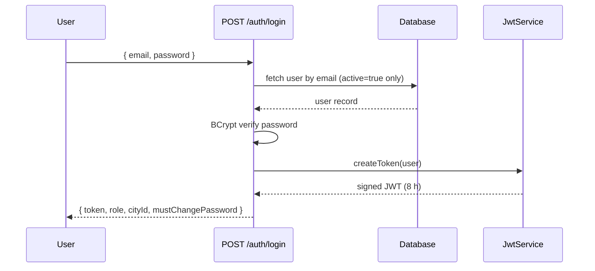
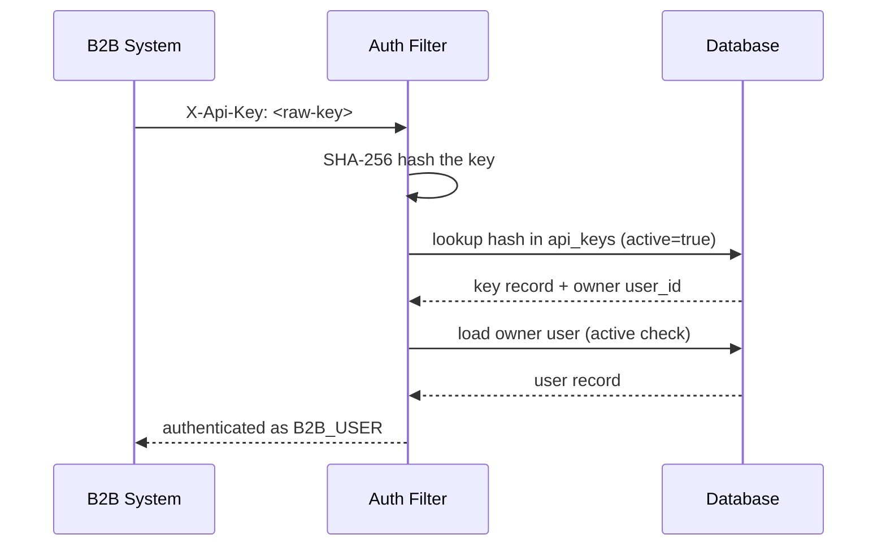
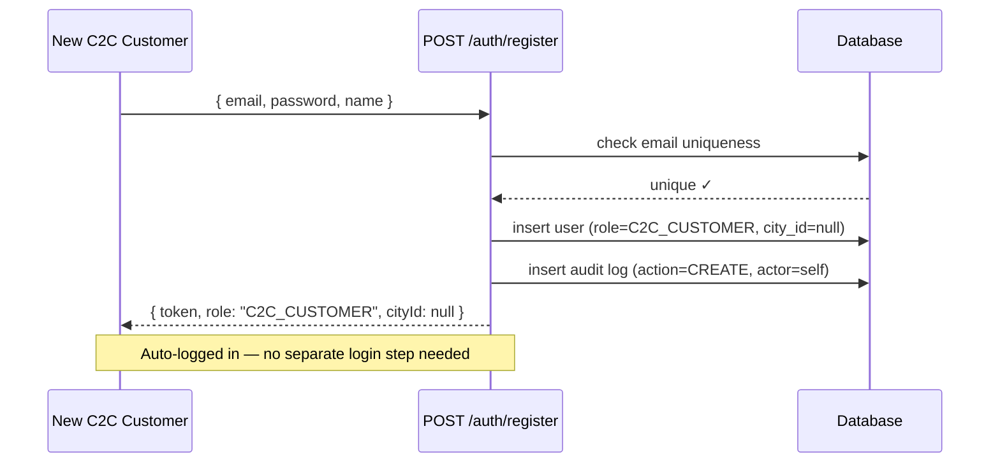
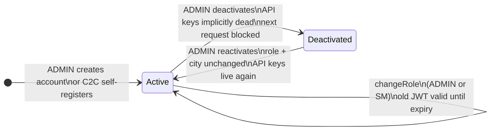

# M1 — Auth Module Design Document

> **Module:** `auth` | **Status:** Design Complete | **Updated:** 2026-05-10 | **Depends on:** `common`
>
> **Related docs:** [SCENARIOS.md](./SCENARIOS.md) — narrative walkthrough of every auth flow | [OPEN-QUESTIONS.md](./OPEN-QUESTIONS.md) — open product decisions | [README.md](./README.md) — local setup | [ROLE-PERMISSIONS.md](./ROLE-PERMISSIONS.md) — full role → permission matrix with rationale

---

## Contents

- [Overview](#overview)
- [Role Model](#role-model)
  - [Action Strings](#action-strings)
  - [CRON\_DRIVER City Assignment](#cron_driver-city-assignment)
  - [AIRLINE\_GHA City Scope](#airline_gha-city-scope)
- [Authentication](#authentication)
  - [JWT — Human Actors](#jwt--human-actors)
  - [API Keys — B2B Machine Clients](#api-keys--b2b-machine-clients)
  - [Password Storage](#password-storage)
  - [First-Login Password Change](#first-login-password-change)
- [Service Overview](#service-overview)
  - [Interaction Map](#interaction-map)
  - [AuthService — The Front Door](#authservice--the-front-door)
  - [UserService — The People Manager](#userservice--the-people-manager)
  - [PermissionService — The Gatekeeper](#permissionservice--the-gatekeeper)
  - [JwtService — The Token Stamper](#jwtservice--the-token-stamper)
- [REST API](#rest-api)
  - [Auth Endpoints](#auth-endpoints)
  - [User Endpoints](#user-endpoints)
  - [Permission Endpoint](#permission-endpoint)
  - [Error Responses](#error-responses)
- [Service Interface Reference](#service-interface-reference)
- [Inter-Module Authorization](#inter-module-authorization)
- [User Self-Service](#user-self-service)
  - [Admin/Manager Password Reset](#adminmanager-password-reset)
  - [Self-Service Password Change](#self-service-password-change)
  - [Self-Service Profile Update](#self-service-profile-update)
- [C2C Self-Registration](#c2c-self-registration)
- [Account Lifecycle](#account-lifecycle)
  - [Reactivation](#reactivation)
  - [API Keys on Deactivation](#api-keys-on-deactivation)
  - [Account Lifecycle State Machine](#account-lifecycle-state-machine)
  - [Who Can Manage Whom](#who-can-manage-whom)
- [Authorization Edge Cases](#authorization-edge-cases)
  - [Station Manager Role-Change Restrictions](#station-manager-role-change-restrictions)
  - [City-Hijacking Prevention](#city-hijacking-prevention)
- [Domain Model](#domain-model)
- [Security Filter Chain](#security-filter-chain)
- [Audit Trail](#audit-trail)
- [Key Design Decisions](#key-design-decisions)

---

## Overview

The `auth` module handles identity, credential verification, and access control for every actor in the 1DD platform. It is a dependency of all other modules that need to know *who* is making a request and *what* they are allowed to do.

**Tech stack:** Java 21, Spring Boot 3.2, Spring Security (stateless), jjwt, BCrypt, Flyway.

---

## Role Model

Twelve **built-in** roles are seeded into the `roles` table via Flyway. ADMIN can additionally create **custom roles** at runtime by selecting any subset of the fixed action strings — no new action strings can be invented. All roles (built-in and custom) live in the same `roles` table and appear alongside each other in any role-assignment UI.

| Role | Scope | Description |
|------|-------|-------------|
| `ADMIN` | Global | Full platform control, user lifecycle, config, custom role management |
| `STATION_MANAGER` | City | City-scoped user management, route oversight, SLA response |
| `SUPERVISOR` | City | SLA red escalation, shipment visibility |
| `HUB_OPERATOR` | City | Hub scanning, stand assignment, bag management |
| `DELIVERY_ASSOCIATE` | City | DA queue, barcode attachment, scan events |
| `VAN_DRIVER` | City | Assigned route view, stop confirmations |
| `CRON_DRIVER` | City | Cron run confirmation, assigned shipment view |
| `CALL_CENTER_AGENT` | City | Exception capture, shipment rescheduling |
| `B2B_USER` | Global | Shipment creation, quoting, own API keys, invoices |
| `B2C_CUSTOMER` | Global | Shipment creation, own tracking, quoting |
| `C2C_CUSTOMER` | Global | Individual sender: shipment creation, own view, tracking, quoting |
| `AIRLINE_GHA` | Global | Manifest view, handover acknowledgement |

**City-scoped roles** (`STATION_MANAGER`, `SUPERVISOR`, `HUB_OPERATOR`, `DELIVERY_ASSOCIATE`, `VAN_DRIVER`, `CRON_DRIVER`, `CALL_CENTER_AGENT`) require a non-null `city_id` on the `users` row. The permission check service enforces that a city-scoped user cannot exercise permissions in a different city.

### Action Strings

Permissions are coarse-grained strings of the form `resource:verb` or `resource:verb:scope`. Samples:

```
shipment:create          shipment:view            shipment:view:own
shipment:view:city       shipment:view:assigned   shipment:track:own
shipment:override        shipment:reschedule
hub:scan                 hub:stand:assign         hub:bag:manage
hub:manage
route:view:assigned      route:stop:confirm       route:override
route:override:city      route:approve            route:approve:city
da:queue:view            barcode:attach           scan:event:create
cron:run:confirm         manifest:view            handover:acknowledge
sla:red:action           exception:escalate       exception:capture
pricing:quote            invoice:view:own         api-key:create:own
api-key:manage           audit:view               audit:view:city
user:create              user:create:city         user:deactivate
user:role:change         user:role:change:city    config:manage
flight:manage
```

Permission checks load the role's permission set from `role_permissions` in the DB. Other modules call the `/permissions/check` endpoint rather than querying the DB directly.

For the complete role → permission matrix with business rationale for every grant, see **[ROLE-PERMISSIONS.md](./ROLE-PERMISSIONS.md)**.

### CRON_DRIVER City Assignment

`CRON_DRIVER` is city-scoped and is assigned the **origin city**. Their job physically spans two cities (driving from origin hub to destination hub overnight), but their permissions are scoped to the origin city only. The destination city's hub operators and DAs handle the inbound leg. When M5 calls `/permissions/check` for a cron driver, it must pass the origin `cityId`. Passing the destination `cityId` will correctly return `allowed: false`.

`CRON_DRIVER` has two distinct jobs within a single role:

- **Grid Edge Runner** — travels along fixed grid edges intraday, collecting parcels from DAs finishing their pickup round and dropping off parcels to DAs starting last-mile delivery. Acts as a moving relay between DAs and the hub.
- **Hub-to-Hub Trunk** — drives the airport leg: hub → departure airport on the origin side, arrival airport → hub on the destination side. The flight covers the inter-city gap.

**Parcel journey through CRON_DRIVER:**

*✈️ Cross-city delivery:*
```
Customer1
   └─→ 🚴 DA (pickup)
         └─→ 🌙 CRON (collects from DAs along grid edges)
               └─→ 🏭 HUB (sorting)
                     └─→ 🌙 CRON (drives to airport)
                           └─→ ✈️ FLIGHT
                                 └─→ 🌙 CRON (receives at destination airport)
                                       └─→ 🏭 HUB (sorting)
                                             └─→ 🚴 DA (delivery)
                                                   └─→ Customer2
```

*🏙️ Same-city delivery:*
```
Customer1
   └─→ 🚴 DA (pickup)
         └─→ 🌙 CRON (collects from DAs along grid edges)
               └─→ 🏭 HUB (sorting)
                     └─→ 🌙 CRON (distributes to DAs along grid edges)
                           └─→ 🚴 DA (delivery)
                                 └─→ Customer2
```

No parcel moves DA → HUB or HUB → DA without a CRON_DRIVER handoff. Their permissions cover accepting parcel handoffs from DAs on grid edges, dropping off to DAs, handing over at the hub inbound dock, receiving at the hub outbound dock, and logging airport handover/receipt events.

**Who watches these flows and what they can see:**

| Role | Visibility and responsibility |
|---|---|
| `SUPERVISOR` | Watches both flows in real time. Escalates if any leg goes RED on SLA. |
| `CALL_CENTER_AGENT` | Steps in anywhere along the flow when a customer raises a complaint. |
| `STATION_MANAGER` | Oversees the entire city flow. Approves any grid or route changes mid-operation. |
| `ADMIN` | Sees both cities end to end — the only role with a full inter-city picture. |

`VAN_DRIVER` vs `CRON_DRIVER`: `VAN_DRIVER` runs fixed planned routes between hub stops (M6 routing). `CRON_DRIVER` runs grid edges exchanging parcels with DAs (M5 dispatch). Different route logic, different scan events, different permissions — they must remain separate roles even though both drive vans.

### AIRLINE_GHA City Scope

`AIRLINE_GHA` is not in the city-scoped set (`isCityScoped()` returns false). A GHA's `city_id` is set to the airport city by convention but is never enforced by the permission check. If M9 calls `/permissions/check?userId=ghaId&action=handover:acknowledge&cityId=DEL`, it will pass even if the GHA is stored with `city_id=MUM` — the city check block in `PermissionServiceImpl` is skipped for non-city-scoped roles. This is intentional: GHAs may handle flights connecting any two hubs.

---

## Authentication

Two credential modes are supported on every request. The `JwtAuthenticationFilter` checks for an API key header first, then falls back to a Bearer token. Both paths produce the same `AuthUserDetails` principal in the Spring `SecurityContext`.

| Mode | Header | Used by |
|------|--------|---------|
| JWT Bearer token | `Authorization: Bearer <token>` | Human actors (all roles) |
| API Key | `X-Api-Key: <raw-key>` | B2B machine clients |

### JWT — Human Actors

- **Algorithm:** HMAC-SHA (key from `jwt.secret` property)
- **Default expiry:** 8 hours (configurable via `jwt.expiry-hours`)
- **Claims:** `sub` (userId UUID), `role`, `cityId`, `name`, `mustChangePassword`, `iat`, `exp`
- Login validates email + BCrypt password, then issues a token
- Token validation re-fetches the user from the DB on every request to catch deactivation in real time



**No refresh token.** Re-login is the intended UX. Sessions are short (8 h) by design — shift-end is a natural logout boundary. For long-running programmatic integrations, use API keys.

**JWT secret rotation** is a hard cutover: rotating `jwt.secret` invalidates all outstanding tokens immediately. Users re-authenticate at their next request. Maximum blast radius is an 8-hour window; operations already tolerate shift-change re-logins. Plan rotation for a low-traffic maintenance window. Multi-key transition is not implemented in v1.

### API Keys — B2B Machine Clients

- **Raw key:** 32 bytes from `SecureRandom`, base64url-encoded (256-bit entropy)
- **Stored as:** SHA-256 hex digest — the raw key is never persisted
- **Lookup:** `X-Api-Key` header → SHA-256 hash → DB lookup on `api_keys.key_hash`
- `last_used_at` updated on each successful authentication
- Revocation is soft (`active = false`)
- Only `B2B_USER` and `ADMIN` roles can create API keys
- **No expiry in v1.** Key hygiene (rotation, revocation of unused keys) is the owner's responsibility.
- **10-key cap per user.** A user may hold at most 10 active keys. Attempting to create an 11th returns HTTP 422. Revoking a key frees the slot.



### Password Storage

BCrypt with Spring's default cost factor (10). Passwords are encoded on registration and never returned in any response.

### First-Login Password Change

The `users` table carries a `must_change_password` boolean (default `false`). It is set to `true` when an admin resets a user's password. The login response includes a `mustChangePassword` field. When `true`, the client must direct the user to `PUT /users/me/password` before accessing other features. Enforcement is client-side in v1; the server does not block other endpoints. The flag is cleared when the user changes their password.

The bootstrap admin seed (`V2__seed_admin.sql`) ships with `must_change_password = false` and a well-known credential. **The seed admin account must be removed before go-live.**

---

## Service Overview

### Interaction Map

```
External World
      │
      ├──► AuthService        "let me in / give me a key"
      │         │
      │         └──► JwtService    "stamp this token"
      │
      ├──► UserService        "manage this person's account"
      │
      └──► PermissionService  "can this person do this?"
                 ▲
                 │
         Every other module
         (M4, M5, M7 etc.)
         calls this before
         any sensitive action
```

### AuthService — The Front Door

Everything to do with getting in and out of the platform: login, registration, token validation, API key lifecycle, password resets.

```
┌─────────────────────────────────────────────────────┐
│  AuthService (public interface)                     │
│  AuthServiceImpl (package-private)                  │
├─────────────────────────────────────────────────────┤
│  login()              credential check              │
│                       → BCrypt verify               │
│                       → JwtService.createToken()    │
│                                                     │
│  register()           C2C only (self-service)        │
│                       → email uniqueness check      │
│                       → BCrypt encode               │
│                       → auto login (token issued)   │
│                                                     │
│  validateToken()      JWT parse                     │
│                       → live DB fetch               │
│                       → active check                │
│                                                     │
│  createApiKey()       10-key cap check              │
│                       → SecureRandom 32 bytes       │
│                       → SHA-256 hash → DB           │
│                       → rawKey returned once        │
│                                                     │
│  revokeApiKey()       ownership check               │
│                       → active = false              │
│                                                     │
│  listApiKeys()        metadata only                 │
│                       no raw key ever               │
│                                                     │
│  resetPassword()      admin/SM only                 │
│                       → BCrypt encode new pwd       │
│                       → mustChangePassword = true   │
│                       → audit log PASSWORD_RESET    │
│                                                     │
│  changePassword()     self-service                  │
│                       → BCrypt verify current pwd   │
│                       → BCrypt encode new pwd       │
│                       → mustChangePassword = false  │
└─────────────────────────────────────────────────────┘
```

### UserService — The People Manager

Everything to do with managing user accounts: creating, role changes, deactivating, reactivating, profile updates. All writes go through here; all audit logs are written here.

```
┌─────────────────────────────────────────────────────┐
│  UserService (public interface)                     │
│  UserServiceImpl (package-private)                  │
├─────────────────────────────────────────────────────┤
│  register()           email uniqueness check        │
│                       → cityId enforced for         │
│                         city-scoped roles           │
│                       → BCrypt encode               │
│                       → audit log CREATE            │
│                                                     │
│  changeRole()         SM city-scope enforced        │
│                       → SM cannot touch peer SM     │
│                       → SM cannot grant ADMIN       │
│                       → audit log GRANT             │
│                       → old JWT valid until expiry  │
│                                                     │
│  deactivate()         active = false                │
│                       → audit log DEACTIVATE        │
│                       → next request blocked        │
│                                                     │
│  reactivate()         active = true                 │
│                       → audit log REACTIVATE        │
│                       → API keys live again         │
│                                                     │
│  updateProfile()      name only                     │
│                       → email immutable             │
│                                                     │
│  getUser()            simple fetch                  │
└─────────────────────────────────────────────────────┘
```

### PermissionService — The Gatekeeper

One job: answer yes or no to "can this user do this action in this city?" Every module calls this before any sensitive action.

```
┌─────────────────────────────────────────────────────┐
│  PermissionService (public interface)               │
│  PermissionServiceImpl (package-private)            │
├─────────────────────────────────────────────────────┤
│  canDo(userId, action, cityId)                      │
│         │                                           │
│         ├─ user.active?                             │
│         │  → false → { allowed: false }             │
│         │                                           │
│         ├─ load role_permissions for user.role_id   │
│         │  → action not in set                      │
│         │  → { allowed: false }                     │
│         │                                           │
│         ├─ role.city_scoped && cityId != null?      │
│         │  → user.cityId != cityId                  │
│         │  → { allowed: false }                     │
│         │                                           │
│         └─ all pass → { allowed: true }             │
└─────────────────────────────────────────────────────┘
```

### JwtService — The Token Stamper

Pure utility: creates tokens, reads tokens, calculates expiry. No business logic, no DB calls — just cryptography.

```
┌─────────────────────────────────────────────────────┐
│  JwtService (stateless helper)                      │
├─────────────────────────────────────────────────────┤
│  createToken(User)    builds payload                │
│                       { sub: userId,                │
│                         role, cityId, name,         │
│                         mustChangePassword,         │
│                         iat, exp }                  │
│                       → HMAC-SHA sign               │
│                       → return JWT string           │
│                                                     │
│  parseToken(String)   verify signature              │
│                       → check expiry                │
│                       → extract claims              │
│                                                     │
│  expiryFor(User)      now + jwt.expiry-hours        │
│                       (default 8h)                  │
│                       no DB, no business logic      │
└─────────────────────────────────────────────────────┘
```

---

## REST API

All endpoints are under the module's base path. Public endpoints are `/auth/login`, `/auth/health`, and `/auth/register`.

### Auth Endpoints

| Method | Path | Auth | Description |
|--------|------|------|-------------|
| `POST` | `/auth/login` | Public | Email+password → JWT + expiry + role + mustChangePassword |
| `GET` | `/auth/health` | Public | Liveness probe |
| `POST` | `/auth/register` | Public | C2C self-registration → auto-login response |
| `POST` | `/auth/api-keys` | `B2B_USER` or `ADMIN` | Create API key; raw key returned once |
| `GET` | `/auth/api-keys` | Authenticated | List own API keys (metadata only, no raw key) |
| `DELETE` | `/auth/api-keys/{keyId}` | Authenticated | Revoke own key (ADMIN can revoke any) |

**Login:**
```json
// POST /auth/login
{ "email": "da@city.in", "password": "..." }

// 200
{
  "token": "<jwt>",
  "expiresAt": "...",
  "role": "DELIVERY_ASSOCIATE",
  "cityId": "BLR",
  "mustChangePassword": false
}
```

**C2C registration** (same response shape as login):
```json
// POST /auth/register
{ "email": "customer@example.com", "password": "...", "name": "Aarav Singh" }

// 200
{ "token": "<jwt>", "expiresAt": "...", "role": "C2C_CUSTOMER", "cityId": null, "mustChangePassword": false }
```

**API key creation** (raw key shown once only):
```json
{ "id": "<uuid>", "label": "my-integration", "rawKey": "<base64url>", "createdAt": "..." }
```

**API key listing** (no raw key):
```json
[{ "id": "<uuid>", "label": "my-integration", "active": true, "lastUsedAt": "...", "createdAt": "..." }]
```

### User Endpoints

| Method | Path | Auth | Description |
|--------|------|------|-------------|
| `POST` | `/users` | `ADMIN` or `STATION_MANAGER` | Register a new user (B2B, B2C, or staff); SM restricted to own city |
| `PUT` | `/users/{id}/role` | `ADMIN` or `STATION_MANAGER` | Change a user's role |
| `GET` | `/users/{id}/audit-log` | `ADMIN` or `STATION_MANAGER` | Full role change history |
| `DELETE` | `/users/{id}` | `ADMIN` | Soft-deactivate (`active=false`) |
| `PUT` | `/users/{id}/reactivate` | `ADMIN` | Restore a deactivated account |
| `POST` | `/users/{id}/reset-password` | `ADMIN` or `STATION_MANAGER` | Force-reset password; sets mustChangePassword |
| `PUT` | `/users/me/password` | Authenticated | Change own password (requires current password) |
| `PUT` | `/users/me` | Authenticated | Update own display name |

Station managers can only create, change roles, or reset passwords for users in their own city and cannot act on other Station Managers or Admins.

### Role Endpoints

| Method | Path | Auth | Description |
|--------|------|------|-------------|
| `POST` | `/roles` | `ADMIN` | Create a custom role — supply name, display name, city\_scoped flag, and a non-empty subset of the seeded permission strings |
| `GET` | `/roles` | Authenticated | List all active roles (built-in + custom) — used to populate role-assignment dropdowns |
| `DELETE` | `/roles/{id}` | `ADMIN` | Deactivate a custom role; blocked if any active user currently holds it; blocked for built-in roles |

Custom roles are composites of the seeded `permissions` rows. No new action strings can be introduced without a code change and Flyway migration.

### Permission Endpoint

| Method | Path | Auth | Description |
|--------|------|------|-------------|
| `GET` | `/permissions/check` | Authenticated | `?userId=&action=&cityId=` → `{ allowed, reason }` |

### Error Responses

| Status | Condition |
|--------|-----------|
| `401 Unauthorized` | Missing or malformed credential; expired JWT |
| `403 Forbidden` | Valid credential but insufficient permission or wrong city scope |
| `404 Not Found` | User or key not found |
| `409 Conflict` | Email already registered |
| `422 Unprocessable Entity` | 10-key cap reached; request validation failure |
| `500 Internal Server Error` | DB unreachable (fail-closed — requests rejected, not silently allowed) |

---

## Service Interface Reference

All service interfaces are public; implementations are package-private.

### `AuthService`
- `login(LoginRequest)` — credential check + JWT issuance
- `register(RegisterRequest)` — public C2C account creation + auto-login
- `validateToken(String)` — JWT parse + live DB user fetch
- `createApiKey(UUID, ApiKeyCreateRequest)` — 10-key cap check, generate + hash + persist
- `revokeApiKey(UUID keyId, UUID requestingUserId)` — ownership check then soft-delete
- `listApiKeys(UUID userId)` — returns metadata list for own keys
- `resetPassword(UUID targetId, String newPassword, UUID actorId)` — admin/SM reset, sets mustChangePassword
- `changePassword(UUID userId, String currentPassword, String newPassword)` — self-service, verifies current

### `UserService`
- `register(RegisterUserRequest, UUID adminId)` — email uniqueness check, city enforcement for city-scoped roles, BCrypt encode, audit log entry
- `changeRole(RoleChangeRequest, UUID adminId)` — station manager city-scope enforcement (including SM-to-SM block), audit log
- `deactivate(UUID userId, UUID adminId)` — soft delete + audit log
- `reactivate(UUID userId, UUID adminId)` — restore + audit log
- `updateProfile(UUID userId, UpdateProfileRequest)` — name update only; email immutable
- `getUser(UUID)` — simple fetch

### `RoleService`
- `createRole(CreateRoleRequest, UUID adminId)` — validates all supplied permissions exist in the `permissions` table, inserts into `roles` + `role_permissions`, writes audit log
- `listAllRoles()` — returns all active rows from `roles` (built-in + custom); used for role-assignment dropdowns
- `deactivateRole(UUID roleId, UUID adminId)` — blocked if any active user currently holds this role; sets `active = false`, writes audit log; blocked for built-in roles

### `PermissionService`
- `canDo(UUID userId, String action, String cityId)` — active check → load `role_permissions` for user's role → city-scope check → `PermissionCheckResponse`

### `JwtService`
- `createToken(User)`, `parseToken(String)`, `expiryFor(User)` — stateless; no DB calls

---

## Inter-Module Authorization

Because auth is a Maven submodule in a **monolith** (single JVM), other modules (M4 orders, M5 dispatch, etc.) inject `PermissionService` as a Spring bean directly. This avoids an HTTP round-trip and is the preferred path for intra-process calls.

```java
// In M4 OrderService — preferred pattern
@Autowired PermissionService permissionService;

PermissionCheckResponse check = permissionService.canDo(userId, "shipment:create", cityId);
if (!check.allowed()) throw new ForbiddenException(check.reason());
```

The HTTP endpoint `GET /permissions/check` exists for external callers (admin tooling, testing) and future extraction if the monolith is split. Internal modules must not call it over HTTP when the bean is available.

**Service-to-service identity (future gateway scenario):** If modules are ever split, each service would need an identity credential to call `/permissions/check`. The pattern: ADMIN creates a named service-account `User` with role `ADMIN` (or a future `INTERNAL_SERVICE` role) and a long-lived API key. Modules authenticate via `X-Api-Key`. Not implemented in v1 — documented for reference.

---

## User Self-Service

### Admin/Manager Password Reset

An ADMIN or city-scoped STATION_MANAGER can reset a user's password when they are locked out or suspect compromise.

```
POST /users/{id}/reset-password
Authorization: Bearer <admin or station_manager token>
{ "newPassword": "..." }
```

Authorization rules mirror role-change scoping:
- `ADMIN` can reset any user's password.
- `STATION_MANAGER` can reset passwords only for users in their own city and cannot reset another STATION_MANAGER's or ADMIN's password.

On success: sets `must_change_password = true`, writes a `PASSWORD_RESET` audit log entry.

### Self-Service Password Change

Any authenticated user can change their own password:

```
PUT /users/me/password
Authorization: Bearer <own token>
{ "currentPassword": "...", "newPassword": "..." }
```

`currentPassword` is verified via BCrypt before accepting the new value. Clears `must_change_password` on success. No audit log row is written (self-service; no role change).

### Self-Service Profile Update

Any authenticated user can update their display name:

```
PUT /users/me
Authorization: Bearer <own token>
{ "name": "New Name" }
```

Email is **not** self-serviceable. It is the login identifier; changing it would bypass uniqueness and audit controls. Email changes must be handled by ADMIN via deactivate-and-recreate. The audit trail is preserved because `role_audit_logs` references `user_id` (UUID), not email.

---

## C2C Self-Registration

`C2C_CUSTOMER` accounts use a public registration endpoint — these are individuals shipping personal parcels to other individuals; no commercial vetting is required.

```
POST /auth/register
(public — no auth required)
{ "email": "...", "password": "...", "name": "..." }
```



Behaviour:
- Assigns `role = C2C_CUSTOMER`, `city_id = null`, `active = true`, `must_change_password = false`.
- Email uniqueness enforced (same check as admin registration).
- Returns a `LoginResponse` (auto-login — token issued immediately on registration).
- Writes a `role_audit_logs` entry with `actor_id = new user's own UUID` (self-registration) and `action = CREATE`.

**Registration paths by customer type:**

| Customer type | Registration path | Why |
|---|---|---|
| `C2C_CUSTOMER` | `POST /auth/register` (public) | Individuals; no commercial pre-conditions |
| `B2C_CUSTOMER` | `POST /users` (ADMIN only) | Business shipping to consumers; requires service agreement and rate setup |
| `B2B_USER` | `POST /users` (ADMIN only) | Business-to-business; requires contract, invoice setup, API key provisioning |

---

## Account Lifecycle

### Reactivation

A deactivated account can be reactivated by ADMIN only (Station Managers cannot reinstate accounts):

```
PUT /users/{id}/reactivate
Authorization: Bearer <admin token>
{ "reason": "..." }
```

Sets `active = true`. The previous DEACTIVATE audit row is preserved; a new REACTIVATE row is appended. The user's role and `city_id` are unchanged — they resume with the same permissions they had before deactivation.

### API Keys on Deactivation

When a user is deactivated (`active = false`), their API keys are **implicitly dead** — the filter loads the owning user and checks `user.isActive()` before setting the SecurityContext. No explicit key revocation is needed. When the account is reactivated, those keys immediately work again. If keys should stay dead after reactivation, the admin must explicitly revoke them via `DELETE /auth/api-keys/{keyId}`.

### Account Lifecycle State Machine



### Who Can Manage Whom

| Action | Who can trigger | Scope |
|--------|----------------|-------|
| Create staff account | ADMIN | Any city |
| Create staff account | STATION_MANAGER | Own city only |
| Change role | ADMIN | Any user |
| Change role | STATION_MANAGER | Own city only; cannot touch peer SM or grant ADMIN |
| Reset password | ADMIN | Any user |
| Reset password | STATION_MANAGER | Own city, not peer SM, not ADMIN |
| Deactivate account | ADMIN | Any user |
| **Reactivate account** | **ADMIN only** | Any user |
| Move user between cities | **ADMIN only** | — |
| Change own password | Any authenticated user | Self only |
| Change own display name | Any authenticated user | Self only |

---

## Authorization Edge Cases

### Station Manager Role-Change Restrictions

`enforceStationManagerCityScope()` applies when the actor is a `STATION_MANAGER`:

1. **Own city only.** Target user's `city_id` must match the SM's `city_id`.
2. **Cannot grant ADMIN.** Prevents self-promotion chains.
3. **Cannot modify another STATION_MANAGER.** SMs are peers; only ADMIN can change a SM's role.

Rule 3 prevents a SM from demoting a peer SM in the same city — an action that requires ADMIN oversight.

### City-Hijacking Prevention

A STATION_MANAGER cannot reassign a user from another city into their own city to gain management rights over them. The city-scope check evaluates the **target user's current `city_id`** in the DB. A SM cannot change a user's `city_id` if it doesn't already match theirs, and they cannot change their own `city_id`. The only entity that can move a user between cities is ADMIN.

---

## Domain Model

### `users`

```
id                   UUID PK
email                VARCHAR(255) UNIQUE NOT NULL
password_hash        VARCHAR(255) NOT NULL
name                 VARCHAR(255) NOT NULL
role_id              UUID NOT NULL REFERENCES roles(id)
city_id              VARCHAR(50)             -- NULL for global roles
active               BOOLEAN NOT NULL DEFAULT TRUE
must_change_password BOOLEAN NOT NULL DEFAULT FALSE
created_at           TIMESTAMP NOT NULL
updated_at           TIMESTAMP NOT NULL
```

Indexes: `email` (login lookup), `role_id` (admin queries).

### `roles`

Both built-in and custom roles live here. Built-in rows are seeded by Flyway and have `is_builtin = true` — they cannot be deactivated.

```
id           UUID PK
name         VARCHAR(100) UNIQUE NOT NULL   -- e.g. "ADMIN", "STATION_MANAGER"
display_name VARCHAR(255) NOT NULL
city_scoped  BOOLEAN NOT NULL DEFAULT FALSE
is_builtin   BOOLEAN NOT NULL DEFAULT FALSE
active       BOOLEAN NOT NULL DEFAULT TRUE
created_at   TIMESTAMP NOT NULL
updated_at   TIMESTAMP NOT NULL
```

Indexes: `name`.

### `permissions`

The fixed set of action strings. Rows are seeded by Flyway alongside the built-in roles. No new rows can be inserted at runtime — adding a permission requires a code change and migration.

```
id     UUID PK
action VARCHAR(100) UNIQUE NOT NULL   -- e.g. "shipment:create"
```

### `role_permissions`

Each row grants one permission to one role. Built-in role→permission rows are seeded by Flyway. Custom role rows are inserted by `RoleService.createRole()`.

```
role_id       UUID NOT NULL REFERENCES roles(id)
permission_id UUID NOT NULL REFERENCES permissions(id)
PRIMARY KEY   (role_id, permission_id)
```

### `api_keys`

```
id           UUID PK
key_hash     VARCHAR(255) UNIQUE NOT NULL   -- SHA-256 of raw key
user_id      UUID NOT NULL REFERENCES users(id)
label        VARCHAR(255) NOT NULL
active       BOOLEAN NOT NULL DEFAULT TRUE
last_used_at TIMESTAMP
created_at   TIMESTAMP NOT NULL
updated_at   TIMESTAMP NOT NULL
```

Indexes: `user_id`, `key_hash` (auth hot path).

### `role_audit_logs`

Append-only. No row is ever updated or deleted.

```
id             UUID PK
actor_id       UUID NOT NULL          -- who made the change
target_user_id UUID NOT NULL          -- whose record changed
action         VARCHAR(50) NOT NULL   -- CREATE | GRANT | DEACTIVATE | REACTIVATE | PASSWORD_RESET
previous_role  VARCHAR(100)           -- role name snapshot at time of change
new_role       VARCHAR(100)           -- role name snapshot at time of change
city_id        VARCHAR(50)
reason         TEXT
created_at     TIMESTAMP NOT NULL
updated_at     TIMESTAMP NOT NULL
```

Indexes: `(target_user_id, created_at DESC)`, `(actor_id, created_at DESC)`.

---

## Security Filter Chain

```
Request
  └─ JwtAuthenticationFilter (OncePerRequestFilter)
       ├─ X-Api-Key header present?
       │    └─ SHA-256 hash → DB lookup (active key) → load User (active check) → setAuthentication
       └─ Authorization: Bearer <token>?
            └─ jjwt parse (signature + expiry) → DB fetch user (live active check) → setAuthentication
  └─ Spring Security authorization
       ├─ /auth/login, /auth/health, /auth/register → permitAll
       └─ all others → authenticated (+ @PreAuthorize method-level checks)
```

Session policy: `STATELESS`. CSRF disabled (API-only service).

**Fail-closed on DB outage.** If the database is unreachable during the user lookup in `validateToken()` or the API key path, a `DataAccessException` propagates through the filter and the request returns HTTP 500. Requests are rejected, not silently allowed through.

**Brute-force protection** is delegated to infrastructure (API gateway or nginx rate-limiting). The application layer does not implement login-attempt counters or account lockout in v1. `BadCredentialsException` returns a uniform message (same for unknown email and wrong password) to prevent user-enumeration.

---

## Audit Trail

Every mutating operation writes a **DB row** in `role_audit_logs` — permanent, queryable via `GET /users/{id}/audit-log`.

The `action` column captures the full lifecycle: `CREATE`, `GRANT`, `DEACTIVATE`, `REACTIVATE`, `PASSWORD_RESET`.

---

## Key Design Decisions

**Permission strings are code constants; all role→permission mappings are DB-driven.** The set of valid action strings (e.g., `shipment:create`) is fixed in code and seeded into `permissions` via Flyway. Adding a new action always requires a code change, a migration, and a deploy. This is intentional: a misconfigured permission is a production incident and should go through code review and automated tests.

Built-in roles and their permission sets are seeded by Flyway alongside permissions — they cover the 12 standard actor archetypes. Custom roles that ADMIN composes at runtime are new rows in the same `roles` table, constrained to the seeded permission vocabulary. `PermissionService.canDo()` follows a single path for all roles: load `role_permissions` from DB → check → city-scope check.

**Single-role-per-user.** Each user has exactly one role. No role stacking, no permission overrides. Role changes are full replacements and are always audited.

**No token revocation / blacklist.** JWTs are trusted until expiry (≤ 8 h). Deactivation is enforced at token *validation* time via the live DB fetch in `validateToken`, so a deactivated user cannot use a still-unexpired token. Role changes take effect only after the old token expires — a deliberate stateless trade-off. Maximum role-change propagation delay is `jwt.expiry-hours` (default 8 h).

**No refresh tokens.** For long-running machine integrations, API keys are the answer. For human actors, re-login at shift-change is the natural boundary.

**API key entropy floor.** 32 bytes of `SecureRandom` → 256-bit key space. SHA-256 is collision-resistant at this entropy level; no salting needed because the key space makes precomputation infeasible.

**City scope is a runtime constraint, not a schema constraint.** The DB allows any role + any `city_id` combination; enforcement is in `UserServiceImpl` (on write) and `PermissionServiceImpl` (on check). This keeps the schema simple and lets ADMIN bypass city scope when needed.

**Audit log is append-only by convention.** No DELETE or UPDATE is issued against `role_audit_logs`. There is no DB trigger enforcing this; the invariant is owned by the service layer. The `action` column captures the full lifecycle: `CREATE → GRANT → DEACTIVATE → REACTIVATE → PASSWORD_RESET`.

**C2C vs B2C/B2B registration split.** C2C is self-service — individuals shipping personal parcels have no commercial pre-conditions; friction at signup loses customers. B2C is admin-created because the "customer" here is a *business* (e.g., an e-commerce company shipping to its end consumers) — onboarding involves a service agreement and rate negotiation. B2B is admin-created for the same reason, plus API key provisioning and invoice setup. All three paths ultimately call `UserRepository.save()` with the same schema; the split is purely at the registration entry point.

**Email is immutable after creation.** Email is the login identifier and the natural audit anchor. Self-service email changes would require re-verification infrastructure out of scope for v1. Operators handle email changes via deactivate-and-recreate; the audit trail is preserved because all logs reference `user_id` (UUID), not email.

**Monolith-first permission checks.** Internal modules inject `PermissionService` as a bean. The HTTP endpoint exists for external tooling and future service extraction only. This avoids serialization overhead and network round-trips on the hot shipment-booking path.
