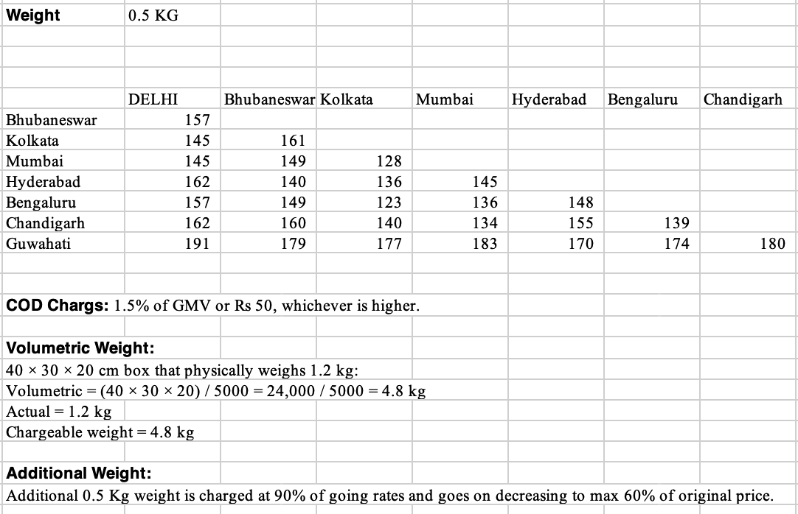

# M2 — Pricing & Costing Engine — Design

> Status: **implemented**. Module `pricing/`, package `com.oneday.pricing`. Replaces the former
> `StubPricingAdapter`. M4 calls it synchronously at booking via `common` `PricingPort`.

## 1. Purpose

M2 turns a booking context into money: a **quoted price** before booking (and the same computation
becomes the **final charge** once actual weight is confirmed). It also runs an internal **costing
model** that produces a per-parcel **cost floor** for scheduling algorithms (M5/M6) — never shown to
customers (M2-D-004).

All rate, surcharge, and tax logic lives here (M4-D-020): M4 passes context and stores the result
unchanged. M4 only computes chargeable weight (see §3).

## 2. Inputs & contract

M4 → M2 via `PricingPort.computeQuote(QuoteRequest)`:

| Field | Meaning |
|-------|---------|
| `customerType` | B2C / B2B / C2C — selects the rate-card family |
| `deliveryType` | INTERCITY / SAME_CITY (from M3 serviceability) |
| `originCity` / `destCity` | city code, e.g. `BLR`, `DEL` (M4 sends IATA codes) |
| `chargeableWeightGrams` | `max(actual, volumetric)`, computed by M4 |
| `declaredValuePaise` | GMV; basis for the COD surcharge |
| `b2bRateCardId` | account card id (B2B only); null for B2C/C2C |
| `paymentMode` | PREPAID / COD (null = PREPAID). **Added for M2** so the COD charge can live here. |

Returns `QuoteResult { baseAmountPaise, taxPaise, totalPricePaise, breakdown, rateCardVersion }`.
`baseAmountPaise` is the taxable base (freight after discount + COD); `breakdown` is itemised
(`base_freight`, optional `b2b_discount`, optional `cod_charge`, `gst_18pct`); `rateCardVersion` is the
applied card snapshot, e.g. `B2C-PUBLISHED v1.0`, stored on the shipment for audit.

## 3. Pricing rules (from the published rate sheet)

**Base price** is the price (₹) for the **first 0.5 kg** of an origin→destination pair. The sheet is a
symmetric city-pair matrix (stored both directions, in paise).

**Volumetric weight** = `L×W×H / 5000` (kg). M4 computes `chargeableWeightGrams = max(actual, volumetric)`
and passes it in; M2 does not recompute weight. The divisor is recorded on the rate card for reference.

**Weight slabs** — base covers slab 1 (0.5 kg). Each further 0.5 kg slab decays 10 pp and floors at
60%:

```
pct(n) = max(slab_floor_pct, first_slab_pct − slab_decrement_pct·(n−1))   // 100, 90, 80, 70, 60, 60…
slabs  = ceil(chargeableWeightGrams / 500)        (min 1)
base_freight = Σ round(base_price · pct(n) / 100)  for n = 1..slabs
```

**Worked example (from the sheet)** — a 40×30×20 cm box weighing 1.2 kg: volumetric = 24000/5000 =
4.8 kg → chargeable 4.8 kg → `ceil(4800/500) = 10` slabs → multiplier `100+90+80+70+60·6 = 700%` =
**7.0× base**.

**B2B discount** — the account's card carries a negotiated `discount_bps`; applied to freight (demo
account = 15%). B2C/C2C cards have 0.

**COD charge** (only when `paymentMode == COD`): `max(₹50, 1.5% of declaredValue)`. B2B is credit-billed,
so M4 passes `paymentMode = null` → no COD.

**GST** — 18% on (freight after discount + COD).

**Same-city** pricing is not in the sheet → each card carries a `same_city_base_price_paise` default
(₹50 for the first slab); slab decay/COD/GST apply as above.

## 4. Rate-card versioning (M2-D-002)

`rate_card` rows are **never mutated**. Publishing a new version inserts a fresh ACTIVE row and flips
the prior ACTIVE card of the same customer type to SUPERSEDED (with `effective_to`). City-pair rows are
owned by a specific card version. A shipment stores `rateCardVersion`, so historical orders always
reconcile against the card active at booking. A partial unique index enforces one ACTIVE published card
per B2C/C2C; B2B accounts each reference their own card by id.

## 5. Costing model (cost floor, internal)

`costing_params` holds per-city ops inputs. The per-parcel floor:

```
da_share  = da_cost_per_shift_paise / (avg_parcels_per_shift · utilisation_pct/100)
van_share = van_cost_per_run_paise / avg_parcels_per_van_run
floor     = da_share + van_share + hub_cost_per_parcel_paise + airline_cost_per_parcel_paise
```

Dividing by *effective* capacity (nameplate × ~70% utilisation) means the DA-utilisation target raises
the floor rather than assuming a DA is busy 100% of the shift — consistent with the cost-floor
invariant used by M3/M5/M6. Exposed (ADMIN only) via `CostingPort.computeCostFloor` and
`GET /api/v1/pricing/cost-floor`.

## 6. Schema (Flyway `db/migration/pricing/`, `V2_x`)

- **`rate_card`** — versioned card header + all rate parameters (slab/gst/cod/discount). (`V2_1`)
- **`city_pair_rate`** — `(rate_card_id, origin_city, dest_city) → base_price_paise`, both directions. (`V2_2`)
- **`costing_params`** — per-city ops inputs, one ACTIVE per city. (`V2_3`)
- **`V2_4`** seeds the B2C + C2C published cards, the demo B2B card (id
  `c0000000-0000-0000-0000-000000000001`, referenced by orders `V4_13`), the full matrix, and costing
  params for the 5 grid cities.

## 7. City-pair matrix (₹, first 0.5 kg)

Codes: DEL, BOM, HYD, BLR, CCU, BBI, IXC, GAU.

|        | DEL | BBI | CCU | BOM | HYD | BLR | IXC |
|--------|----:|----:|----:|----:|----:|----:|----:|
| BBI    | 157 |     |     |     |     |     |     |
| CCU    | 145 | 161 |     |     |     |     |     |
| BOM    | 145 | 149 | 128 |     |     |     |     |
| HYD    | 162 | 140 | 136 | 145 |     |     |     |
| BLR    | 157 | 149 | 123 | 136 | 148 |     |     |
| IXC    | 162 | 160 | 140 | 134 | 155 | 139 |     |
| GAU    | 191 | 179 | 177 | 183 | 170 | 174 | 180 |

## 8. Known gap — Chennai (MAA)

MAA is a serviceable grid city but **absent from the rate sheet**. Intercity bookings touching MAA
return `422 No rate configured` until ops publishes its rows. Serviceable ∩ priced = {DEL, BOM, HYD, BLR}.

## 9. Failure modes

- No active card / missing city-pair → `NoRateConfiguredException` → **422** (M4 surfaces it; the call
  is inside M4's Resilience4j `pricing` circuit breaker, 500 ms default timeout — raised to 8 s for the
  remote dev DB via `ORDERS_RESILIENCE_PRICING_TIMEOUT_MS`).
- Admin/costing endpoints require **ADMIN** (`@PreAuthorize`); the quote-preview and published-tariff
  endpoints are open.

## 10. M4 integration & error handling

- **Contract change:** `QuoteRequest` gained `paymentMode` so the COD surcharge lives in M2. M4's B2C/C2C
  booking passes it; B2B passes `null` (credit-billed → no COD).
- A missing rate during an M4 **booking / cart-add / checkout** raises `NoRateConfiguredException`, now
  mapped by M4's `OrdersGlobalExceptionHandler` to a clean **`422 "Route not priceable"`** (previously a
  generic 500). The detail carries the lane, e.g. `No rate configured for MAA→DEL on card C2C-PUBLISHED`.
- The pricing **circuit breaker ignores** `NoRateConfiguredException` (`ResilienceConfig.ignoreExceptions`)
  — a missing rate is a business outcome, so repeated unpriced-lane attempts can't trip the breaker and
  503 the priced lanes.
- The former `StubPricingAdapter` (app module) is **deleted**; `PricingPortAdapter` is the only
  `PricingPort` bean across all profiles.

## 11. Customer-facing surfaces (demo UI)

- **Live cost box** on the B2C booking form: a read-only "Shipping cost (computed by M2)" panel that calls
  `POST /api/v1/pricing/quote` and updates as the route, weight/dimensions, declared value, or payment
  mode change (driven from `renderLocCard` + input/`selectPay` handlers). Unpriced lanes turn the box amber.
- **Published rate chart**: `GET /api/v1/pricing/rate-card?customer_type=` (open) feeds a modal rendering
  the city-pair matrix + the costing rules, with a **B2C / C2C / B2B toggle** (B2B shows its negotiated
  `discount_bps`). Reachable from both the B2C and B2B forms.

## 12. Tests

- `PricingEngineTest` — slab math (incl. the 4.8 kg worked example), COD min/%, GST, B2B discount.
- `RateCardServiceImplTest` / `CostingServiceImplTest` — resolution, versioning, cost floor.
- `PricingM4IntegrationTest` — drives the real adapter→service→engine chain through `PricingPort` with
  M4-shaped `QuoteRequest`s (incl. M4's `max(actual, L·W·H/5)` weight math) across B2C/C2C/B2B, same-city,
  COD, and the unpriced-lane 422 path.

> Flyway `V2_1–V2_4` applied to the **Singapore** dev DB (`singapore1dd`, the current default in `.env`)
> and the local DB. The Oregon DB (`oneday_cipv`) will get them on its next app boot against the M2 build.

