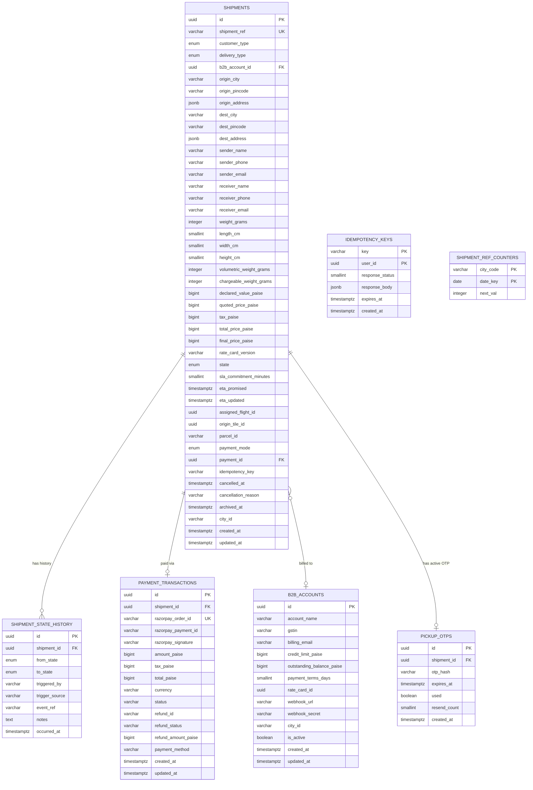

# M4 — Entity Relationship Diagram

> Generated from [M4-ORDERS-DESIGN.md](M4-ORDERS-DESIGN.md) §10 (Database Schema).  
> Update this file whenever the schema changes.

## Notes

- `SHIPMENT_STATE_HISTORY` is append-only — rows are never updated or deleted.
- `PAYMENT_TRANSACTIONS` has one row per payment attempt; a COD shipment has no row until delivery is confirmed by M5.
- `B2B_ACCOUNTS.outstanding_balance_paise` is incremented atomically with each B2B booking (same DB transaction, `SELECT FOR UPDATE`).
- `IDEMPOTENCY_KEYS` rows are purged nightly when `expires_at < NOW()`. The `request_fingerprint` column (SHA-256 of canonicalised request body) was added in V4_10 (PR #8) alongside the fingerprinting logic that writes it.
- `PICKUP_OTPS` stores BCrypt-hashed OTPs for DA pickup verification. At most one row exists per shipment at any time (unique index on `shipment_id`). On resend the old row is deleted and a new one is inserted. Rows are not archived — they can be purged after expiry.
- `SHIPMENT_REF_COUNTERS` is a per-city-per-day sequence counter; see design doc §5.1 for the Redis INCR upgrade path at high volume.
- `assigned_flight_id` references M9's flight table (cross-module, not a DB foreign key — enforced at application level).
- `origin_tile_id` references M3's grid tile table (same cross-module rule).
