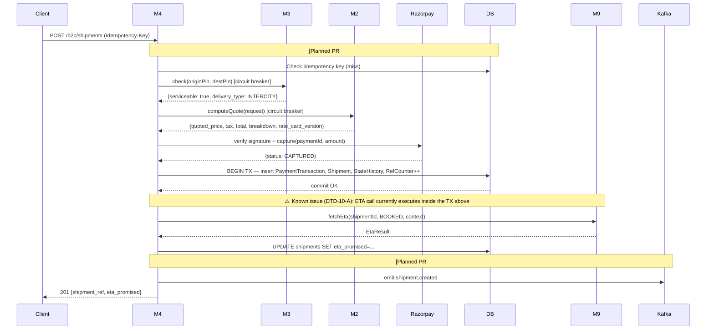
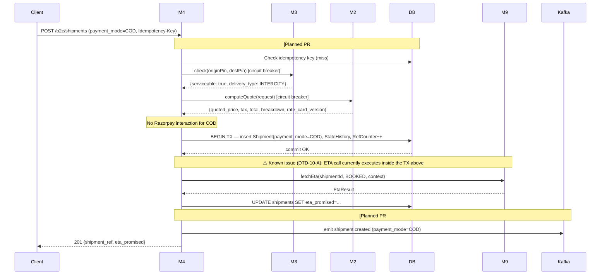
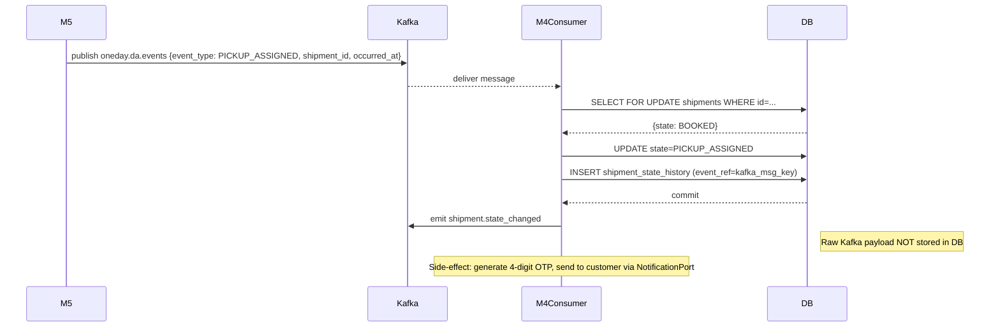
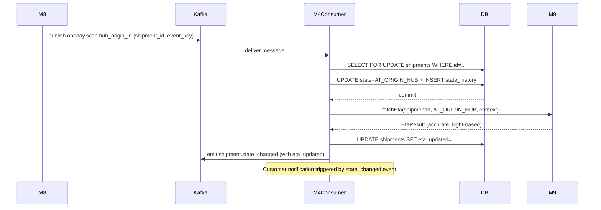

# M4 — Sequence Diagrams

> Extracted from [M4-ORDERS-DESIGN.md](M4-ORDERS-DESIGN.md) §8.

---

## B2C / C2C Booking (PREPAID)



---

## B2C / C2C Booking (COD)



---

## B2B Booking (credit — no Razorpay)

```mermaid
sequenceDiagram
    participant Client
    participant M4
    participant DB
    participant M3
    participant M2
    participant M9

    Client->>M4: POST /api/v1/b2b/shipments (Idempotency-Key, X-User-Id)
    M4->>DB: findById(b2bAccountId) — check account exists + is_active
    DB-->>M4: B2bAccount {creditLimitPaise, outstandingBalancePaise, rateCardId}
    M4->>M3: check(originPincode, destPincode) [circuit breaker + time limiter]
    M3-->>M4: {serviceable: true, delivery_type: INTERCITY, originTileId}
    Note over M4: compute volumetricWeightGrams; chargeableWeightGrams = max(actual, volumetric)
    M4->>M2: computeQuote(CustomerType.B2B, deliveryType, cities, chargeableWeight, rateCardId) [circuit breaker + time limiter]
    M2-->>M4: {baseAmountPaise, taxPaise, totalPricePaise, breakdown, rateCardVersion}
    M4->>DB: BEGIN TX
    M4->>DB: SELECT FOR UPDATE b2b_accounts WHERE id=b2bAccountId
    DB-->>M4: B2bAccount (locked)
    Note over M4: check outstanding + total ≤ creditLimit — else 402 CreditLimitExceededException
    M4->>DB: generateRef → ShipmentRefCounter SELECT FOR UPDATE + increment
    M4->>DB: INSERT shipments (customerType=B2B, paymentMode=null, b2b_account_id, state=BOOKED)
    M4->>DB: UPDATE b2b_accounts SET outstanding_balance_paise = outstanding + totalPricePaise
    M4->>DB: INSERT shipment_state_history (from_state=null, to_state=BOOKED)
    DB-->>M4: commit OK
    Note over M4,M9: ⚠️ Known issue (DTD-10-A): ETA call currently executes inside the TX above (same as B2C)
    M4->>M9: fetchEta(shipmentId, BOOKED, context) [best-effort — failure does not roll back]
    M9-->>M4: EtaResult (or exception — logged as WARN)
    Note over M4: [Planned PR #14] Kafka shipment.created emission not yet wired for B2B
    M4-->>Client: 201 {shipment_ref, state, pricing, eta_promised} — payment field omitted (null, @JsonInclude NON_NULL)
```

> **No Razorpay interaction.** B2B is always credit. The `payment` field in `BookingResponse` is set to `null` and excluded from the JSON output via `@JsonInclude(NON_NULL)` on the field.

> **No new Flyway migration.** `b2b_accounts` and `shipments.b2b_account_id` already existed from PR #4. `shipments.payment_mode` is nullable; `null` is the correct value for B2B credit shipments.

---

## Kafka State Transition (e.g. BOOKED → PICKUP_ASSIGNED)



> **Note:** `PICKUP_ASSIGNED → PICKED_UP` is NOT a Kafka-driven transition. `PICKED_UP` is triggered exclusively by the OTP verify HTTP endpoint (`POST /internal/v1/shipments/{ref}/pickup-otp/verify`), called by M5's DA app after the customer provides the OTP. M4 does not consume `DaEventType.PICKUP_COMPLETED` for state transitions.

---

## AT_ORIGIN_HUB — Accurate ETA Update


