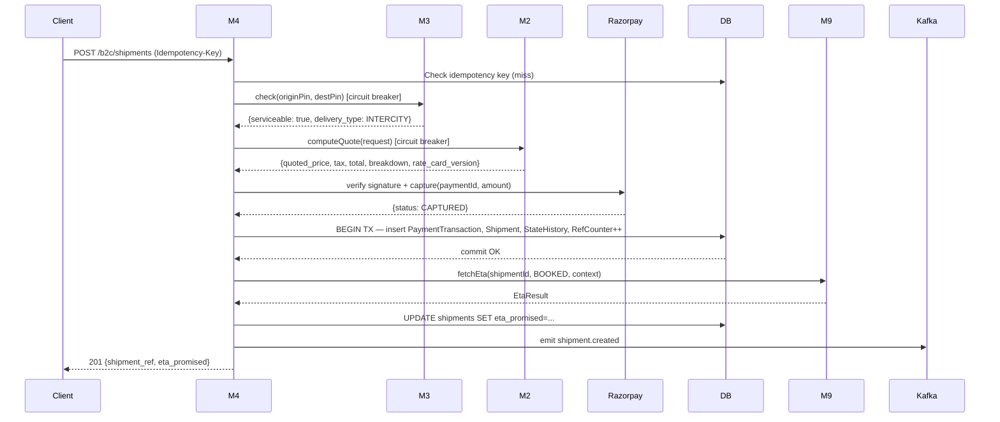
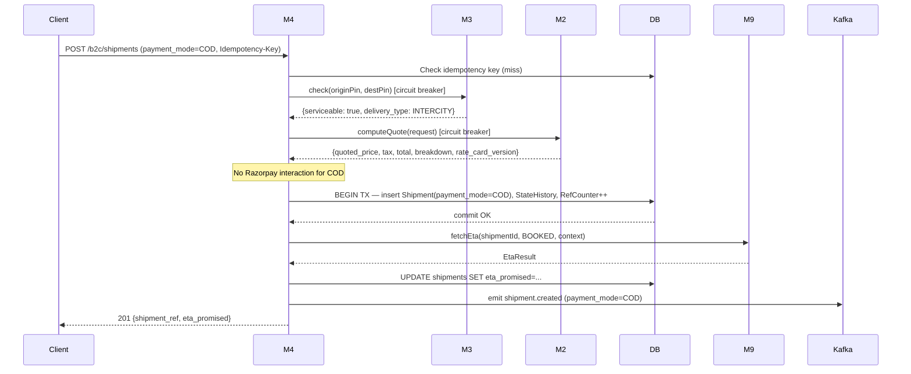
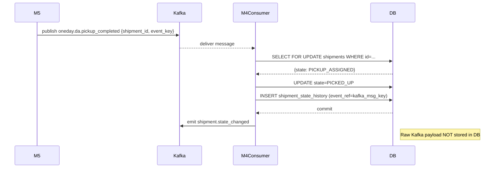
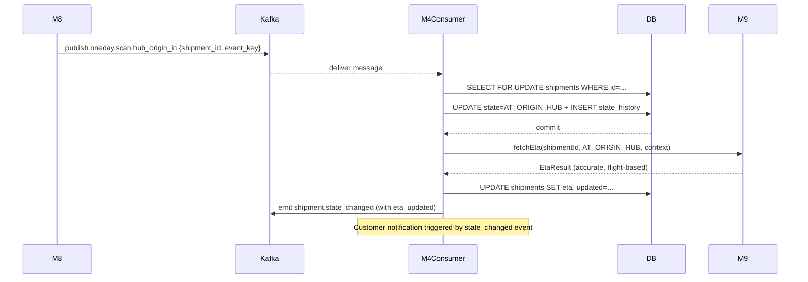

# M4 — Sequence Diagrams

> Extracted from [M4-ORDERS-DESIGN.md](M4-ORDERS-DESIGN.md) §8.

---

## B2C / C2C Booking (PREPAID)

---

## B2C / C2C Booking (COD)

---

## Kafka State Transition (e.g. PICKUP_ASSIGNED → PICKED_UP)

---

## AT_ORIGIN_HUB — Accurate ETA Update

