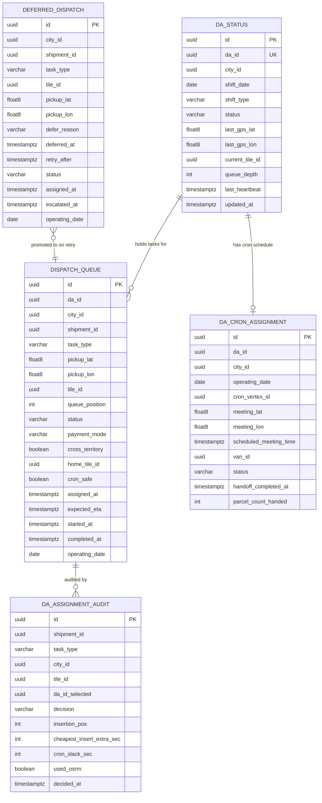

# M5 — Entity Relationship Diagram

> Generated from [M5-DISPATCH-DESIGN.md](M5-DISPATCH-DESIGN.md) §14 (Data Model).  
> Update this file whenever the schema changes.

## Notes

- `DISPATCH_QUEUE` is append-only — rows are never deleted (XC-D-002). Status transitions are recorded via `status` column updates but row history is preserved via `DA_ASSIGNMENT_AUDIT`.
- `DA_STATUS` has one row per DA (unique constraint on `da_id`). It is the only mutable table in M5 — updated on every GPS heartbeat flush and status change. The authoritative live state is in-memory; DB is flushed every 2 minutes.
- `DA_CRON_ASSIGNMENT` has a unique constraint on `(da_id, operating_date)` — one cron schedule per DA per shift day. Populated at nightly replan by consuming M6's `cron.scheduled` Kafka event.
- `DEFERRED_DISPATCH` rows progress from `PENDING → ASSIGNED` (when a DA becomes available and the order is retried successfully) or `ESCALATED` (after `DeferredRetryJob` determines the order cannot be assigned before shift end) or `EXPIRED` (shift ended, passed to M11).
- `DA_ASSIGNMENT_AUDIT` is fully append-only. Every assignment attempt — successful or deferred — creates one row. `da_id_selected` is `NULL` when `decision` is `DEFERRED_*`.
- `home_tile_id` in `DISPATCH_QUEUE` is non-null only when `cross_territory = true`; it records the tile the order was originally routed to before cross-territory search found a better DA.
- Cross-module references (no DB foreign keys enforced):
  - `da_id` → M1 `users` table (auth module)
  - `shipment_id` → M4 `shipments` table
  - `tile_id`, `cron_vertex_id`, `current_tile_id`, `home_tile_id` → M3 `tile` / `grid_vertex` tables
  - `van_id` → M6 routing tables
