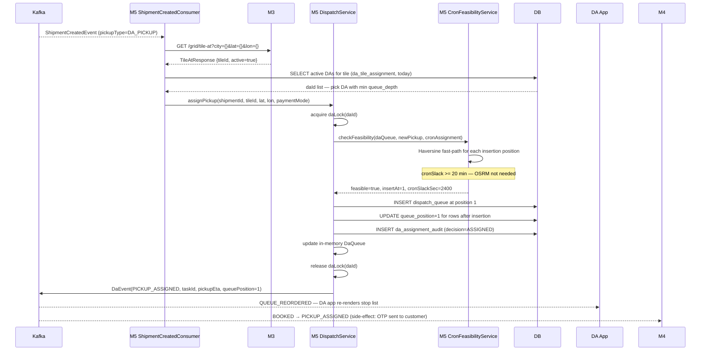
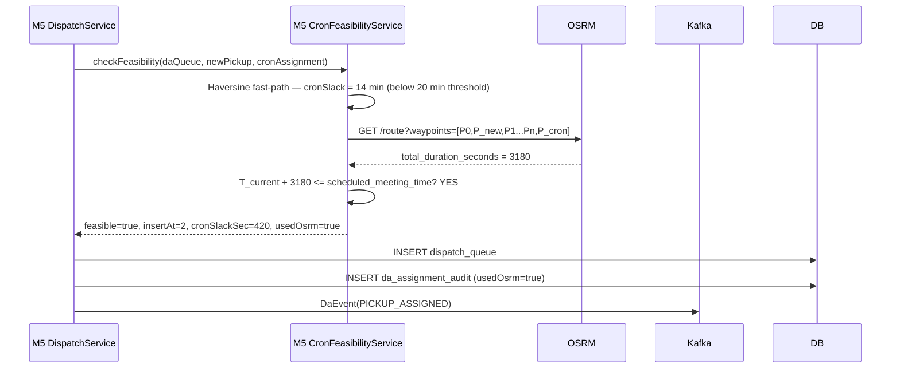
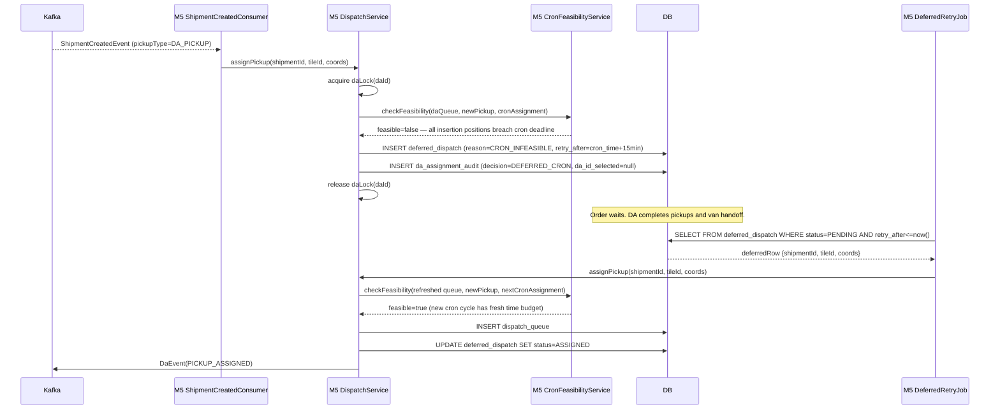
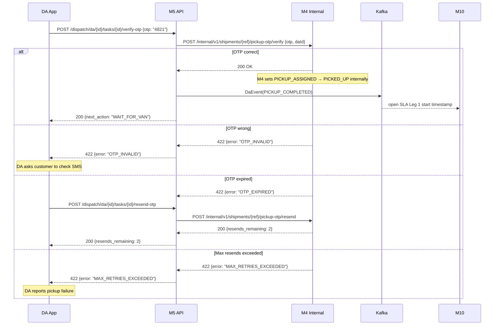
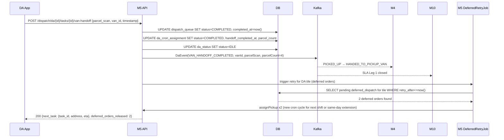
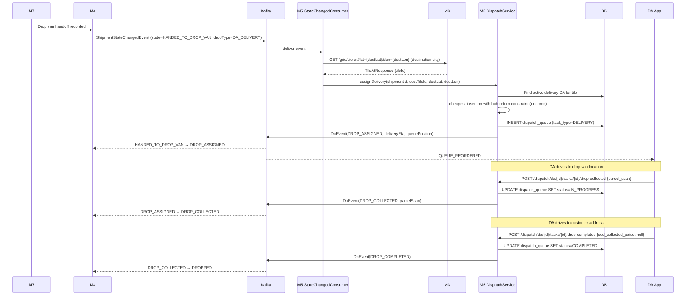
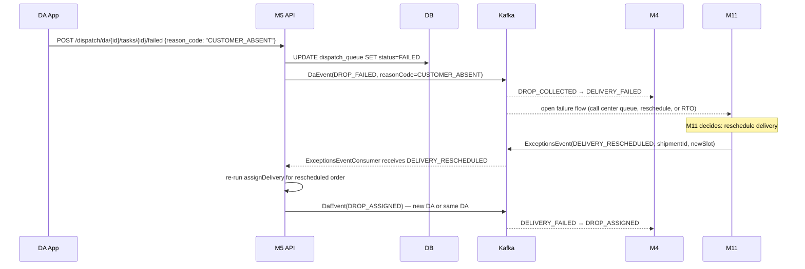
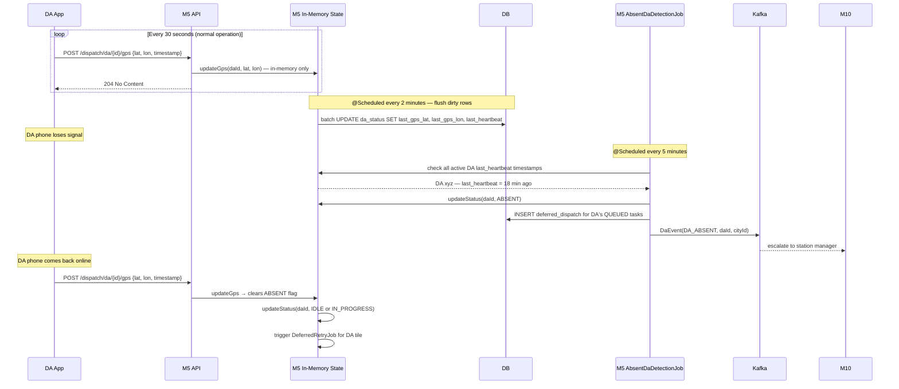
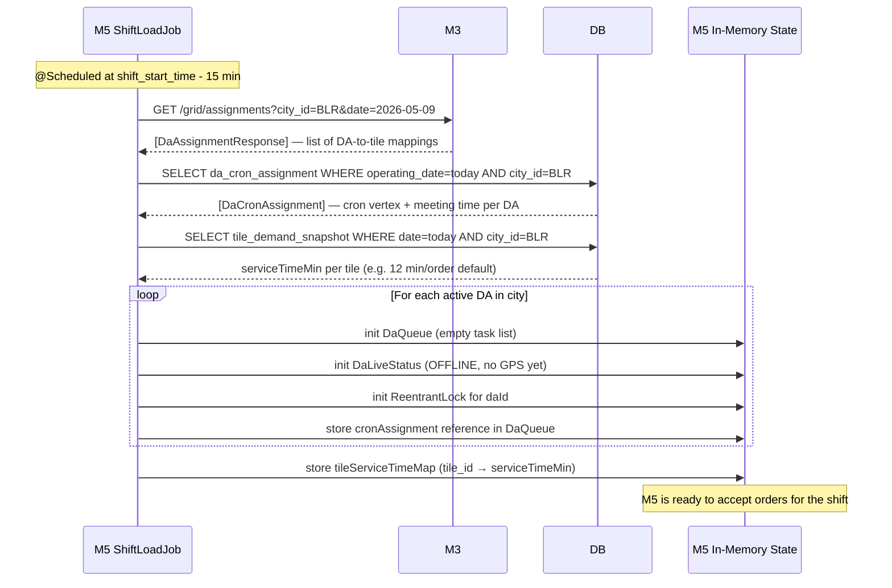
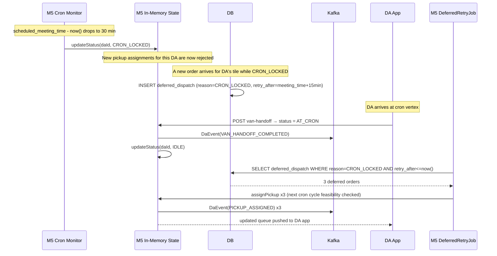

# M5 — Sequence Diagrams

> Extracted from [M5-DISPATCH-DESIGN.md](M5-DISPATCH-DESIGN.md) §6, §8, §9, §11, §12.

---

## 1. Pickup Assignment — Happy Path

Triggered when M4 emits `ShipmentCreatedEvent` for a `DA_PICKUP` shipment.

> ↩ **Return to implementation plan:** [Phase 3 — PR #6 (CronFeasibilityService)](M5-Implementation-Plan.md#phase-3-pr6-build) · [Phase 3 — PR #7 (DispatchServiceImpl)](M5-Implementation-Plan.md#phase-3-pr7-build)

---

## 2. Pickup Assignment — Borderline Cron (OSRM Confirmation)

Same as above but cron slack is tight, triggering the OSRM slow path.

> ↩ **Return to implementation plan:** [Phase 3 — PR #6 (CronFeasibilityService)](M5-Implementation-Plan.md#phase-3-pr6-build)

---

## 3. Pickup Assignment — Cron Infeasible → Deferred → Retry

When no insertion position keeps the DA cron-feasible, the order is deferred and retried after the DA's van handoff completes.

> ↩ **Return to implementation plan:** [Phase 3 — PR #7 (DispatchServiceImpl)](M5-Implementation-Plan.md#phase-3-pr7-build) · [Phase 4 — PR #8 (ShipmentCreatedConsumer)](M5-Implementation-Plan.md#phase-4-pr8-build) · [Phase 7 — PR #13 (DeferredRetryJob)](M5-Implementation-Plan.md#phase-7-pr13-build)

---

## 4. OTP Verification (Pickup Confirmation)

The DA arrives at the customer's location and verifies the customer-held OTP.

> ↩ **Return to implementation plan:** [Phase 5 — PR #11 (OtpVerificationService)](M5-Implementation-Plan.md#phase-5-pr11-build)

---

## 5. Van Handoff (Cron Meeting)

The DA reaches the cron vertex and physically hands parcels to the hub consolidation van.

> ↩ **Return to implementation plan:** [Phase 5 — PR #10 (DaDispatchController)](M5-Implementation-Plan.md#phase-5-pr10-build)

---

## 6. Delivery Assignment — Full Last-Mile Flow

Triggered when M7 loads a parcel onto the drop van at the destination hub.

---

## 7. Delivery Failure → M11 Escalation

---

## 8. GPS Heartbeat and Absent DA Detection

> ↩ **Return to implementation plan:** [Phase 2 — PR #4 (DaStatusService + ShiftLoadJob)](M5-Implementation-Plan.md#phase-2-pr4-build)

---

## 9. Shift Load (Start of Day)

Runs 15 minutes before shift start. Initialises all in-memory state for the day.

> ↩ **Return to implementation plan:** [Phase 2 — PR #4 (DaStatusService + ShiftLoadJob)](M5-Implementation-Plan.md#phase-2-pr4-build)

---

## 10. Cron Freeze and Post-Handoff Queue Release

Shows the state transitions as a DA approaches the cron meeting window.

