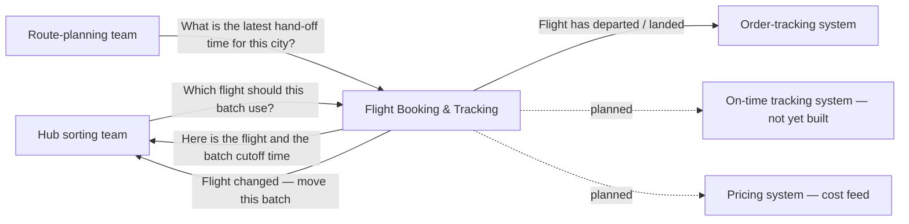
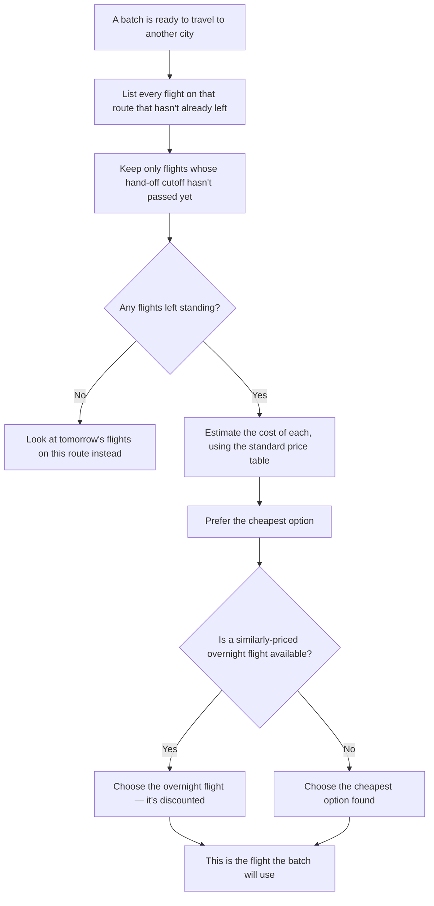
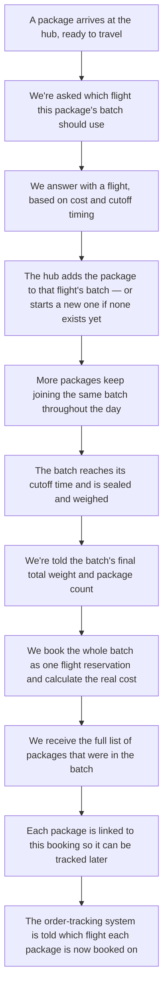
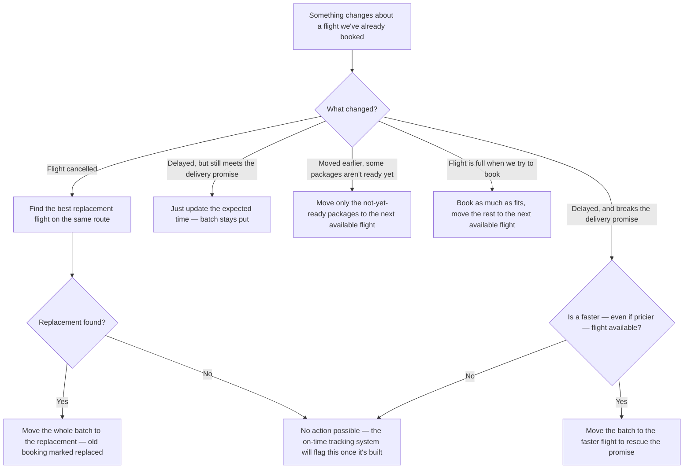
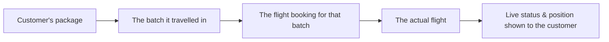
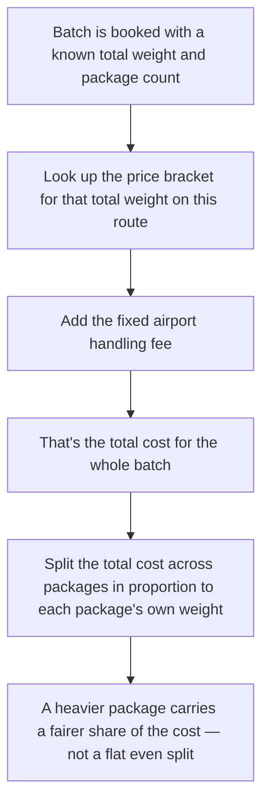

# M9 — Flight Booking & Tracking: Plain-Language Plan

This is the plan for the part of the platform that gets a batch of packages onto an airplane, keeps track of what that costs, deals with flights changing, and lets a customer see where their package's flight currently is.

**A quick way to picture it:** the hub packs many customers' packages into one big batch. We book that whole batch onto a flight under a single reservation — the way a travel agent books a whole tour group under one reservation number instead of booking every traveller separately. Everything below is about how that single reservation gets chosen, booked, tracked, and re-booked when things change.

---

## 1. Why this exists, and what it does and doesn't do

Getting packages onto a flight is the single biggest cost in delivering a package in one day, and it's also the biggest lever for bringing that cost down — a flight batch that's nearly full costs far less per package to fly than two half-full batches. So the two things that matter most here are: pick a flight that's cheap enough, and don't let batches fly half-empty if a fuller option still meets the delivery promise.

**This system decides:**
- Which flight a batch of packages should travel on.
- When to book that batch as one confirmed reservation, once it's finished being packed.
- What to do when a flight is delayed, cancelled, overbooked, or moved earlier.
- What the live status of a flight is, so a customer can see where their package currently is.
- What the actual cost of a booking is, so that number can feed into what the company charges to stay profitable.

**This system does NOT decide:**
- How packages physically get packed into a batch, or moved between shelves/vehicles at the hub — that's the hub team's job. This system only says "this batch belongs on flight X"; the hub team does the physical part.
- Whether a package has broken its promised delivery time — that's a separate, not-yet-built system's job. This system just reports flight status and re-books when needed; it doesn't judge lateness.
- What a customer pays — that's the pricing system's job, and it's already built. This system only feeds an internal cost number used for profitability tracking, never the customer's price.
- Scanning or verifying packages — that's a separate system's job; this system just refers to a package by its ID.

---

## 2. Who this talks to

The hub sorting team asks this system which flight to use, the moment a package is ready to be sorted — before any batch decision is made, not after. The route-planning team asks it separately for the latest possible hand-off time per city, so it can plan how long a package's road journey to the hub can safely take. Once a flight actually departs or lands, the order-tracking system is told, so a customer's order status updates automatically.

---

## 3. What we keep track of ourselves

- **A flight timetable per route** — which flights run between which two cities, what time they leave, and how late a batch can be handed over and still make it (the "cutoff").
- **A standard price table per route** — what it costs to fly a given amount of weight, plus a fixed handling fee, so a cost can be estimated before a batch is even finished.
- **A record of each finished booking** — once a batch is sealed and booked onto a flight, we keep the confirmation number, the real weight and cost, and the list of packages in it.
- **How much weight has already been committed to each specific flight** — a simple running number per flight, used so we don't try to book more onto a flight than it can actually carry.

None of this requires knowing which real airline or booking vendor we'll eventually use — see the next section.

---

## 4. A stand-in for the real flight-booking vendor

Which real airline, agency, or booking system this platform will eventually connect to hasn't been decided yet. So everything here is built against a single, well-defined connection point — search for flights, book a batch, check a flight's status, cancel a booking — and for now, a realistic simulated stand-in sits behind that connection point instead of a real vendor. It behaves the way a real one would: it returns believable flight options, gives back a confirmation number when a batch is booked, and reports status updates over time.

The benefit: none of the decision-making, booking, or tracking logic described below needs to change later. Once a real vendor is chosen, only what sits behind that one connection point gets swapped out.

---

## 5. How we decide which flight a package's batch should go on

The goal is simple: pick the cheapest flight that still gets the batch there in time to meet the delivery promise. Flights running in the discounted overnight window get a slight preference when cost is close, since they're cheaper for the same trip.

**One honest limitation, worth calling out directly:** normally only one batch is being filled per flight at a time, and while it's still being filled, we genuinely don't know its true running weight — we only find out for certain once it's sealed and weighed. So this decision uses a typical estimate for the route rather than the exact live weight, and it's corrected to the real number once the batch is actually finished. This is a deliberate trade-off, not an oversight: flights on a route are spaced far enough apart that an arriving package usually only has one realistic flight it could catch anyway, so there's rarely a genuine choice left to fine-tune using live numbers.

---

## 6. The booking journey

---

## 7. When a flight changes

There's no separate "cancelled" notice on its own — a cancellation always shows up as "move this batch to a replacement flight," because a plain "your flight is gone" message wouldn't tell the hub team what to actually do. Every one of these moves keeps a full history: the old booking is never deleted, just marked as replaced and linked forward to the new one, so a customer's tracking always resolves to the correct current flight even after a change.

---

## 8. Live tracking for the customer

Since which real flight-tracking data source to use hasn't been decided either, this starts out simulated too — a believable live position is calculated along the flight's known path between the two cities, and updates as the flight would be expected to progress, so the feature works end-to-end before a real live-tracking source is ever connected.

---

## 9. What the airport ground team can see and do

The team that physically loads batches onto planes gets a read-only view: which batches are booked for a given hub and day, with their weights and package counts — never who the individual packages belong to, just the batch-level facts they need. They can also confirm two things back to us: that a batch has been physically handed over at the dock, and that it's been fully loaded — both are simply timestamps we record for later reporting.

---

## 10. How the bill is calculated and split per package

The airline bills the whole batch as one unit — a bigger, fuller batch costs less per package because there's a minimum charge and a handling fee that get spread across more weight and more packages. When that total needs to be attributed back to individual packages (for internal cost tracking), it's split in proportion to each package's own weight rather than divided evenly, so a heavy package isn't shown as costing the same as a very light one.

---

## 11. What can go wrong

- **No flight can make the delivery promise at all** — nothing to do here; the batch still goes on the best available option, and the not-yet-built on-time tracking system will eventually flag it as late.
- **Cancellation with a same-day replacement** — handled automatically, invisible to the customer.
- **Cancellation with no same-day replacement** — rolls to the next day; flagged for the (not yet built) customer-issues system.
- **A delay that breaks the promise, with a rescue flight available** — moved to the faster option automatically.
- **A delay that breaks the promise, with no rescue available** — no action possible; surfaced later by the on-time tracking system.
- **A flight moved earlier, stranding some not-yet-ready packages** — only the stranded ones get moved to the next flight; anything already sealed into a different, already-booked batch is left alone.
- **A flight runs out of room** — the batch splits: what fits is booked as normal, the rest is booked onto the next available flight.
- **A very light batch** — the minimum charge applies regardless; it still ships once sealed, no separate approval needed.
- **Duplicate or out-of-order status updates** (e.g., a "landed" update arriving before a "departed" one, due to normal network timing) — status only ever moves forward, never backward, and a repeat update is simply ignored.
- **Weekends / holidays with a reduced flight schedule** — naturally handled, since only the days a flight actually runs are ever considered.
- **All five cities fly direct to each other** — no route currently requires a connecting flight, so that complexity doesn't exist yet.
- **The same "batch sealed" notice arriving twice** (normal for how these notifications are delivered) — safely ignored the second time; no duplicate booking is created.
- **Time correctness across midnight** — every cutoff and departure time is calculated consistently in local time, including the overnight discount window, which deliberately spans midnight.

---

## 12. Still-open questions

- **Who officially issues the booking number** — the agency booking on our behalf, or the airline directly? Doesn't block anything: we own tracking that number's full lifecycle either way.
- **What the real hand-off cutoff time is, per route** — until real airport data is available, a placeholder default is used per route.
- **Where live flight-position data will eventually come from** — an airline's own feed, or a third-party flight-tracking service? Simulated tracking covers this until that choice is made.
- **How a package's ID gets matched to its order record** — a small lookup against the order-tracking system, not yet formalized as a dedicated method there.
- **No clean label yet exists for "moved to rescue a broken delivery promise"** — it's currently recorded under the closest existing label; doesn't affect behavior, just the wording in internal logs.
- **A small change is needed on the hub side first** — right now, when the hub asks which flight to use, it doesn't tell us which city the package is *coming from*, only where it's going. That needs to be added before real flight selection can work, and should land as its own small, isolated fix before anything else here is built.

---

## 13. Rough build order

Start with the hub-side fix above, since everything else depends on it. Then build the basic version first: our own flight timetable and price table, plus the ability to decide which flight a batch should use and book it once sealed. Next, add live tracking so customers can see flight status. After that, add the logic for handling flights that change — delays, cancellations, overbooking. Last, add the ground team's read-only views and a way to simulate disruptions for testing, and connect the real cost numbers into the pricing system's internal accounting.
