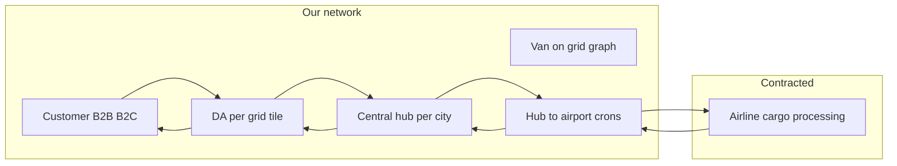

# Product Requirements Document (PRD)

## One-day / intercity express delivery platform

| Field | Value |
|--------|--------|
| **Version** | 1.0 |
| **Status** | Draft — from stakeholder discovery (father demo) |
| **Target path** | PRD → design doc → PoC |
| **Related** | [PRD-DISCOVERY-QUESTIONNAIRE.md](./PRD-DISCOVERY-QUESTIONNAIRE.md) |

---

## 1. Executive summary

The product is a **one-day (or time-definite) intercity express delivery** system covering **B2B and B2C** with **in-house operations** (no third-party logistics for core service in the stated scope). Version one launches at **city scale: five (5) cities** with a **per-city grid system** of **rectangular tiles**, **per-tile delivery associates (DAs)**, **central hub per location**, and **airline carriage** under direct or agent-mediated contracts. Operations are **highly auditable**: barcode-led hub sortation, **flight-level bags and system-generated manifests**, **SLA monitoring per leg** with **supervisor escalation** on red states, and **nightly** (not intraday) replan for van routes to reduce chaos.

The same **grid and process pattern** is **symmetric** on origin and destination: hub ↔ airport crons, sortation by stand/bag, and updated barcode data controlling physical stand placement.

**Pricing** is a **dedicated module**: varies by business account, end customer, city, and **volumetric weight** of the packet.

---

## 2. Product vision and goals

### 2.1 Vision

Provide **predictable, traceable, and cost-aware** one-day (or best-time) delivery between urban service areas, with **end-to-end ownership** of ground legs and **visibility** of air and partner-airline handovers.

### 2.2 Strategic goals

- **G1 — Operational control:** Station-level mitigation; **no third-party** involvement in the core product scope for the stated v1; exceptions handled by **own supervisors** and **call center** flows.
- **G2 — Algorithmic + human control:** **Dynamic** grids, routes, and assignment **constrained** by **human approval** (station manager: city; admin: all cities) and **nightly** stability for van routes.
- **G3 — Promise integrity:** Customer-facing **ETA** uses a **predicted flight**; hub-level **flight assignment**; clear rules when **van-to-airport** or **airline processing** misses windows.
- **G4 — Cost efficiency:** Driver capacity, hours, and costing live in a **connected costing model**; grid sizing targets **~70% worker utilisation** to balance cost and slack.

### 2.3 Non-goals (explicit from discovery)

- **Third-party carriers** for core pickup/delivery in scope as stated: **excluded** for now (station must mitigate).
- **Fully automated** dynamic route changes intraday: **discouraged**; prefer **nightly replan** and **approval** when change is necessary.

*Note: Section 2.2 “no third party” may conflict with **airline** as partner — clarify: **no 3P for last-mile/DA**; **airline is a contracted partner, not 3P parcel carrier**.*

---

## 3. Stakeholders and user personas

| Persona | Role | Primary needs in product |
|----------|------|----------------------------|
| **End customer (B2C)** | Books shipment, tracks, receives | Clear ETA, status per leg, reschedule options on failure |
| **Business user (B2B)** | Contract pricing, volume, APIs or portal | **Pricing module** (account + city + **volumetric** rules), reporting |
| **Delivery associate (DA)** | Picks up from address, hands to hub/van | Fast assignment, **queue** clarity, **priority** to main hub van / cron schedule |
| **Van driver** | Sequenced stops on grid vertices, to hub | Nightly route, **70/30** rule (see §8), time window to hub |
| **Station manager** | City-level operations | **Grid/override** (city), mitigate **no-DA** grid, **SLA** red actions, approve route changes when required |
| **Admin** | Network-wide | Full **grid and route** override, config, user rights |
| **Hub operator** | Scan, stand, bag, manifest | **Barcode → stand** flow, **bag** capacity, system **manifests** per flight |
| **Hub–airport cron driver** | Recurring runs | Continuous or scheduled to/fro; handover timing to airline process |
| **Supervisor (critical leg)** | SLA breach / red | **Action** (not just notification); may differ from station manager in large orgs |
| **Call center** | Failed pickup/delivery | **Reason** capture, **reschedule** window, **feedback** for penalty workflow |
| **Airline / GHA (partner)** | Aircraft cargo, cutoffs, processing | **API** tracking, responsibility split when **processing time** missed |

---

## 4. Scope

### 4.1 Phased geography

- **V1 — Five (5) cities** (identity of cities: **TBD** — see §20).

### 4.2 Customer segments

- **B2B and B2C** — both in scope; pricing and contract rules may differ (see §5).

### 4.3 Serviceable area (urban)

- **Grid and coverage only in urban areas**, **determined by pincode** (or equivalent serviceability list).
- **Rural** or non-urban: **excluded** until explicitly in scope; **“where to stop”** for grid making is **urban pincode** boundary.

### 4.4 Modes and topology

- **Default:** DAs assigned **one rectangular tile (grid cell) per DA**; **one central hub per city/location.**
- **Small cities (exception):** If there is **no parent aggregation** point in the model, the **DA delivers directly to the hub** (no intermediate “parent” node).
- **Multi-stop / intercity with intermediate airports:** Treated as **our** responsibility for **transit between stops**; **not** left to the airline. Flow: e.g. **to airport A → from airport A → to airport B → from airport B** … as many legs as product supports; each **ground interstop** is **us**.

---

## 5. Business rules: pricing and costing

### 5.1 Pricing module (requirement)

- **Inputs / dimensions (minimum):**
  - **Business** (B2B account) vs **B2C** customer
  - **City** (origin and/or destination, as per commercial rule)
  - **Volumetric weight** (or dimensional weight) of the packet
- **Output:** **Charge** or **quotable** price for a shipment before booking.
- **Integration:** “Costing **sheet**” or system holds **DA capacity, working hours**, and related **costing model** parameters; **algorithms and scheduling must read** the same or synced data.

### 5.2 Open (was unanswered in session)

- **2.3 — Non-goals for V1** (e.g. international, COD, returns) — see §20.
- **2.5 — Per-parcel or per-lane cost ceiling** for optimization — TBD for algorithm constraints.

---

## 6. Grid system (rectangular tiles, vertices, and dynamics)

### 6.1 Definition

- **Grid** = **rectangular tiles** (axis-aligned) covering the **urban serviceable** region.
- **Geometric rule:** A **recurring** operation (“cron” in the business sense) **should touch a vertex of the grid**; design must **cover all corners** of the service polygon (i.e. no uncovered gaps; grid tessellation and vertex alignment are **first-class** layout constraints for routing and hub shuttles).
- **Assignment:** **One DA per rect tile** (per stable assignment period) unless rebalanced.

### 6.2 How grids are created and updated (weighting)

- **70% historical, 30% current** order data drive **where** and **how large** tiles are (historical + live demand mix).
- **Dynamic adjustment** when **load**, **geographic area covered**, or **order density** change; **target ~70% worker (DA) utilisation** as a key tuning goal.
- **Dynamic allocation** (e.g. DA-to-tile) uses **at least the past week** of data.
- **Human-in-the-loop:**
  - **Station manager:** can approve / apply **local (city) changes** to grids.
  - **Admin:** **full** access to grid definitions and overrides.
  - System **proposes** dynamic grid size / boundaries; **human approval** is required before (or for certain classes of) go-live, per policy **TBD** (e.g. auto within bounds vs always approve).

### 6.3 Route planning (grid level)

- **All vertices** of a grid (tile corners and/or the graph defined on the rect mesh — exact graph **TBD in design doc**) are the **traversable network** the **van** uses; **all routes** are **dynamically plannable** on this graph.
- **Admins and station** roles can **override** any automated plan.

### 6.4 Edge case: no DA in a grid

- If a **grid has no available DA**, the system must **notify the station manager** to **mitigate** (reassign, recruit shift, or temporarily merge tiles — process **TBD**).

---

## 7. Delivery associate (DA) assignment and pickup behaviour

### 7.1 Speed and queue

- **Orders must be assigned to a DA as fast as possible** (low latency in system).
- DAs work from a **queue (PQ)**; **if a new order appears that is closer** to current position or is **faster to serve**, the **closer / better pickup should be prioritised** (preemption or reorder subject to design — requirement is **closer-favouring** logic).

### 7.2 Priority: main scheduled van / hub “cron” (consolidation)

- The **main scheduled run** to the hub (referred in notes as “meal / **cron** van” — treat as **primary hub consolidation** vehicle) has **strict priority.**
- **New pickups** are only accepted into the **current** DA queue if **stopping to hand off packets to that van** at the **agreed cron spot** is still **time-feasible** (DA can still reach the **meeting point** on time with current queue and ETAs).
- *Design implication:* **constraint solver** or rule engine: **meeting the hub van / cron** > opportunistic closer pickups, unless a closer pickup does not **break** the cron handoff.

### 7.3 Operating hours

- **~16 hours** operating window, **2 shifts** (example stated: **11–7** — interpret as two blocks covering 16h; **exact wall-clock** **TBD** in ops appendix).

### 7.4 No third-party; station mitigation

- **No third party** for pickup/delivery in the stated product scope: issues are **mitigated at station** level (not outsourced to 3P courier).

### 7.5 Small city simplification

- **No parent aggregation** node: **DA → hub direct** (small cities).

---

## 8. Van routing (stops, time windows, replan, hub)

### 8.1 Model

- **Van route = ordered sequence of stops** (at grid vertices and/or stop points).
- **Deciding the route** uses the **same 70% historical / 30% current** weighting spirit as **grids** (shared philosophy across planning modules).

### 8.2 Constraints (dynamic inputs)

- **Number of packets** on the run.
- **Time window to reach hub** (or within-route SLA for that leg).

### 8.3 Change policy

- **Not** to change **very frequently**; only when **necessary** and ideally **with approval** (who: station / admin per severity — **TBD**).
- **Nightly replan** is the **default** for van routes to **avoid constant intraday** dynamism; **if** dynamic change is required, **notify station manager** and avoid uncontrolled auto-churn.

### 8.4 Physical topology

- **One central hub per city/location** (single primary hub; secondary hubs not in v1 per discovery).

---

## 9. Hub: sortation, bags, crons, flight reschedule

### 9.1 Physical flow (origin hub)

- **Inbound dock** → **sort by flight / destination** → **assign to flight bag** (grouped by **flight number**).
- For each **flight** used for a bag, a **manifest** is attached **at bag level** — **system-generated** (not manual only).

### 9.2 Hub ↔ airport crons

- **Scheduled runs to and from the airport** run **continually** (or on a high-frequency defined cadence) between **hub and airport**.

### 9.3 Low-weight flight bag: reschedule to next flight

- If a **flight bag** is **underweight** (threshold **TBD**), the system may **move the bag to a later flight** only if:
  - **The earliest-received parcel in that bag** is still **on time** for its **SLA** under the **new** flight; **if not, do not** reschedule to next flight.
- *Algorithm:* “Slack in bag” and **per-parcel** commitment times must be checked before deferring a flight.

### 9.4 Multi-hop

- Stops in sequence: **treated as** repeated **(to airport) → (from airport) → …**; **transit between intermediate stops** is **our** responsibility, not the airline (see §4.4).

### 9.5 Capacity and mitigation

- **7.5 System mitigation** for hub overload: **TBD** detailed tactics (throttle booking, add wave, call supervisor — to be defined in design). Principle: system must not silently **drop** SLAs; **define** back-pressure in design doc.

---

## 10. Barcodes, labels, and scanning (physical-digital contract)

This section is **binding** for traceability and hub automation.

### 10.1 When DA receives packet (first mile)

- DA **attaches a barcode**; it becomes the **unique id** of the journey.
- Barcode/label data **includes at minimum (conceptual):** **destination hub**, **final destination** (or dest sort key), and **stand** (inside hub) or pointer to the **sort plan** (exact encoding in design).
- *Note:* Original text said “hub it will go to, destination, and the **bag (on the stand inside the hub)**” — implement as **data model** that supports **stand** and **bag** identity.

### 10.2 Inside the hub (scan in)

- Packet is **scanned** and must **match** the plan: placed on **stand number** that was encoded / derived from the label (or updated after re-sort).
- **Bags** on a stand use **labels with two numbers on QR: (1) flight, (2) physical stand.**
- QR (or 2D code) for the bag: **flight number**, **destination**, **references to packets** inside the bag.
- If a **physical stand** is full, ops must be able to **reassign the bag to another stand** (system and physical relabel/scan workflow).

### 10.3 Destination (symmetry)

- **After landing**, **collect from airport** by **hub–airport cron** → **sorting center**; packets scanned; **barcode** reflects **updated** physical stand / bag in **dest** system.
- **Carrier / grid system on the destination side is identical and symmetric** to origin.
- **Verification:** Some checks **on pickup and delivery**; much can be **done at customer onboarding** (KYC, address, auth — level **TBD**).

---

## 11. Airline integration, flight assignment, and ETAs

### 11.1 Commercials

- **Kinetics [sic: likely “Company”] / operator** will have **independent contracts** with **airlines**; possibly **through agents**; v1 can include **agent-mediated** where needed.
- **No third parties** in the **parcel sense**; **airline** is a **transport partner** (see §2.2 note).

### 11.2 Data and assignment

- **Access to:** which **flights** are available, **schedules**, and **live** times.
- **Flight assignment** is done **at hub level** (not only client-side).
- **Customer-facing ETA** uses a **predicted flight** (selected / committed path with buffers).

### 11.3 Handover and failure responsibility

- **We** aim to **almost guarantee** handover to the airline before their cutoff when our **van** is late only due to **our** processing. If the **airline’s processing** time (their handling after handover) **exceeds** what blocks loading, **responsibility** to **rebook on the next flight** may sit with the **airline** per contract — **our** job: **track** via **airline (or GHA) APIs** and **show** status to the customer.
- *Exact contract split must be a legal/ops annex; product must support **reason codes** and **next-flight** state.*

### 11.4 Inverse flow (destination)

- **Mirror of pickup** — from airport to dest hub, sort, last mile (see §10.3 and §4.4).

---

## 12. Events, success/failure, call center, penalties, RTO

### 12.1 Event model

- **Every leg** event is **success** or **failure** (no ambiguous terminal state for that attempt without resolution path).

### 12.2 Failure handling (pickup or delivery)

- On **failure:** capture **reason**; register as **failed**; **route to call center**; **collect feedback**; obtain a **rescheduled time** if applicable; system **reschedules** the attempt.
- If feedback indicates the **DA did not actually attempt** pickup or delivery, **penalize** the DA (policy and HR integration **TBD**).

### 12.3 RTO (return to origin)

- **RTO** occurs when **all delivery attempts** have **failed** per business rules (count, time window, customer unreachable — **TBD** full rule set).

### 12.4 SLA leg monitoring (cross-cutting)

- **SLA monitored on every leg.**
- If any leg is **red (critical)**, a **supervisor** must act; system’s role: **flag** and **surface**; automated mitigation **TBD** per leg type.
- *Align with station manager and supervisor **RACI** in implementation.*

---

## 13. Non-functional requirements

| ID | Category | Requirement |
|----|----------|-------------|
| **NFR-1** | **Auditability** | All material scans and **manifest** events are **append-only** and queryable. |
| **NFR-2** | **Human override** | Grids, van routes, and exceptions **must** support **admin** and **station** overrides with **audit log**. |
| **NFR-3** | **Stability** | Prefer **nightly** **van** and **grid** **replan** over chaotic intraday changes; intraday only with **governance** and **notifications**. |
| **NFR-4** | **Cost** | New build must be **cost-efficient**; **utilisation** targets (~70% on DAs) and **costing sheet** alignment are **first-class** inputs to algorithms. |
| **NFR-5** | **Scalability (v1)** | **5 cities**; design should not **preclude** more cities and **multi-hop** (already in product rules). |
| **NFR-6** | **Reliability** | **Hub–airport** and **airline** dependencies must have **defined** fallback UX (delay messaging, rebooking visibility). |

---

## 14. Functional requirements summary (traceability)

| ID | Area | Short description |
|----|------|-------------------|
| **FR-1** | Pricing | Module: business, customer, city, **volumetric** weight. |
| **FR-2** | Serviceability | **Urban pincodes**; grid only in covered urban area. |
| **FR-3** | Grids | Rect tiles, vertex/corner rules, 70/30 historical/current, 70% util target, DA per tile, approval workflow. |
| **FR-4** | DA assign | Fast assign, PQ, closer-order priority; **hub van** priority with **cron meeting** **feasibility** constraint. |
| **FR-5** | Vans | Sequence of stops, 70/30, packet count and hub time window; **nightly** replan; approval on needful changes. |
| **FR-6** | Hub | Sort by dest/flight, bags by **flight id**, system **manifests**; stand/bag/QR; **reschedule** only if all parcels in bag still on time. |
| **FR-7** | Barcode | Unique id at DA attach; hub scan; bag dual-number QR; stand overflow → move bag. |
| **FR-8** | Air | Hub **flight** assignment; customer **predicted** flight for ETA; **track** partner APIs. |
| **FR-9** | Multi-hop | We own **all** **intermediate ground** transits. |
| **FR-10** | Exceptions | **Failure** reasons, **CC**, reschedule, **penalties** for no-attempt, **RTO** rule. |
| **FR-11** | SLAs | **Per-leg** monitoring; **red** = supervisor; system **flags**. |
| **FR-12** | Roles | Station (city) vs admin; **no-DA** grid → **manager** **notify**. |

---

## 15. System boundaries (v1)

- **“Our network”** includes **DAs, vans, hub, crons, dest hub, dest DAs.**
- **Interstop air-to-air** **ground** legs: **us**, not the airline.
- **Airline** = **linehaul and terminal processing** only (per contract).

---

## 16. Glossary

| Term | Meaning in this PRD |
|------|----------------------|
| **DA** | Delivery associate (first/last mile pickup or delivery) |
| **Rect tile** | One cell of the rectangular **grid** (urban) |
| **Hub van / cron** | **Primary scheduled** run meeting point for DAs to hand off to linehaul/hub; **highest** scheduling priority in assignment rules |
| **PQ** | Priority queue of orders for a DA |
| **Stand** | Physical slot in hub where a **bag** or **sort** unit is placed |
| **Manifest** | System-generated list of **packets** in a **flight bag** |
| **RTO** | Return to origin after **failed** delivery per policy |
| **GHA** | Ground handling agent at airport |
| **3P** | Third-party parcel carrier (excluded in core; airline is partner) |

---

## 20. Open questions, TBD, and information to add

*Use this section to drive the next meetings and design doc; nothing here should block **starting** the design doc, but it **must** be closed before **PoC sign-off**.*

### 20.1 Business and GTM (was gaps in session)

| # | Item | Why needed |
|---|------|------------|
| **2.3** | **Explicit v1 non-goals** (e.g. returns linehaul, same-hour, intl) | Stops scope creep; PRD completeness |
| **2.5** | **Per-order** or **per-leg** **cost** **ceiling** for routing optimization | Ties pricing to ops algorithms |
| **2.1 cities** | **Names of the 5** launch cities and **pilot** order (phasing) | Sizing, regulatory, map data |
| **2.1** | **B2B vs B2C** % mix in year 1 | Load on hub, invoicing, support |

### 20.2 Grid and geometry (precision for engineering)

| # | Item | Note |
|---|------|------|
| G1 | Exact meaning of “**cron touches a vertex**” | Is this **per hub vehicle**, **per DA**, or **per tile corner**? Map to a **routable graph** in design. |
| G2 | **Grid corner coverage** "all corners" | Confirm **tessellation** (no hole), **UTM** vs **WGS** for rect in India, and **max tile size** in km. |
| G3 | **DA ↔ tile** when **utilisation** drives **merging** or **splitting** tiles | 1:1 is stated; when utilisation is low/high, is **1 DA : N small tiles** or **N DAs** allowed? |
| G4 | **Approval** flow for **grid** changes | SLA hours (e.g. approve within 24h) vs **auto-accept** in green band |

### 20.3 Algorithms (design doc, not PRD, but inputs missing)

| # | Item | Note |
|---|------|------|
| A1 | **Formal objective** for **DA** assignment: lexicographic order (e.g. hub van on-time **> ** distance) | Needed for spec |
| A2 | **“Closer”** — distance from **where**? Last GPS, home base, or next stop? | Affects “closest order” |
| A3 | **Nightly** van replan: **input** freeze time; **lock** pickups after 22:00? | Ops rule |
| A4 | **Reschedule** **flight bag** — **low weight** **threshold** and who sets it | Per airline / hub? |

### 20.4 Hub and barcodes

| # | Item | Note |
|---|------|------|
| H1 | **Label** standard (Code-128, PDF417, **QR** on bag only?) | Print hardware, scan guns |
| H2 | **Reassign** bag when stand full: **reprint** vs **electronic** only update | Dual numbering sync |
| H3 | **7.5** **System mitigation** for hub overload: **throttle** booking vs **extra shift** | Product vs ops playbook |

### 20.5 Air and legal

| # | Item | Note |
|---|------|------|
| L1 | **AWB** issued under whose **IATA** / **FHL**? | Drives data fields and APIs |
| L2 | **Liability** matrix when **our** **cron** is late **vs** **airline** **processing** | Customer messaging and **refund** |
| L3 | **“Almost guarantee handover**”** — **SLA in minutes** at airport | Measurable |

### 20.6 Failure, CC, and HR

| # | Item | Note |
|---|------|------|
| F1 | **RTO** after **N** **attempts**; **N** and **days** | Policy |
| F2 | **DA penalty** — **fined**, **docked**, or **points**; integration with **payroll** | Product scope: **flag** only vs full workflow |
| F3 | **Call center** hours vs **16h** field ops | Gaps in overnight failures |

### 20.7 Misheard / ambiguous (confirm with father)

| # | Phrase in notes | Suggested resolution |
|---------------|-----------------|------------------------|
| M1 | “**meal** cron van” | Treat as **main hub consolidation** / **scheduled** **hub** **meet** — confirm one **label** in ops doc |
| M2 | “**Knsotics**” with airlines | **“Our company”** / **legal** **entity** name in contracts — replace in legal annex |
| M3 | “**11–7**” for **2 shifts** | Get **actual** **shift** **times** (e.g. 05:00–14:00 / 14:00–22:00) in IST |
| M4 | “**no parenting** / aggregation” in small city | **DA → hub** direct; confirm **cities** this applies to |

### 20.8 Nice-to-have in PRD v1.1

- **KPIs** and **SLOs** (on-time, attempt success, cost per parcel, 70% util **actual**).
- **RACI** (station **manager** **vs** **supervisor** for red legs).
- **Data retention** and **DPDP**-aligned policy for **addresses** and **proof of delivery** media.

---

## 21. Document change log

| Version | Date | Author | Changes |
|---------|------|--------|---------|
| 1.0 | 2026-04-25 | Product (from father demo) | First comprehensive PRD from discovery answers |

---

*End of PRD. Next artifact: **technical design document** (algorithms, services, data model, API sketches) and **PoC** scope (e.g. one **city** + one **airport pair** + **barcode** path).*
