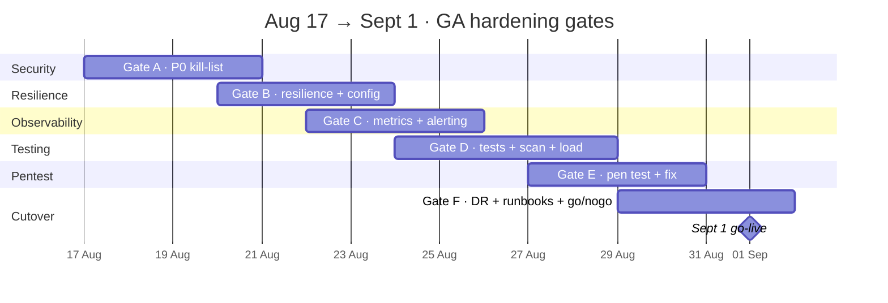

# Godspeed → Production-Ready (GA) · 15-Day Plan

**Window:** Mon Aug 17 → Mon Sept 1, 2026
**Bar:** Full public **GA** production readiness — *except* controls blocked on the company being a
legal entity (tagged `[ENTITY]`), which stay as clean, explicitly-flagged mocks/sandbox.
**Capacity:** ~3 devs (Sid / Yash / Agniva) + AI assist, **interleaving** hardening with the
on-the-go changes ops keeps requesting (tracked in [`CHANGE-REQUESTS.md`](./CHANGE-REQUESTS.md)).
**Near-term event:** Sept 1 DEL↔BOM pilot (real parcels). The pilot is the deadline; the bar is GA.

> This is a living plan. Dates are gate windows, not rigid sprints — a gate closes when its **exit
> criteria** are met. Nothing in Gate A is negotiable before a real user touches production.

---

## 1. Context

Godspeed (M1–M11) passed its internal presentation. Two workstreams now run in parallel:

1. **Get to GA** — real security, resilience, observability, alerting, testing, load + pen testing,
   DR, and a genuine `prod` profile. Today the platform is *demo/staging-grade*, not prod-grade.
2. **Absorb continuous change** — ops/internal stakeholders will keep requesting features round
   after round. Those are logged and sized in [`CHANGE-REQUESTS.md`](./CHANGE-REQUESTS.md) and
   interleaved here; hardening does **not** pause for features, and vice-versa.

The **only** accepted GA exceptions are controls that legally require the company to exist —
DLT SMS registration, Razorpay live KYC, GHA/AWB partner credentials, a Google Play org account,
a company domain/WAF. These are tracked in §5 and stay as **loudly-flagged** sandbox mocks that
**cannot silently masquerade as live**.

---

## 2. The Delta (evidence-backed)

Severity: **P0** = forge/expose risk, fix before any real user · **P1** = GA-required ·
**P2** = GA depth (load / pen / DR).

| # | Finding | Verdict | Sev | Evidence |
|---|---------|:-------:|:---:|----------|
| 1 | Committed, well-known **JWT signing key**, no forced override | broken | **P0** | `app/src/main/resources/application.properties:41` — `jwt.secret=change-me-...`, no `${JWT_SECRET}` placeholder; if env unset, **admin JWTs are forgeable** |
| 2 | **No `prod` profile** → deploy runs `staging` → all `@Profile("!prod")` mock/dev endpoints LIVE | broken | **P0** | `render.yaml` `SPRING_PROFILES_ACTIVE=staging`; `MockPaymentController`, `MockWalletController`, `DevOtpController`, `StubEtaAdapter`, `GridSeeder` all active in the deployed env |
| 3 | **Console authz + city-scoping gap** (hub/routing/grid/airline = authenticated-only) | broken | **P0** | [`AUTHZ-CITY-SCOPING-GAP.md`](./AUTHZ-CITY-SCOPING-GAP.md); only `StationDispatchController` + auth `DaController` enforce role/city; any logged-in user can `POST /hub/{hubId}/receive` or flip `PUT /routing/fleet/{cityId}` for **any** city |
| 4 | **No rate limiting** anywhere (login/OTP/register/API-key open to brute force) | missing | **P0** | no bucket4j / resilience4j `RateLimiter` / gateway; only business-logic OTP resend caps |
| 5 | **OSRM + external RestTemplate**: no timeouts, no circuit breaker | partial | **P0** | `routing/.../OsrmConfig.java` `new RestTemplate()` (infinite timeout); same pattern in grid, dispatch — a hung OSRM exhausts the thread pool |
| 6 | **Metrics/observability**: logging good, **no metrics/actuator, no tracing** | partial | **P1** | JSON logging + Axiom drain + correlation IDs exist; actuator deliberately excluded; no Prometheus / health-dependency signal |
| 7 | **No ops alerting** (error rate, health fail, DLQ growth, latency) | missing | **P1** | DLQ topology exists (`common/.../RabbitStreamSupport`), but no PagerDuty/Slack/Sentry/uptime wiring |
| 8 | **Security headers missing**; CORS origin fully open | partial | **P1** | `auth/.../SecurityConfig.java` `allowedOriginPatterns("*")`; no CSP/HSTS/X-Frame-Options/X-Content-Type-Options/Referrer-Policy |
| 9 | **Circuit breakers only in `orders`** (booking path); rest unprotected | partial | **P1** | `orders/.../config/ResilienceConfig.java` covers serviceability/pricing/payment; nothing on airline (AeroDataBox/GHA), SMS, KYC, OSRM |
| 10 | **Exception-handler coverage patchy**; `GlobalExceptionHandler` bean clash | partial | **P1** | handlers in orders/auth/pricing/hub only; `application.properties` `allow-bean-definition-overriding=true` masks a name clash (last-one-wins may drop an advice) |
| 11 | **JWT 8h, no refresh/revocation**; API-key writes DB every request | partial | **P1** | `auth/.../JwtServiceImpl` 8h TTL; `auth/.../JwtAuthenticationFilter` saves `lastUsedAt` on every API-key request |
| 12 | **Flyway `validate-on-migrate=false`**; HikariCP untuned | partial | **P1** | `application.properties`; no `spring.datasource.hikari.*`; parallel bulk-pricing pool (8 threads) vs default 10 conns on shared Render Postgres |
| 13 | **Dormant `autoStartup=false` consumers** can silently DLQ-fill | partial | **P1** | `sla/.../SlaFlightEventsConsumer`, hub `ShipmentStateConsumer` |
| 14 | **Testing**: unit/slice ok in some modules; Testcontainers declared-unused; e2e skipped in CI; **no load test, no pen test, no FE tests** | partial | **P2** | dispatch/grid/orders/auth solid; sla/pricing/shuttle thin; `app`/`exceptions` = 0; `ci.yml` runs `-DexcludedGroups=e2e` |
| 15 | **No DR/backup drill**, no runbooks, no on-call/incident process | missing | **P2** | not in-repo; Render-managed backups unverified |
| 16 | **Scan flows** never physically tested end-to-end as a checklist | gap | **P2** | camera-based scan exists (`oneday-driver-app/.../BarcodeScanner.tsx`); no documented full-chain scan pass |

**Keep (already good):** structured JSON logging + Axiom drain + correlation IDs (`RequestIdFilter`,
`common/.../AuditLog`, `RabbitConsumerMdcAspect`); robust idempotency in orders (`IdempotencyFilter`
— SHA-256 body fingerprint, 24h TTL, replay); DLQ topology + ADMIN replay tooling; Flyway-owned
schema; `open-in-view=false`; batch-insert tuning; gitignored `.env` with only placeholder secrets;
CI (build + CodeQL + Trivy CVE + gitleaks).

---

## 3. Definition of "Prod-Ready" (GA exit checklist)

Derived from the SRE Production Readiness Review dimensions + the Spring-Boot 2025 checklist
(sources in §7). Each line is a **go/no-go gate**; `[ENTITY]` items in §5 are the only accepted
exceptions.

- **Ownership** — every service/module has a named owner + on-call; escalation matrix exists.
- **Reliability / SLO** — SLOs defined (availability, p99 latency, on-time %); error budget agreed.
- **Observability** — metrics (Four Golden Signals), tracing, structured logs, dashboards; every
  request and parcel traceable end to end.
- **Security / Privacy** — no forgeable tokens, no live mocks, every endpoint role + tenant scoped,
  rate-limited, security headers, secrets from env only, dependency + container CVE clean.
- **Capacity** — load-tested to target GA scale with headroom; DB pool / broker / OSRM ceilings
  known; autoscaling/pool sizes set from data.
- **Recovery / DR** — backups verified by a restore drill; RPO/RTO defined; data + broker recovery
  documented.
- **Rollout / Rollback** — health-gated deploy, tested rollback, prod migration dry-run.
- **Incident response** — runbooks + alerting so a broken prod pages someone within minutes.

---

## 4. The Plan — Six Gates

Gates overlap deliberately (different owners run in parallel). Feature CRs from
[`CHANGE-REQUESTS.md`](./CHANGE-REQUESTS.md) slot into the same days by priority — CR-001, CR-002,
CR-004 are the high-priority ones to interleave.

### Gate A — P0 security kill-list · Aug 17–20
*Nothing real ships until every item here is closed.*

- **A1 `[auth]` JWT secret.** Require `JWT_SECRET` from env; **fail boot** if absent, weak, or equal
  to the committed default; rotate the leaked key; delete the committed literal. (`application.properties:41`)
- **A2 `[app]` Real `prod` profile.** Add `application-prod.yml` + a `prod` profile; move every
  mock/dev bean behind `@Profile("dev|staging")` or an explicit `godspeed.mocks.<x>.enabled` flag
  with a **boot guard that refuses to start in prod** if a mock is enabled. Flip `render.yaml` →
  `SPRING_PROFILES_ACTIVE=prod`. Verify `MockPayment/MockWallet/DevOtp/StubEta/GridSeeder` are dark.
- **A3 `[hub/routing/grid/airline]` Authz + city scoping.** Apply the `StationDispatchController`
  pattern — per-module `Authz` helper, `requireRole(...)`, and **city/hub scoping** against
  `User.cityId` (ADMIN bypass). Promote coarse rules into `SecurityConfig` `requestMatchers` per
  path prefix so a missing per-controller check can't silently expose an endpoint. Closes
  [`AUTHZ-CITY-SCOPING-GAP.md`](./AUTHZ-CITY-SCOPING-GAP.md).
- **A4 `[auth/common]` Rate limiting.** bucket4j (Redis/Upstash-backed for the multi-instance case)
  or resilience4j `RateLimiter` as a servlet filter — strict on `/auth/login`, `/auth/otp/request`,
  `/auth/register`, and `X-Api-Key`; global per-IP + per-user ceilings; `429` + `Retry-After`.
- **A5 `[routing/grid/dispatch]` Bound external calls.** Replace `new RestTemplate()` with a shared
  bean that has connect/read timeouts + resilience4j CircuitBreaker + bounded retry (OSRM first).

**Exit A:** no forgeable tokens · no live mocks in prod · every back-office endpoint role + city
scoped · brute-force capped · no unbounded external call.

### Gate B — Resilience, config, data safety · Aug 20–23

- **B1** Extend circuit breakers/timeouts to airline (AeroDataBox/GHA), SMS, KYC, Razorpay SDK.
- **B2** Fix the `GlobalExceptionHandler` bean clash; add `@RestControllerAdvice` to every module
  missing one (dispatch, routing, grid, airline, shuttle, sla, barcode); one consistent error envelope.
- **B3 `[auth]`** Short-lived access token + refresh-token rotation + revocation list; cut the 8h TTL.
- **B4** Make API-key `lastUsedAt` async/throttled (no DB write per request).
- **B5 `[data]`** Set Flyway `validate-on-migrate=true` after reconciling drifted grid migrations;
  size HikariCP explicitly against the bulk-pricing pool + Render Postgres connection limit.
- **B6** Reconcile `autoStartup=false` consumers with their producers so no queue silently DLQs.

**Exit B:** all external calls fault-isolated · uniform errors · safe token lifecycle · migrations
validated · DB pool sized · no dormant-consumer DLQ risk.

### Gate C — Observability + alerting · Aug 22–25

- **C1 `[app]`** Actuator on a **separate, secured management port**; Micrometer + Prometheus
  registry; **deep health** (DB + broker readiness); liveness/readiness split; keep the Axiom log
  drain and wire it (Render → Axiom).
- **C2** Metrics scrape → Grafana Cloud / Prometheus; dashboards on the **Four Golden Signals**
  (latency, traffic, errors, saturation) + queue depth + DLQ + booking/payment funnel + on-time %.
- **C3** Distributed tracing: Micrometer Tracing + OTel exporter (correlation propagation already
  exists via `RabbitConsumerMdcAspect`).
- **C4** Error tracking: Sentry (or equivalent) across backend + web + driver app.
- **C5 Alerting (core ask).** Wire Alertmanager / Better Stack / PagerDuty on: health-fail,
  error-rate spike, p99 latency, **DLQ growth**, broker disconnect, payment-failure rate; external
  uptime monitor on prod URLs. **Every threshold configurable via config/env.**

**Exit C:** a broken prod surfaces an alert within minutes · every request/parcel traceable end to
end · dashboards live.

### Gate D — Testing depth + scan-flow field pass + load test · Aug 24–28

- **D1** CI runs the e2e suites (add a Postgres service / real Testcontainers — deps already
  present); raise coverage on thin modules (sla, pricing, shuttle) and the zero modules
  (`exceptions`, app-level wiring).
- **D2** Frontend tests: Playwright E2E for the 6 web consoles' critical flows; vitest/RTL
  components; Maestro for the driver app (auth → task → OTP → scan → arrive → GPS).
- **D3 Scan-flow field checklist.** Physically run **every** scan family end to end on a real phone
  camera, with a documented pass/fail sheet: label mint · pickup · `HUB_ORIGIN_IN/OUT` ·
  `GHA_ACCEPTANCE` · `VAN_LOAD/UNLOAD` · `DEST_SHUTTLE_IN` · `HUB_DEST_IN/OUT` · `HUB_COLLECT` ·
  `DELIVERED`. Include the UPI/Wi-Fi/URL-QR false-read guard (`oneday-driver-app/src/scan.ts`).
- **D4 Load test.** k6/Gatling against staging at target GA scale — booking, quote, payment,
  tracking, scan ingest, telemetry. Find the DB-pool / OSRM / broker ceiling; record a **capacity
  plan** and set pool/autoscale sizes from the results.

**Exit D:** green e2e in CI · FE + mobile E2E green · scan checklist 100% pass · load test hits
target throughput with headroom + documented capacity plan.

### Gate E — Pen test + fix · Aug 27–30

- **E1** Automated: OWASP ZAP baseline + full scan against staging; Trivy/CodeQL (already in CI) at
  zero criticals.
- **E2** Manual OWASP Top 10 / ASVS pass — focus: auth, authz/city-scoping (regression on A3),
  **IDOR** on `{hubId}`/`{cityId}`/`{ref}` path params, idempotency bypass, rate-limit bypass,
  payment/refund tampering (HMAC), JWT tampering.
- **E3** Triage → fix P0/P1 findings → re-test.

**Exit E:** no open high/critical · documented residual-risk register.

### Gate F — DR, runbooks, cutover, Go/No-Go · Aug 29 – Sept 1

- **F1 `[data]`** Verify Render Postgres automated backups; run a **restore drill**; define RPO/RTO;
  document broker/data recovery.
- **F2** Runbooks: deploy, rollback, incident response, on-call rotation, DLQ replay (tool exists),
  common-failure playbooks; ownership + escalation matrix.
- **F3** Prod cutover: prod env vars/secrets set (real `JWT_SECRET`, DB, broker); prod migration
  dry-run; health-gated / blue-green rollout with **tested rollback**; security headers + tightened
  CORS live; company domain/SSL where available.
- **F4** **Go/No-Go review** against the §3 GA checklist.

**Exit F:** signed-off go/no-go · prod live, or a dated + owned residual list.

---

## 5. Company-formation / external blockers `[ENTITY]`

These cannot be fully cleared until the company is a legal entity. They stay as **clean,
boot-flagged sandbox/mocks** and are tracked here, **not** counted against the GA bar. Requirement:
each mock logs LOUDLY and **refuses prod** unless an explicit `godspeed.mocks.<x>.enabled=true`
override is set — a mock must never masquerade as live.

| Item | Blocked on | Interim state | Flips to live when |
|------|-----------|---------------|--------------------|
| **DLT registration** (transactional SMS) | Registered entity + TRAI DLT | Msg91/SendGrid sandbox; OTP via `DevOtpController` in non-prod | DLT sender/template IDs issued |
| **Razorpay live KYC + keys** | Company KYC | `rzp_test_*` mock gateway (`RazorpayProperties.live=false`) | Live keys via env `RAZORPAY_*` |
| **GHA / AWB credentials** | Airline partner + entity | `StubGhaAdapter` / sandbox | Partner sandbox → prod creds |
| **Google Play org account** | Company account | Internal-testing track / sideload | Play org + signing key |
| **Company domain + SSL + WAF** | Domain purchase | Render/Vercel default domains | Domain + edge WAF + HSTS |
| **GST / legal invoicing IDs** | Registration | Placeholder invoice fields | GSTIN issued |

---

## 6. Sept 1 Go/No-Go (headline)

- Gate A + B + C **fully closed**.
- Gate D: scan checklist 100% + load test at target scale passed.
- Gate E: no open high/critical.
- Gate F: restore drill + runbooks + tested rollback done.
- `[ENTITY]` items either live or consciously accepted as sandbox **with sign-off**.

---

## 7. Verification & Sources

**Verification**
- Backend: `mvn clean install` green incl. e2e (with DB); new tests per hardened module.
- Events: `rabbitmqadmin -N cloudamqp` — every live queue `consumers≥1`, `*.dlq` empty.
- Security: ZAP scan clean; forged-JWT rejected; unauthorized cross-city call → 403; `429` on
  brute-force; no mock endpoint reachable in prod.
- Observability: kill a dependency → alert fires; trace a parcel end to end.
- Load: k6 report meets target throughput + p99 with headroom.
- DR: restore a backup to a scratch DB and boot against it.

**Sources**
- SRE Production Readiness Review — [SRE School PRR guide](https://sreschool.com/blog/production-readiness-review-prr/),
  [GitLab handbook PRR](https://handbook.gitlab.com/handbook/engineering/infrastructure/production/readiness),
  [Cortex](https://www.cortex.io/post/how-to-create-a-great-production-readiness-checklist),
  [getDX](https://getdx.com/blog/production-readiness-checklist/) — ownership, SLO/observability,
  capacity, recovery, rollback.
- Spring Boot 2025 production-ready + security checklists — HTTPS/JWT, keep actuator off the public
  surface, rate limiting + circuit breakers/timeouts via resilience4j, liveness/readiness probes,
  secret rotation, security headers.

---

*Godspeed · GA prod-readiness · Aug 17 → Sept 1, 2026 · living document.*
