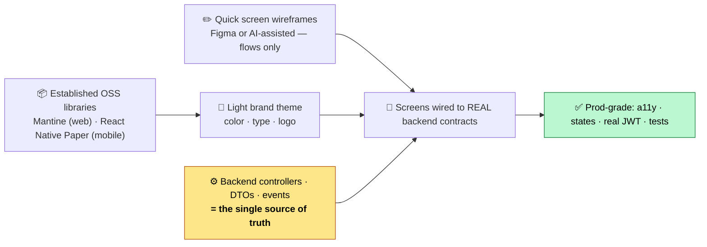
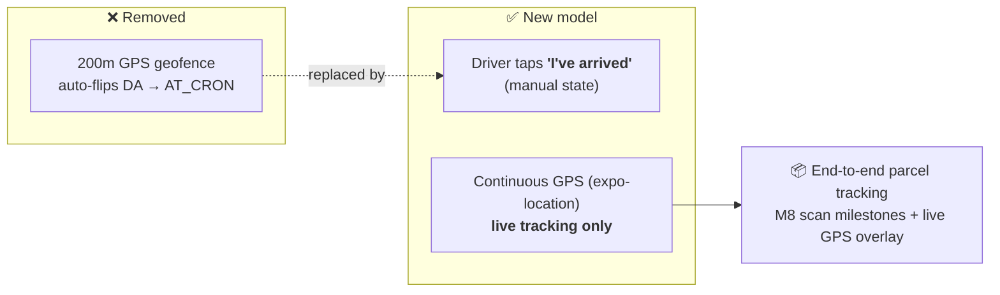
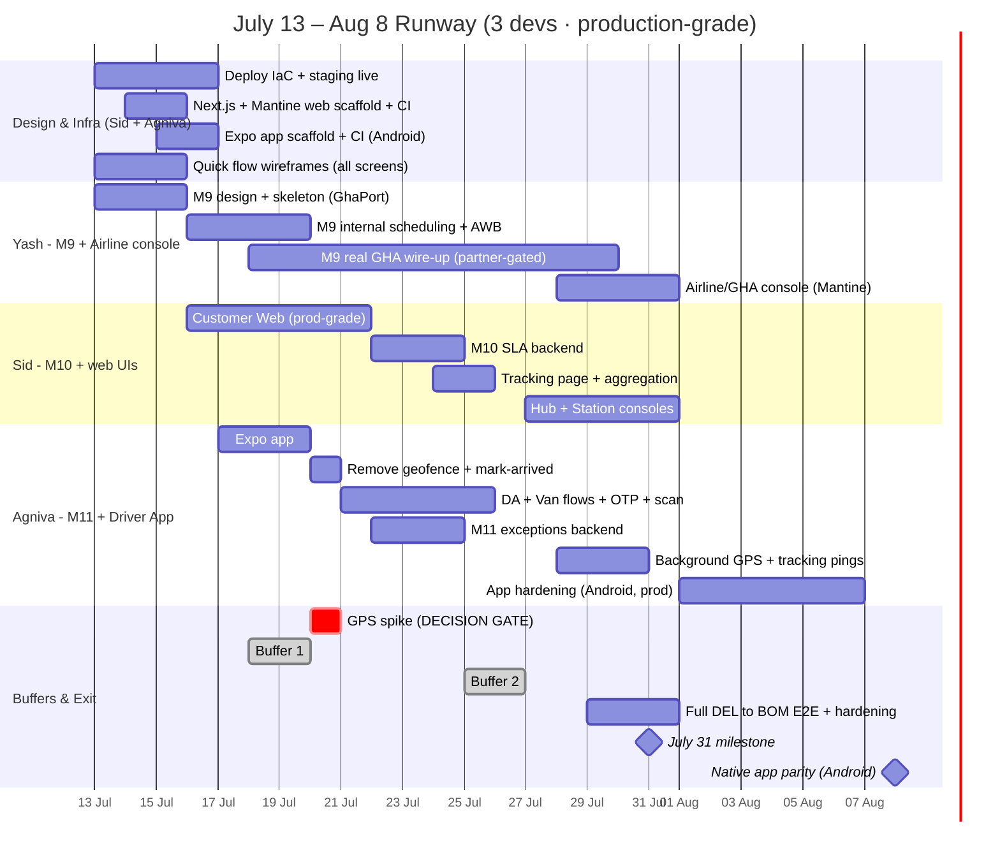
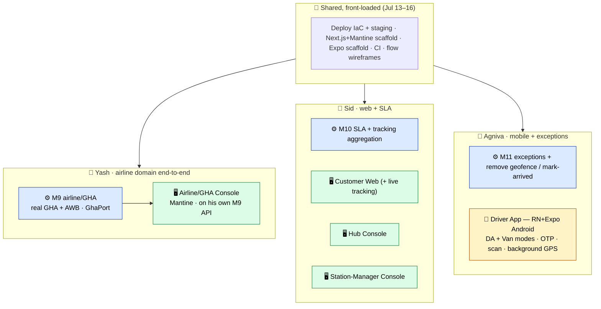
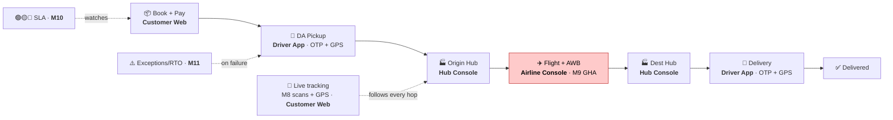

# 🚀 One-Day Delivery — September 1 Pilot Runway

### Detailed Day-Wise Plan · **Mon Jul 13 → Fri Jul 31, 2026** (+ mobile extension to ~Aug 8)

**Pilot lane:** Delhi (DEL) ↔ Mumbai (BOM) · real parcels · low volume
**Team (3):** **Yash** → M9 airline/GHA · **Sid** → M10 + web UIs · **Agniva** → M11 + native mobile app
**Every deliverable is production-grade.** Web on **Mantine**, mobile on **React Native + Expo (Android-first)**. **Zero demo reuse.**

`Off-the-shelf design → production UI → on staging → one real parcel tracked end-to-end`

---

## 📌 Context

We committed to a **pilot on September 1, 2026** — the *entire* product: backend **M1–M11**, all client UIs, testing to depth, and production ("broad") environments.

This document details the **first 2.5 weeks (Jul 13 → Jul 31)** day-by-day, with **named ownership**. The **native DA/Van app** is a bigger build than a web app, so its full parity extends **~5–8 days past Jul 31** (agreed extension) into an **early-August mobile window** — the July milestone lands a functional installable Android build.

> [!IMPORTANT]
> **Hard rules for this runway:**
> 1. **Production-grade only** — even for the pilot. Customer-facing UX is **top-notch**.
> 2. **No demo-branch reuse** — we don't carry over a single demo UI component. But we **do** build on **established open-source libraries** (Mantine, Expo, React Native Paper) — no bespoke/custom design system. Every screen is wired to the **real backend contracts** already in this repo (controllers / DTOs / events), never demo endpoints/orchestrators.
> 3. **Native Android app** for DA/Van drivers — **React Native + Expo**, installable, with reliable **background GPS** (`expo-location`). This is required because live tracking needs location while the app is backgrounded / screen-locked.
> 4. **Tracking everywhere is a requirement** — every parcel is trackable end-to-end (scan milestones + live GPS).

---

## 🎯 What changed in this revision

| Change | Before | Now |
|:---|:---|:---|
| **DA / Van apps** | *(PWA idea, dropped)* | 🔄 **Native React Native + Expo, Android-first** (installable, background GPS) |
| **Cron "arrived" check** | Auto **200m GPS geofence** flips DA → `AT_CRON` | 🔄 **Removed.** Driver **taps "I've arrived"** manually. GPS no longer gates state |
| **GPS purpose** | Geofence + display | 🔄 **Live tracking only** — end-to-end parcel tracking (scans + GPS overlay) |
| **Design** | Bespoke Figma design system + tokens + custom component library | 🔄 **Off-the-shelf: Mantine (web) + React Native Paper (mobile)**, lightly themed; quick flow wireframes only (Figma or AI-assisted — whatever's fastest to acceptable prod) |
| **Timeline** | All in Jul 13–31 | 🔄 **Web + backend by Jul 31; native app parity ~Aug 8** |

> [!NOTE]
> **Honest bottom line.** By **Jul 31**: web (Customer + 3 ops consoles) and all backend (M9 in progress, M10/M11 built) are on staging at production quality, and a real DEL↔BOM parcel completes the chain end-to-end. The **native Android app** lands a **functional installable build** (login, task feed, OTP, scan, "I've arrived," background GPS) by Jul 31, with **full production polish/parity in the Aug 1–8 mobile window**. **iOS ships post-pilot.**

---

## 🧭 Decisions baked in (all confirmed)

| Decision | Choice |
|:---|:---|
| **Web stack** | **Next.js (App Router) + TypeScript + Mantine** (established OSS component library, lightly themed — *no* custom library) |
| **Mobile stack** | **React Native + Expo + React Native Paper**, **Android-first**; background GPS via `expo-location` |
| **Design approach** | Off-the-shelf components + a light brand theme; quick screen wireframes (Figma **or** AI-assisted) — fastest path to acceptable prod design |
| **Web testing** | vitest + Testing Library (component) + **Playwright** (E2E) |
| **Mobile testing** | Jest (unit) + **Maestro** (mobile E2E flows) |

---

## 🎨 Design Approach — Off-the-Shelf, Zero Demo Reuse

> **No bespoke design system, no custom component library.** We consume Mantine's / React Native Paper's components as-is, apply a light theme, and spend our design effort on **flows and content**, not on rebuilding buttons. Demo-branch UI is not referenced at all.

---

## 🔍 Ground Truth — Where We Actually Stand

> Source of truth is the backend code **in this working tree**. Demo branches are ignored entirely.

### Backend modules

| Module | Status | Notes |
|:------:|:------:|:------|
| `common` · **M1** auth · **M2** pricing · **M3** grid · **M4** orders · **M5** dispatch · **M6** routing · **M7** hub · **M8** barcode | ✅ **Built** | Real, substantial — our integration targets |
| **M9** airline | 🔴 **EMPTY** | pom-only — **real GHA/AWB to build (Yash)** |
| **M10** sla | 🔴 **EMPTY** | pom-only — **build (Sid)** |
| **M11** exceptions | 🔴 **EMPTY** | pom-only — **build (Agniva)** |

### Client UIs — all fresh (no demo reuse)

| UI | Platform | Owner |
|:---|:---|:---|
| **Customer Web** (incl. live-tracking page) | Next.js + Mantine | 🆕 **Sid** |
| **Hub Console** | Next.js + Mantine | 🆕 **Sid** |
| **Station-Manager Console** | Next.js + Mantine | 🆕 **Sid** |
| **Airline / GHA Console** | Next.js + Mantine | 🆕 **Yash** (owns M9 end-to-end) |
| **Driver App** (DA + Van modes) | **React Native + Expo (Android)** | 🆕 **Agniva** |

### Platform gaps (still real)

| Area | Reality |
|:---|:---|
| Deploy IaC | 🔴 No `Dockerfile` / `render.yaml` / `vercel.json` |
| Spring profiles | 🔴 No `application-prod` / `-staging` |
| Web + mobile apps | 🔴 New from scratch — nothing to reuse |
| Device GPS | 🔴 100% simulated today — real `expo-location` to build |
| **Cron geofence** | ⚠️ **200m auto-check exists and must be removed** (`DaStatusServiceImpl.updateGps`) |
| Snap-to-road | 🔴 None (OSRM used only for the travel-time matrix) |
| CI | ✅ 5 backend workflows; **web + mobile CI to add** |

---

## 📍 GPS & Tracking — the new model

- **State (cron/arrival):** driver-declared via a **"Mark arrived"** action — backend removes the geofence auto-transition and exposes a manual endpoint. **GPS accuracy no longer affects state.**
- **Tracking (requirement):** every parcel is trackable across the whole chain — **M8 scan-ledger milestones** (pickup → origin-hub in/out → flight → dest-hub in/out → delivery) plus a **live GPS overlay** from the Driver App during the mobile legs, surfaced on the **Customer Web tracking page** and to ops.
- **Jul 20 GPS spike (reframed):** on real Android phones via Expo — is raw GPS clean enough for the **tracking map**? Accurate → OSRM display; noisy → Map My India map-matching (reserved in buffers). *This is now a display-quality decision, not a state decision.*

---

## 🔌 Backend Contracts = the UI's Source of Truth

| UI (owner) | Real backend surface |
|:---|:---|
| **Customer Web** (Sid) | M4 `B2c/B2bShipmentController` (+cancellation), M2 `/api/v1/pricing/quote`, `PaymentController` (Razorpay), M1 auth, **Map My India** address search, **tracking** = M8 ledger + `van_live_status` |
| **Driver App — DA mode** (Agniva) | `PickupOtpController`, M5 DA endpoints, delivery OTP, **new "mark arrived" endpoint**, `expo-location` → telemetry |
| **Driver App — Van mode** (Agniva) | `VanDriverController` (manifest · load-scan · stops/confirm · return-scan), `VanTelemetryController`, background GPS |
| **Hub Console** (Sid) | M7 controllers (bags · load · `parcels/{id}/resolve` · `reassign-flight`) |
| **Station-Mgr Console** (Sid) | M4 orders (city-scoped), M5 dispatch board, M10 SLA, M11 exceptions |
| **Airline/GHA Console** (Yash) | **M9 endpoints (Yash builds)** — flight schedule · hub assignment · AWB status |

---

## 🗺️ Timeline

---

## 👥 Team Ownership

| Dev | Backend | Client UI |
|:---|:---|:---|
| **Yash** | **M9** airline/GHA (real GHA + AWB, whole runway) | **Airline/GHA Console** (Mantine) |
| **Sid** | **M10** SLA + tracking aggregation | **Customer Web** (+ tracking) · **Hub** · **Station-Manager** consoles (Mantine) |
| **Agniva** | **M11** exceptions + remove geofence / mark-arrived | **Driver App** (RN+Expo, Android) — DA + Van modes, OTP, scan, background GPS |

> **Shared, front-loaded (Jul 13–16):** Sid + Agniva stand up **deploy IaC + staging**, the **Next.js+Mantine** and **Expo** scaffolds + CI, and quick **flow wireframes**. Yash starts M9.
> **Yash owns the airline domain end-to-end** — the M9 backend *and* the Airline/GHA console that sits on it (built after his M9 endpoints exist).

### 🔴 Day-1 business actions (external lead time)

| | Action | Owner | Gates |
|:--:|:---|:---|:---|
| **A** | Request **GHA sandbox API access + AWB stock/credentials** | Yash | M9 real wire-up |
| **B** | Create **Map My India** account + REST/JS SDK keys | Sid | Customer-Web address search |
| **C** | Obtain **Razorpay live keys** (env only) | Sid | Live payments |
| **D** | **Google Play** developer account + Android signing key | Agniva | App distribution |
| **E** | Confirm **DEL↔BOM lane** data (grids, rate cards, flights) | Yash | E2E chain |

---

## ⏱️ Buffer Policy

| Buffer | Dates | Purpose |
|:---|:---|:---|
| **Buffer 1** | Sat–Sun **Jul 18–19** | Catch up on scaffolds/infra |
| **Buffer 2** | Sat–Sun **Jul 25–26** | Absorb GHA slip / GPS fallback / UI overrun |
| **Buffer 3** | Thu–Fri **Jul 30–31** | Integration hardening + exit gate |
| **Mobile extension** | **Aug 1–8** | Native Android app to full production parity |

> Map My India *tracking* fallback (if the GPS spike fails) is pre-reserved in Buffer 2/3.

---

## 📅 Day-by-Day

### Window 1 · Jul 13–20 — Scaffolds, deploy foundation, core builds

**🟦 Mon Jul 13 — Infra, scaffolds, M9 kickoff, procurement**
- **Sid + Agniva:** Deploy IaC (`Dockerfile` JDK 21, `application-staging/-prod.yml`); start quick **flow wireframes** for all screens.
- **Yash:** M9 real-GHA design note (flight sync, hub assignment, **AWB issuance**, `GhaPort` contract).
- **All:** Fire Day-1 actions **A–E**.
- **✅ Exit:** Docker builds locally · GHA/Map My India/Play requests submitted.

**🟦 Tue Jul 14 — Web scaffold, deploy pipeline, M9 skeleton**
- **Sid:** **Next.js + Mantine** app scaffold + light theme + web CI + Vercel preview.
- **Agniva:** `render.yaml` + `vercel.json`; **first backend deploy to staging**.
- **Yash:** M9 skeleton — entities (Flight, FlightAssignment, Awb), Flyway `V9_1`, `GhaPort` + `StubGhaAdapter`.
- **✅ Exit:** Web app boots on Vercel with Mantine · staging backend live · M9 compiles.

**🟦 Wed Jul 15 — Expo app scaffold, M9 internal**
- **Agniva:** **React Native + Expo** app scaffold (Android), React Native Paper, mobile CI, dev-build APK.
- **Sid:** Customer Web shell — routes, auth, layout on Mantine.
- **Yash:** M9 internal flight scheduling + **hub assignment** (emits events M7 consumes).
- **✅ Exit:** Expo dev APK installs on a real Android phone · M9 schedules a flight internally.

**🟦 Thu Jul 16 — Customer Web build, M9 AWB**
- **Sid:** **Customer Web** — booking on M4/M2 contracts, **Map My India** address search, Razorpay (test), real M1 JWT.
- **Agniva:** Expo app — auth + DA/Van task feed skeleton on real endpoints.
- **Yash:** M9 **AWB issuance** + GHA client start (sandbox or contract behind `GhaPort`).
- **✅ Exit:** Customer Web books → quotes → pays (test) on staging · app shows a live task list.

**🟥 Fri Jul 17 — Driver App flows + prod auth**
- **Agniva:** Driver App — pickup/delivery OTP, barcode **scan** (Expo camera), on real controllers.
- **Sid:** Validate **real JWT auth path** in prod/staging (no demo filter); rollback doc.
- **Yash:** M9 GHA integration continues.
- **✅ Exit:** A DA can complete an OTP pickup from the Android app on staging.

**⬜ Sat–Sun Jul 18–19 — Buffer 1**

**🟦 Mon Jul 20 — 🚦 GPS spike · remove geofence · M10 start**
- **Agniva:** **GPS field spike** on real Android phones (Expo background location) → decision gate (display quality only). **Remove the 200m geofence** in `DaStatusServiceImpl`; add the **"Mark arrived"** manual endpoint + app button.
- **Sid:** **M10 SLA** from zero — per-leg GREEN/AMBER/RED, consumer on `oneday.shipments.events` + scans, Flyway `V10_1`.
- **✅ Exit:** GPS decision recorded · geofence gone, manual arrival works · M10 computes leg SLA.

### Window 2 · Jul 20–31 — Driver flows, M10/M11, tracking, integration

**🟦 Tue Jul 21 — Van mode + M10 breach**
- **Agniva:** Driver App **Van mode** — manifest load-scan, per-stop confirm, return-scan.
- **Sid:** M10 breach detection + escalation events (feeds M11); implement GPS-gate outcome (OSRM snap-to-road or begin map-matching).
- **✅ Exit:** Van loop runs from the app on staging · SLA transitions visible.

**🟦 Wed Jul 22 — Customer Web polish + M11 start**
- **Sid:** Customer Web to **production quality** — states, a11y (WCAG AA), responsive, component tests.
- **Agniva:** **M11 exceptions** from zero — failure capture, call-center queue, RTO, Flyway `V11_1`.
- **✅ Exit:** Customer Web passes prod-grade checklist · a pickup-failure raises an M11 exception.

**🟦 Thu Jul 23 — Notifications + M11 RTO**
- **Agniva:** `NotificationPort` real SMS (OTP delivery, alerts); M11 RTO attempt-count workflow.
- **Sid:** Start **Hub Console** on M7 contracts.
- **✅ Exit:** OTP SMS delivered to a real phone · Hub Console renders live bags.

**🟦 Fri Jul 24 — Tracking + M9 GHA + full-chain dry run**
- **Sid:** **End-to-end tracking** — aggregation endpoint (M8 milestones + `van_live_status`) + **Customer Web tracking page** (timeline + live map).
- **Yash:** Complete real GHA/AWB against sandbox *if creds live*; else `GhaPort` sim + log blocker.
- **All:** **Full DEL↔BOM chain** on staging via **production endpoints**: book → pickup (GPS) → hub → flight/AWB → hub → delivery → SLA → exception path.
- **✅ Exit:** A real parcel completes the chain and is **trackable end-to-end** on staging.

**⬜ Sat–Sun Jul 25–26 — Buffer 2**

**🟦 Mon Jul 27 — Ops consoles + integration hardening**
- **Sid:** **Hub Console** wrap-up + **Station-Manager Console** (orders/dispatch/SLA/exceptions).
- **Agniva:** Driver App polish + start **background GPS tracking pings**.
- **Yash:** Verify all `@RabbitListener` bindings (no DLQ) on staging CloudAMQP; scaffold the **Airline/GHA Console** on his M9 endpoints.
- **✅ Exit:** All web consoles reachable · every live queue `consumers=1`, `*.dlq` empty.

**🟦 Tue Jul 28 — Payments live + pilot data + background GPS**
- **Sid:** Razorpay **live** keys (env only); Customer Web live-payment smoke.
- **Agniva:** Background GPS pings power the live tracking map.
- **Yash:** Build **Airline/GHA Console** (flight schedule, hub assignment, AWB status) on his M9 endpoints; seed/verify DEL↔BOM data; prod migration dry-run.
- **✅ Exit:** A live-mode payment books a real shipment · live GPS shows on the tracking map · Airline console shows a scheduled flight + AWB.

**🟦 Wed Jul 29 — Regression + E2E**
- **All:** Backend `mvn clean install` green + new M9/M10/M11 tests; **Playwright** (web) + **Maestro** (app) E2E; fix regressions.
- **✅ Exit:** All suites green · staging stable through a full run-day.

**🟩 Thu–Fri Jul 30–31 — Buffer 3: integration hardening & exit gate**
- **All:** Soak the DEL↔BOM chain; polish Customer Web + tracking; triage the Aug bug/polish + mobile-parity list.
- **✅ Exit:** July 31 milestone below.

### Mobile Extension · Aug 1–8 — Native Android app to full parity

- **Agniva (+ pairing as needed):** Driver App to **production parity** — background-location reliability (Doze/battery), offline queueing of scans, error/retry UX, Play internal-testing track, Maestro E2E green, signed release build.
- **✅ Exit:** Installable, production-grade **Android** Driver App used for the pilot. *(iOS post-pilot.)*

---

## 🏁 July 31 Exit Criteria (production-grade)

- [ ] Staging live; real IaC (Docker + `render.yaml` + Vercel); prod profile + **real JWT auth** validated
- [ ] **Web (Mantine):** Customer Web at **production quality** with **end-to-end tracking page**; Hub / Station / Airline consoles functional (polish → Aug)
- [ ] **Driver App (RN+Expo, Android):** **functional installable build** — auth, DA + Van flows, OTP, scan, **"Mark arrived,"** background GPS *(full parity → Aug 8)*
- [ ] **Geofence removed**; manual arrival live; **GPS drives tracking only**
- [ ] **M9** internal + AWB working (real GHA if sandbox live, else `GhaPort` sim + tracked blocker)
- [ ] **M10** SLA + **M11** exceptions built, consuming events, surfaced in consoles
- [ ] **Map My India address** in Customer Web; **real device GPS** from the app; GPS display decision recorded
- [ ] OTP SMS delivering; Razorpay **live** payment smoke passes
- [ ] Full **Delhi↔Mumbai** chain completes end-to-end on staging via production endpoints, **trackable end-to-end**; DLQs empty
- [ ] CI green (backend + web + mobile)

---

## 🚚 The Pilot Chain (end-to-end + tracked)

---

## ⚠️ Top Risks & Mitigations

| Risk | Mitigation |
|:---|:---|
| **Native app is the new long pole** (background GPS, Doze, offline, Play release) | Extension window **Aug 1–8**; Jul 31 = functional build; Android-only for pilot; Expo modules do the heavy lifting; pair on it if it slips |
| **Sid carries 3 web UIs + M10 + tracking** | **Mantine off-the-shelf** makes web fast; Customer Web is the only fully-polished one by Jul 31, Hub/Station consoles functional then polished in Aug (Airline console moved to Yash) |
| **GHA external partner dependency** | Day-1 request; `GhaPort` + sim adapter so a delay slips only the real wire-up |
| **GPS quality unknown** | Jul 20 spike (display-only now that state is manual); map-matching fallback reserved in buffers |
| **Background location on Android** (battery/Doze killing pings) | `expo-location` background task + foreground service; validated in the Aug hardening window |
| **"Production-grade" scope creep** | Fixed per-screen prod-grade checklist = "done" |

---

## 🔭 Forward Look (to Sept 1)

| Window | Focus |
|:---|:---|
| **Aug 1–8** | **Native Android app → full production parity** (background GPS, offline, Play internal track) |
| **Aug 1–10** | M1–M11 integration testing; console polish; live-tracking hardening; GHA sandbox → real |
| **Aug 10–20** | All testing complete + fixes; two overflow days |
| **Aug 20–31** | Production cutover · prod data seed · monitoring/alerting · go/no-go |
| **🎉 Sept 1** | **Delhi↔Mumbai pilot go-live** (Android app; iOS follows) |

---

## ✅ Verification

| Layer | How |
|:---|:---|
| **Backend** | `mvn clean install` (e2e locally); each new M9/M10/M11 gets a unit + integration test |
| **Events** | `rabbitmqadmin -N oneday` peek-queue on `oneday.{shipments,da,cron,flight}.events` — non-empty `*.dlq` = contract break |
| **Web** | Per screen: prod-grade checklist + vitest/Testing Library + **Playwright** + Vercel preview |
| **Mobile** | Install the signed Android build on a real phone; **Maestro** E2E; validate **background GPS** with the screen locked |
| **End-to-end** | Real DEL↔BOM run via **production endpoints** on staging with the app's real GPS + real payment — **not** the demo orchestrator; parcel visible on the tracking page throughout |
| **GPS gate** | Jul 20 field spike (Expo, real Android) — OSRM-only vs. Map My India map-matching for the tracking map |

---

*One-Day Delivery · Sept 1 pilot runway · Jul 13–31 (+ mobile to ~Aug 8) · production-grade · Mantine + Expo · zero demo reuse*

