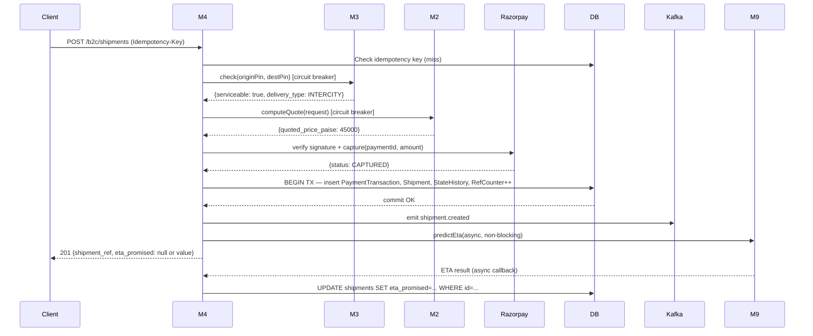
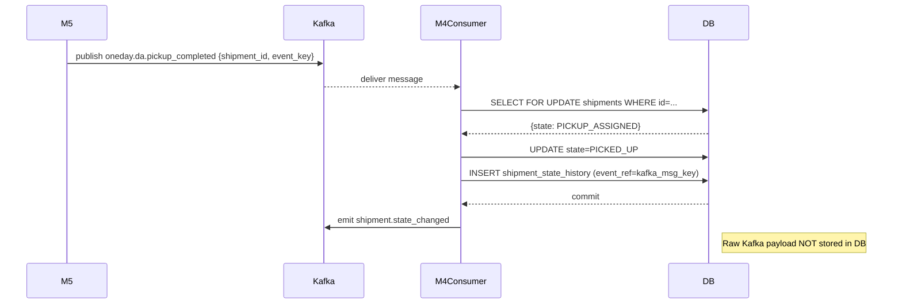

# M4 — Order Booking & Shipment Lifecycle: Design Document

| Field | Value |
|---|---|
| **Module** | M4 — Orders |
| **Version** | 0.3 |
| **Status** | Draft — pending ops sign-off on state machine |
| **Author** | Satvik |
| **Last updated** | 2026-05-11 |
| **Depends on** | M1 (auth/JWT), M2 (pricing), M3 (grid/serviceability), M8 (barcode/label) |
| **Consumed by** | M5 (dispatch), M6 (routing), M7 (hub), M9 (airline), M10 (SLA), M11 (exceptions) |
| **Related docs** | [MODULES.md](../MODULES.md) · [DECISIONS.md](DECISIONS.md) · [M8-BARCODE-DESIGN.md](M8-BARCODE-DESIGN.md) · [PRD-ONE-DAY-DELIVERY.md](../PRD-ONE-DAY-DELIVERY.md) |

---

## Table of Contents

1. [Purpose](#1-purpose)
2. [Industry Context](#2-industry-context)
3. [Scope](#3-scope)
4. [Key Design Decisions](#4-key-design-decisions)
5. [Domain Model](#5-domain-model)
6. [State Machine](#6-state-machine)
7. [API Design](#7-api-design)
8. [Service Layer](#8-service-layer)
9. [Kafka Event Schema](#9-kafka-event-schema)
10. [Database Schema](#10-database-schema)
11. [Payment Integration](#11-payment-integration)
12. [Notification Design](#12-notification-design)
13. [Observability](#13-observability)
14. [Configuration Reference](#14-configuration-reference)
15. [Failure Modes & Recovery](#15-failure-modes--recovery)
16. [Edge Cases](#16-edge-cases)
17. [Non-Functional Requirements](#17-non-functional-requirements)
18. [Interface Contracts](#18-interface-contracts)
19. [Open Decisions](#19-open-decisions)

---

## 1. Purpose

M4 is the operational core of the platform. It owns:

- The customer-facing booking API for **B2C**, **B2B**, and **C2C** shipments
- The canonical **shipment state machine** — single source of truth for every shipment's current state
- Coordination of **Razorpay payment** (B2C and C2C) and **credit invoicing** (B2B)
- **Notification dispatch** (SMS, Email, WhatsApp) on every state transition
- The public **tracking API** consumed by customers and external systems
- Delegation of serviceability (M3), pricing (M2), ETA (M9), and barcode registration (M8)

Every other module either feeds state into M4 via Kafka or reads shipment data from M4's internal API. M4 never calls M5–M11 directly — it emits events and reacts to theirs via Kafka consumers.

---

## 2. Industry Context

| Player | Model | Booking experience | State granularity | Payment |
|---|---|---|---|---|
| Delhivery | B2B-first, 3PL network | API + portal; weight reconciliation post-delivery | ~12 states, scan-driven | Credit + prepaid |
| BlueDart | B2B-first, own airline | AWB-based booking, portal | ~8 customer-visible states | Credit dominant |
| Shiprocket | B2C aggregator | Merchant-centric; multi-carrier | Varies by carrier | Prepaid, COD |
| FedEx India | B2B + B2C | Global standards; AWB | ~15 states including customs | Prepaid + credit |
| **1DD (ours)** | **B2B + B2C + C2C, own airline + DA** | **Single API; sub-2s booking** | **20 states; full operational visibility** | **Razorpay prepaid (B2C/C2C) + credit (B2B); no COD v1** |

**Key differentiators to protect in this design:**
- Booking-to-dispatch in under 2 seconds (synchronous M2 + M3 calls must stay under 500ms each)
- Full operational state visibility (not just customer-facing checkpoints)
- City-pair-aware pricing at booking time with chargeable weight locked in

---

## 3. Scope

### 3.1 In Scope for v1

- **B2C** single-shipment booking with Razorpay prepayment (individual consumers)
- **B2B** single-shipment booking with monthly invoice and credit-limit enforcement (business accounts)
- **C2C** single-shipment booking — person-to-person, treated as B2C for payment flow, different rate card
- Full 20-state shipment state machine covering both **INTERCITY** and **SAME_CITY** delivery paths
- Cancellation up to and including the `PICKED_UP` state
- Customer tracking API (state history + ETA)
- Notification dispatch (SMS + Email + WhatsApp) on every state transition
- Serviceability check at booking (delegates to M3)
- Price quote at booking (delegates to M2 with customer_type + delivery_type for correct rate card)
- ETA at booking (delegates entirely to M9 via `EtaPort`; returns `null` if M9 is unavailable)
- Barcode and label registration at booking (delegates to M8)
- Razorpay webhook receiver for async payment confirmation and refund events
- B2B webhook delivery of state change events to registered business endpoints
- GST 18% applied to all bookings; breakdown included in invoice response

### 3.2 Out of Scope for v1

| Topic | Note |
|---|---|
| Bulk B2B booking | Multiple shipments in one API call; post-v1 |
| COD (Cash on Delivery) | Explicitly excluded — increases DA risk, adds reconciliation complexity. **Not a future plan; requires business decision.** |
| Address modification after booking | State would need to be BOOKED and un-assigned; post-v1 |
| Delivery rescheduling API | Handled by M11; M4 only reacts to M11 events |
| Reporting / invoice portal for B2B | Separate billing service; out of scope |
| Multi-parcel shipments | v1 is 1 booking = 1 parcel; see §4.1 |
| Customs / international shipping | Domestic only |
| GST invoice generation | Invoice PDF/XML generation is a billing service concern; M4 provides the data |
| Weight reconciliation (post-pickup reweighing) | Post-v1; `final_price_paise` column is reserved for this |
| Same-day delivery | Intercity only in v1; same-day is a separate product |

---

## 4. Key Design Decisions

### KDD-1: C2C as a first-class customer type

**Decision:** Add `C2C` to the `customer_type` enum alongside `B2C` and `B2B`.

**Rationale:** C2C (person-to-person) parcels have the same payment flow as B2C (Razorpay prepaid) but use a different rate card from M2. Treating C2C as just `B2C` with a special flag would bleed business logic into the pricing module. A first-class enum value keeps the type system clean and allows M2 to branch cleanly on `customer_type`.

**Consequence:** Booking endpoint is shared (`POST /api/v1/b2c/shipments`); the `customer_type` field in the request body determines the rate card. Auth role required: `B2C_CUSTOMER` (same as B2C).

---

### KDD-2: delivery_type field (INTERCITY vs SAME_CITY)

**Decision:** Add `delivery_type ENUM('INTERCITY', 'SAME_CITY')` to `Shipment`. Derive it at booking from `origin_city == dest_city`.

**Rationale:** Same-city shipments skip the air leg entirely (`AT_AIRPORT`, `DEPARTED` states are inapplicable). Without this field, the state machine cannot determine which transitions are legal for a given shipment. The field is set once at booking and never changes.

**Consequence:** M4 state machine branches after `IN_BAG`:
- `INTERCITY` → `DISPATCHED_TO_AIRPORT → AT_AIRPORT → DEPARTED → AT_DEST_HUB`
- `SAME_CITY` → `OUT_FOR_DELIVERY` directly

---

### KDD-3: Consumed Kafka events are NOT stored in DB

**Decision:** M4 does not persist raw Kafka event payloads. Only the **state transition effect** is stored: a new `shipment_state_history` row with `trigger_source=KAFKA_EVENT` and `event_ref` set to the Kafka message key.

**Rationale:** Kafka is the durable log for events. Duplicating payloads in PostgreSQL wastes storage and creates a sync problem. The `event_ref` (Kafka message key) is sufficient to correlate back to the Kafka topic if a raw payload is ever needed (Kafka retains for 7 days by default; configure longer for audit).

---

### KDD-4: ETA computation is entirely owned by M9

**Decision:** M4's `EtaPort` interface has a single method: `predictEta(originCity, destCity, bookedAt, deliveryType)`. M9 implements it. M4 stores whatever M9 returns. If M9 is unavailable, `eta_promised` is `null`.

**Rationale:** ETA depends on flight schedules, buffer times, and DA availability windows — all information M9 owns. Any placeholder logic in M4 would become a maintenance burden and could mislead customers. A null ETA is an honest signal; a wrong ETA is worse.

**Consequence:** The booking API can return `eta_promised: null` in early development. Client apps must handle null gracefully.

---

### KDD-5: 1 booking = 1 parcel in v1

**Decision:** `parcel_id` is a column on `Shipment`, not a child table.

**Rationale:** Multi-parcel is a B2B enterprise feature. All B2C and C2C bookings are single-parcel. B2B single-parcel covers the majority of early B2B volume. A 1:N migration (add `parcels` table as child of `shipments`) is straightforward and documented as the upgrade path.

---

### KDD-6: Idempotency on the booking endpoint

**Decision:** `POST /api/v1/b2c/shipments` and `POST /api/v1/b2b/shipments` accept an `Idempotency-Key` header. Duplicate requests with the same key within 24 hours return the original response (HTTP 200 + original body).

**Rationale:** Network retries and client-side double-clicks are inevitable. Without idempotency, a Razorpay capture could succeed while the DB write fails, leaving the customer charged but without a shipment.

**Implementation:** Store `(idempotency_key, response_body, expires_at)` in a separate `idempotency_keys` table. Key is scoped to the authenticated user.

---

### KDD-7: B2B credit check is atomic with booking

**Decision:** The credit check (`outstanding_balance + booking_amount <= credit_limit`) and the `Shipment` insert happen in the same DB transaction, with a row-level lock on the `b2b_accounts` row.

**Rationale:** Race conditions between concurrent B2B bookings could otherwise allow a single account to exceed its credit limit. `SELECT ... FOR UPDATE` on the account row serialises concurrent bookings per account.

---

### KDD-8: Circuit breakers on synchronous module calls

**Decision:** All synchronous calls to M2 (pricing) and M3 (serviceability) use Resilience4j circuit breakers with a 500ms timeout. On open circuit, the booking fails fast with `503 Service Unavailable`.

**Rationale:** M4 is the booking entry point. A slow M2 or M3 response would block all booking threads if unconstrained. Failing fast preserves M4's capacity. Fallback (cache last known quote) is explicitly **not** implemented — a stale price would be incorrect for customers.

---

### KDD-9: No COD in v1 — not even a flag

**Decision:** `payment_mode` will not include a COD option. No DB column, no API field.

**Rationale:** COD requires cash reconciliation with the DA, a separate collection workflow, and fraud controls. Introducing it even as a disabled flag invites future shortcuts that bypass proper implementation.

---

## 5. Domain Model

### 5.1 Core Entities

#### `Shipment`

The canonical record for one shipment end-to-end.

| Field | Type | Notes |
|---|---|---|
| `id` | UUID | Internal PK |
| `shipment_ref` | VARCHAR(30) | Human-readable, e.g. `1DD-BLR-20260511-000042` |
| `customer_type` | ENUM(`B2C`, `B2B`, `C2C`) | Drives pricing and auth |
| `delivery_type` | ENUM(`INTERCITY`, `SAME_CITY`) | Derived at booking; determines state machine path |
| `b2b_account_id` | UUID (nullable) | Null for B2C and C2C |
| `sender_name` | VARCHAR(100) | |
| `sender_phone` | VARCHAR(15) | E.164 format: `+91XXXXXXXXXX` |
| `sender_email` | VARCHAR(254) (nullable) | |
| `origin_address` | JSONB | Full address object (see §5.3) |
| `origin_city` | VARCHAR(10) | City code: BLR, BOM, DEL, HYD, MAA |
| `origin_pincode` | VARCHAR(10) | Promoted from JSONB for indexed queries |
| `dest_address` | JSONB | |
| `dest_city` | VARCHAR(10) | |
| `dest_pincode` | VARCHAR(10) | |
| `receiver_name` | VARCHAR(100) | |
| `receiver_phone` | VARCHAR(15) | E.164 format |
| `receiver_email` | VARCHAR(254) (nullable) | |
| `weight_grams` | INTEGER | Actual weight; must be > 0 and ≤ 70,000 |
| `length_cm` | SMALLINT | ≤ 150 |
| `width_cm` | SMALLINT | ≤ 150 |
| `height_cm` | SMALLINT | ≤ 150 |
| `volumetric_weight_grams` | INTEGER | `(l × w × h) / 5` (industry standard divisor) |
| `chargeable_weight_grams` | INTEGER | `max(actual, volumetric)`; locked at booking |
| `declared_value_paise` | BIGINT (nullable) | Shipper-declared value for liability cap; does not affect pricing in v1; required for B2B |
| `quoted_price_paise` | BIGINT | Price in paise (₹1 = 100 paise) |
| `gst_paise` | BIGINT | 18% GST on `quoted_price_paise` |
| `total_price_paise` | BIGINT | `quoted_price_paise + gst_paise` |
| `final_price_paise` | BIGINT (nullable) | Set after weight confirmation (post-v1); reserved |
| `rate_card_version` | VARCHAR(50) | Snapshot of M2 rate card version used; audit |
| `state` | shipment_state ENUM | Current state (see §6) |
| `sla_commitment_minutes` | SMALLINT | End-to-end SLA in minutes committed at booking; provided by M9/EtaPort |
| `eta_promised` | TIMESTAMPTZ (nullable) | ETA from M9; null if M9 unavailable at booking |
| `eta_updated` | TIMESTAMPTZ (nullable) | Latest revised ETA from M9 |
| `assigned_flight_id` | UUID (nullable) | Set by M9; null until flight assigned |
| `origin_tile_id` | UUID (nullable) | Grid tile from M3; used by M5 for DA assignment |
| `parcel_id` | VARCHAR(30) (nullable) | Assigned by M8 at label generation |
| `payment_id` | UUID (nullable) | FK to `payment_transactions`; null for B2B |
| `idempotency_key` | VARCHAR(100) (nullable) | Stored to support deduplication |
| `cancelled_at` | TIMESTAMPTZ (nullable) | |
| `cancellation_reason` | VARCHAR(500) (nullable) | |
| `archived_at` | TIMESTAMPTZ (nullable) | Set when moved to cold storage after 2 years |
| `city_id` | VARCHAR(10) | Origin city; used for city-scoped auth enforcement |
| `created_at` | TIMESTAMPTZ | |
| `updated_at` | TIMESTAMPTZ | Auto-updated via DB trigger |

---

#### `ShipmentStateHistory`

Append-only audit trail. Rows are **never updated or deleted**.

| Field | Type | Notes |
|---|---|---|
| `id` | UUID | |
| `shipment_id` | UUID | FK to `shipments` |
| `from_state` | shipment_state (nullable) | Null only for the initial BOOKED entry |
| `to_state` | shipment_state | |
| `triggered_by` | VARCHAR(100) | Actor ID (user UUID) or system identifier (e.g. `m5-consumer`) |
| `trigger_source` | ENUM(`API`, `KAFKA_EVENT`, `SYSTEM`) | |
| `event_ref` | VARCHAR(200) (nullable) | Kafka message key for KAFKA_EVENT; API request ID for API |
| `notes` | TEXT (nullable) | Human-readable context |
| `occurred_at` | TIMESTAMPTZ | Wall clock time of the transition |

> **Kafka events are NOT stored here as raw payloads.** Only the transition effect is recorded. `event_ref` is the Kafka message key for correlation back to the Kafka log.

---

#### `PaymentTransaction`

One row per payment attempt. Multiple rows possible for B2C refunds.

| Field | Type | Notes |
|---|---|---|
| `id` | UUID | PK |
| `shipment_id` | UUID | FK |
| `razorpay_order_id` | VARCHAR(100) | Created by M4 on Razorpay before checkout |
| `razorpay_payment_id` | VARCHAR(100) (nullable) | Set on capture |
| `razorpay_signature` | VARCHAR(500) (nullable) | HMAC-SHA256; stored for audit |
| `amount_paise` | BIGINT | Amount excluding GST |
| `gst_paise` | BIGINT | 18% GST |
| `total_paise` | BIGINT | `amount_paise + gst_paise` |
| `currency` | VARCHAR(3) | `INR` |
| `status` | ENUM(`CREATED`, `AUTHORIZED`, `CAPTURED`, `FAILED`, `REFUND_INITIATED`, `REFUNDED`) | |
| `refund_id` | VARCHAR(100) (nullable) | Razorpay refund ID |
| `refund_status` | ENUM(`PENDING`, `PROCESSED`, `FAILED`) (nullable) | |
| `refund_amount_paise` | BIGINT (nullable) | May differ from original if partial refund (post-v1) |
| `payment_method` | VARCHAR(50) (nullable) | card / upi / netbanking |
| `created_at` | TIMESTAMPTZ | |
| `updated_at` | TIMESTAMPTZ | Auto-updated via trigger |

---

#### `B2bAccount`

Represents a business customer with credit terms.

| Field | Type | Notes |
|---|---|---|
| `id` | UUID | |
| `account_name` | VARCHAR(200) | |
| `gstin` | VARCHAR(15) | |
| `billing_email` | VARCHAR(254) | |
| `credit_limit_paise` | BIGINT | |
| `outstanding_balance_paise` | BIGINT | Running total of unbilled shipments; updated atomically |
| `payment_terms_days` | SMALLINT | e.g. 30 |
| `rate_card_id` | UUID | FK to M2 rate card |
| `webhook_url` | VARCHAR(500) (nullable) | If set, M4 delivers state events to this URL |
| `webhook_secret` | VARCHAR(100) (nullable) | HMAC-SHA256 key for webhook signing |
| `city_id` | VARCHAR(10) | Primary city of operation |
| `is_active` | BOOLEAN | |
| `created_at` | TIMESTAMPTZ | |
| `updated_at` | TIMESTAMPTZ | |

---

#### `IdempotencyKey`

Stores booking idempotency keys for deduplication within 24 hours.

| Field | Type | Notes |
|---|---|---|
| `key` | VARCHAR(100) | Client-supplied idempotency key |
| `user_id` | UUID | Scoped per user to prevent cross-user collision |
| `response_status` | SMALLINT | HTTP status code of original response |
| `response_body` | JSONB | Original response body |
| `expires_at` | TIMESTAMPTZ | `created_at + 24h`; rows purged by nightly job |
| `created_at` | TIMESTAMPTZ | |

---

#### `ShipmentRefCounter`

Atomic sequence for generating human-readable shipment references.

| Field | Type | Notes |
|---|---|---|
| `city_code` | VARCHAR(10) | PK component |
| `date_key` | DATE | PK component (IST date) |
| `next_val` | INTEGER | Incremented with `SELECT ... FOR UPDATE` |

> **Known bottleneck:** Row-level lock on `(city_code, date_key)` serialises concurrent bookings per city per day. At volumes above ~500 bookings/min per city, consider migrating to Redis `INCR` with a Lua script that atomically increments and returns the counter, syncing to DB asynchronously. See §15.5.

---

### 5.2 Relationship: Shipment ↔ Parcel

In v1: 1 `Shipment` = 1 parcel. The `parcel_id` column on `Shipment` holds the M8-assigned parcel identifier.

**Upgrade path to multi-parcel (post-v1):** Introduce a `parcels` child table with `(id, shipment_id, parcel_id, weight_grams, state)`. Migrate existing rows with a Flyway migration. No API surface change required — multi-parcel bookings would use the existing B2B endpoint with a `parcels[]` array.

---

### 5.3 Address Object (JSONB Schema)

```json
{
  "line1": "12, MG Road",
  "line2": "Near Brigade Junction",
  "landmark": "Opposite HDFC Bank",
  "city": "Bengaluru",
  "city_code": "BLR",
  "state_name": "Karnataka",
  "pincode": "560001",
  "latitude": 12.9716,
  "longitude": 77.5946
}
```

`city_code` and `pincode` are promoted to top-level columns on `Shipment` for indexed queries. `latitude`/`longitude` are populated by M3's serviceability response.

---

### 5.4 State Labels (Human-Readable)

| State | Customer-visible label |
|---|---|
| `BOOKED` | Order confirmed |
| `PICKUP_ASSIGNED` | Pickup agent assigned |
| `PICKED_UP` | Parcel collected |
| `HANDED_TO_VAN` | Parcel handed to transport |
| `AT_ORIGIN_HUB` | Arrived at origin hub |
| `HUB_PROCESSING` | Being processed at hub |
| `IN_BAG` | Sorted and bagged for dispatch |
| `DISPATCHED_TO_AIRPORT` | En route to airport |
| `AT_AIRPORT` | At airport — airline check-in |
| `DEPARTED` | In transit by air |
| `AT_DEST_HUB` | Arrived at destination hub |
| `DEST_HUB_PROCESSING` | Being sorted for last-mile |
| `OUT_FOR_DELIVERY` | Out for delivery |
| `DELIVERED` | Delivered |
| `PICKUP_FAILED` | Pickup unsuccessful |
| `DELIVERY_FAILED` | Delivery unsuccessful |
| `RTO_INITIATED` | Return to sender initiated |
| `RTO_IN_TRANSIT` | Returning to sender |
| `RTO_COMPLETED` | Returned to sender |
| `CANCELLED` | Cancelled |

---

## 6. State Machine

> **Status:** Updated 2026-05-11 — 20 states; SAME_CITY path added; IN_TRANSIT removed.
> Requires ops sign-off before implementation (see §19, OD-4).

### 6.1 Visual Flow — INTERCITY Path

```
                         ┌─────────┐
                         │ BOOKED  │
                         └────┬────┘
              ┌───────────────┼──────────────────┐
              ▼               ▼                  │
     ┌────────────────┐  ┌──────────┐            │
     │PICKUP_ASSIGNED │  │CANCELLED │◄───────────┤ (customer cancels up to PICKED_UP)
     └───────┬────────┘  └──────────┘            │
      ┌──────┴──────┐                            │
      ▼             ▼                            │
┌─────────────┐ ┌──────────────┐                │
│PICKUP_FAILED│ │  PICKED_UP   │────────────────►┘
└──────┬──────┘ └──────┬───────┘
       │               │
       │          ┌────▼──────────┐
       │          │ HANDED_TO_VAN │   DA cron handoff; DA responsibility ends
       │          └────┬──────────┘
       │               │
       │          ┌────▼──────────┐
       │          │AT_ORIGIN_HUB  │   Hub in-scan (M8)
       │          └────┬──────────┘
       │               │
       │          ┌────▼──────────┐
       │          │HUB_PROCESSING │   Stand assigned; being sorted (M7)
       │          └────┬──────────┘
       │               │
       │          ┌────▼──────────┐
       │          │    IN_BAG     │   Bagged for specific flight (M7)
       │          └────┬──────────┘
       │               │
       │     ┌─────────┴──────────────────────────────────────┐
       │     │ delivery_type=INTERCITY      delivery_type=SAME_CITY
       │     ▼                                        ▼
       │  ┌────────────────────┐            ┌──────────────────────┐
       │  │DISPATCHED_TO_AIRPORT│           │  OUT_FOR_DELIVERY     │ ←── (skip air leg)
       │  └────┬───────────────┘            └──────────┬───────────┘
       │       │                                        │
       │  ┌────▼──────────┐                            │
       │  │  AT_AIRPORT   │   GHA acceptance scan      │
       │  └────┬──────────┘                            │
       │       │                                        │
       │  ┌────▼──────────┐                            │
       │  │   DEPARTED    │   Flight departed           │
       │  └────┬──────────┘                            │
       │       │                                        │
       │  ┌────▼──────────┐                            │
       │  │ AT_DEST_HUB   │   Dest hub in-scan (M8)    │
       │  └────┬──────────┘                            │
       │       │                                        │
       │  ┌────▼──────────────┐                        │
       │  │DEST_HUB_PROCESSING│   Last-mile sort        │
       │  └────┬──────────────┘                        │
       │       │                                        │
       │  ┌────▼──────────────┐                        │
       │  │ OUT_FOR_DELIVERY  │◄───────────────────────┘
       │  └────┬──────────────┘
       │  ┌────┴─────────────┐
       │  ▼                  ▼
       │ ┌──────────┐ ┌─────────────────┐
       │ │DELIVERED │ │ DELIVERY_FAILED  │
       │ └──────────┘ └────────┬────────┘
       │              ┌────────┴──────────────┐
       │              ▼                       ▼
       │    ┌─────────────────┐   ┌──────────────────────┐
       │    │  RTO_INITIATED  │   │  OUT_FOR_DELIVERY     │ (rescheduled attempt)
       │    └──────┬──────────┘   └──────────────────────┘
       │           │
       │    ┌──────▼──────────┐
       │    │ RTO_IN_TRANSIT  │
       │    └──────┬──────────┘
       │           │
       └──────────►│
                   ▼
            ┌──────────────┐
            │ RTO_COMPLETED│
            └──────────────┘
```

---

### 6.2 States Reference

| # | State | Meaning | Custody | Triggered by |
|---|---|---|---|---|
| 1 | `BOOKED` | Created; payment captured (B2C/C2C) or invoiced (B2B) | Platform | M4 booking API |
| 2 | `PICKUP_ASSIGNED` | DA assigned to collect | DA | M5 `oneday.da.assigned` |
| 3 | `PICKED_UP` | DA confirmed physical pickup | DA | M5 `oneday.da.pickup_completed` |
| 4 | `HANDED_TO_VAN` | DA handed to cron van; DA responsibility ends | Cron van | M5 `oneday.da.cron_handoff_completed` |
| 5 | `AT_ORIGIN_HUB` | Scanned in at origin hub | Hub ops | M8 `HUB_ORIGIN_IN` scan event |
| 6 | `HUB_PROCESSING` | Stand assigned; being sorted | Hub ops | M7 stand assignment event |
| 7 | `IN_BAG` | Bagged for specific flight (or same-city route) | Hub ops | M7 bag creation event |
| 8 | `DISPATCHED_TO_AIRPORT` | Bag on cron van; left the hub *(INTERCITY only)* | Cron driver | M6/M7 cron departure event |
| 9 | `AT_AIRPORT` | Handed to GHA; airline custody *(INTERCITY only)* | GHA/Airline | M8 `GHA_ACCEPTANCE` scan |
| 10 | `DEPARTED` | Flight departed *(INTERCITY only)* | Airline | M9 `flight.departed` event |
| 11 | `AT_DEST_HUB` | Scanned in at destination hub *(INTERCITY only)* | Dest hub ops | M8 `HUB_DEST_IN` scan |
| 12 | `DEST_HUB_PROCESSING` | Last-mile sort at destination *(INTERCITY only)* | Dest hub ops | M7 dest sort event |
| 13 | `OUT_FOR_DELIVERY` | Last-mile DA assigned and en route | Last-mile DA | M5 `oneday.da.lastmile_assigned` |
| 14 | `DELIVERED` | Delivery confirmed | — (complete) | M5 `oneday.da.delivery_completed` |
| — | `PICKUP_FAILED` | DA could not pick up | — | M5 `oneday.da.pickup_failed` |
| — | `DELIVERY_FAILED` | DA could not deliver | — | M5 `oneday.da.delivery_failed` |
| — | `RTO_INITIATED` | Return-to-origin by M11 | Platform | M11 after N failed delivery attempts |
| — | `RTO_IN_TRANSIT` | Return flight to origin city | Airline | M9 return flight departed |
| — | `RTO_COMPLETED` | Returned to sender | — (complete) | M5 return delivery confirmed |
| — | `CANCELLED` | Cancelled by customer (allowed up to `PICKED_UP`) | — (complete) | M4 cancellation API |

> States 8–12 are skipped for `SAME_CITY` shipments. `IN_BAG` transitions directly to `OUT_FOR_DELIVERY` for same-city.

---

### 6.3 Allowed Transitions

```
BOOKED
  → PICKUP_ASSIGNED           (M5: oneday.da.assigned)
  → CANCELLED                 (API: customer cancels)

PICKUP_ASSIGNED
  → PICKED_UP                 (M5: oneday.da.pickup_completed)
  → PICKUP_FAILED             (M5: oneday.da.pickup_failed)
  → CANCELLED                 (API: customer cancels before pickup)

PICKED_UP
  → HANDED_TO_VAN             (M5: oneday.da.cron_handoff_completed)
  → CANCELLED                 (API: last state allowing cancellation)

HANDED_TO_VAN
  → AT_ORIGIN_HUB             (M8: HUB_ORIGIN_IN scan)

AT_ORIGIN_HUB
  → HUB_PROCESSING            (M7: stand assignment event)

HUB_PROCESSING
  → IN_BAG                    (M7: bag creation event)

IN_BAG [delivery_type=INTERCITY]
  → DISPATCHED_TO_AIRPORT     (M6/M7: cron departure event)

IN_BAG [delivery_type=SAME_CITY]
  → OUT_FOR_DELIVERY          (M5: lastmile_assigned — skips air leg)

DISPATCHED_TO_AIRPORT
  → AT_AIRPORT                (M8: GHA_ACCEPTANCE scan)

AT_AIRPORT
  → DEPARTED                  (M9: flight.departed event)

DEPARTED
  → AT_DEST_HUB               (M8: HUB_DEST_IN scan — triggered after flight lands)

AT_DEST_HUB
  → DEST_HUB_PROCESSING       (M7: dest sort event)

DEST_HUB_PROCESSING
  → OUT_FOR_DELIVERY          (M5: lastmile_assigned)

OUT_FOR_DELIVERY
  → DELIVERED                 (M5: delivery_completed)
  → DELIVERY_FAILED           (M5: delivery_failed)

DELIVERY_FAILED
  → RTO_INITIATED             (M11: after N failed delivery attempts)
  → OUT_FOR_DELIVERY          (M11: rescheduled delivery — within M11's logic)

PICKUP_FAILED
  → PICKUP_ASSIGNED           (M11: rescheduled pickup attempt)
  → CANCELLED                 (M11: no further pickup possible)

RTO_INITIATED
  → RTO_IN_TRANSIT            (M9: return flight departed)

RTO_IN_TRANSIT
  → RTO_COMPLETED             (M5: return delivery to sender confirmed)
```

Any transition not listed above is rejected with `409 Conflict`.

---

### 6.4 State Machine Implementation

```java
// ShipmentStateMachine.java (package-private)
public void transition(UUID shipmentId, ShipmentState target, TransitionContext ctx) {
    Shipment s = repo.findByIdWithLock(shipmentId); // SELECT FOR UPDATE
    Set<ShipmentState> allowed = TRANSITIONS.getOrDefault(s.getState(), Set.of());
    // delivery_type check for IN_BAG branching
    if (s.getState() == IN_BAG) {
        allowed = s.getDeliveryType() == INTERCITY
            ? Set.of(DISPATCHED_TO_AIRPORT)
            : Set.of(OUT_FOR_DELIVERY);
    }
    if (!allowed.contains(target)) {
        throw new IllegalStateTransitionException(s.getState(), target);
    }
    ShipmentState prev = s.getState();
    s.setState(target);
    repo.save(s);
    historyRepo.save(ShipmentStateHistory.of(s.getId(), prev, target, ctx));
}
```

---

### 6.5 Out-of-Order Kafka Event Handling

Kafka does not guarantee ordering across partitions. If M4 receives an event for a state transition that is not currently valid (e.g. `DEPARTED` arrives before `AT_AIRPORT` has been processed), M4 will:

1. Attempt the transition — the state machine rejects it as invalid.
2. Log a `WARN` with the event details and current state.
3. Park the event on the `oneday.shipments.dlq` dead-letter topic with a `rejection_reason: OUT_OF_ORDER` header.
4. M4 does **not** retry automatically. An operator must re-drive the parked event after the out-of-order lag resolves.

This is an operational edge case; the primary mitigation is using the `shipment_id` as the Kafka partition key so all events for one shipment land on the same partition in order.

---

## 7. API Design

### 7.1 Conventions

- All endpoints are versioned: `/api/v1/...`
- Authentication: JWT bearer token unless noted
- Dates/times: ISO 8601 with timezone offset
- Monetary values: `paise` in API integers; display formatting is client responsibility
- Idempotency: `Idempotency-Key: <uuid>` header on all POST mutation endpoints
- Rate limiting: 60 req/min per user for booking endpoints; 600 req/min for tracking (public)
- Pagination: cursor-based using `next_cursor` token; fallback to `page`/`page_size` (max 100)

### 7.2 Request Validation Rules

| Field | Rule |
|---|---|
| `sender_phone` / `receiver_phone` | E.164 format: `+91` followed by 10 digits |
| `weight_grams` | 1 – 70,000 (≤ 70 kg; airline cargo limit) |
| `length_cm`, `width_cm`, `height_cm` | 1 – 150 each |
| `origin_pincode` / `dest_pincode` | 6-digit numeric string |
| `declared_value_paise` | ≥ 0; required for B2B; optional for B2C/C2C |
| `purchase_order_ref` (B2B) | Max 100 chars; alphanumeric + hyphens |
| City codes | Must be one of: `BLR`, `BOM`, `DEL`, `HYD`, `MAA` |
| `customer_type` | `B2C`, `B2B`, or `C2C` |
| Idempotency-Key | 36-char UUID format |

Validation failures return `400 Bad Request` with a structured error body:
```json
{
  "error": "VALIDATION_FAILED",
  "violations": [
    { "field": "sender.phone", "message": "Must be E.164 format: +91XXXXXXXXXX" }
  ]
}
```

---

### 7.3 B2C / C2C Endpoints

#### `POST /api/v1/b2c/shipments` — Book a shipment

**Auth:** JWT with role `B2C_CUSTOMER`  
**Headers:** `Idempotency-Key: <uuid>` (required)

**Request:**
```json
{
  "customer_type": "B2C",
  "sender": {
    "name": "Priya Sharma",
    "phone": "+919876543210",
    "email": "priya@example.com",
    "address": {
      "line1": "12 MG Road",
      "line2": "Near Brigade Junction",
      "landmark": "Opposite HDFC Bank",
      "city_code": "BLR",
      "pincode": "560001"
    }
  },
  "receiver": {
    "name": "Rahul Mehta",
    "phone": "+919999988888",
    "email": "rahul@example.com",
    "address": {
      "line1": "45 Marine Lines",
      "city_code": "BOM",
      "pincode": "400002"
    }
  },
  "parcel": {
    "weight_grams": 1200,
    "length_cm": 30,
    "width_cm": 20,
    "height_cm": 15,
    "description": "Electronics — laptop",
    "declared_value_paise": 8000000
  },
  "razorpay_payment_id": "pay_XXXXXXXXXXXXXXXX",
  "razorpay_order_id": "order_XXXXXXXXXXXXXXXX",
  "razorpay_signature": "abc123..."
}
```

> Set `customer_type: "C2C"` for person-to-person shipments. Same endpoint, same flow — different rate card from M2.

**Booking flow (synchronous):**
```
1.  Check Idempotency-Key → if exists, return cached response (200)
2.  Validate all fields (see §7.2)
3.  Call M3 ServiceabilityPort.check(originPincode, destPincode)
     → 422 UNSERVICEABLE if either pincode is not covered
4.  Compute volumetric weight; determine delivery_type (INTERCITY / SAME_CITY)
5.  Call M2 PricingPort.computeQuote(request) [circuit breaker, 500ms timeout]
     → 503 if circuit open
6.  Compute GST (18%); compute total_price_paise
7.  Verify Razorpay HMAC-SHA256 signature server-side
     → 402 PAYMENT_VERIFICATION_FAILED if invalid
8.  Capture payment via Razorpay API
     → 402 PAYMENT_CAPTURE_FAILED if capture fails
9.  Open DB transaction:
     a. Insert PaymentTransaction (status=CAPTURED)
     b. Insert Shipment (state=BOOKED)
     c. Insert ShipmentStateHistory (from_state=null, to_state=BOOKED, source=API)
     d. Increment ShipmentRefCounter (SELECT FOR UPDATE)
     e. Store Idempotency-Key with response
    Commit.
10. Call M8 BarcodePort.register(shipmentId) — async, best-effort
11. Call EtaPort.predictEta(...) via M9 — async, non-blocking; update eta_promised if response arrives
12. Emit shipment.created Kafka event
13. Trigger notifications asynchronously (SMS + Email + WhatsApp)
14. Return 201 Created
```

**Response `201 Created`:**
```json
{
  "shipment_ref": "1DD-BLR-20260511-000042",
  "state": "BOOKED",
  "delivery_type": "INTERCITY",
  "pricing": {
    "quoted_price_paise": 45000,
    "gst_paise": 8100,
    "total_price_paise": 53100,
    "currency": "INR",
    "breakdown": {
      "base_rate_paise": 40000,
      "weight_surcharge_paise": 5000
    },
    "rate_card_version": "v2026-04"
  },
  "eta_promised": "2026-05-12T20:00:00+05:30",
  "tracking_url": "/api/v1/shipments/1DD-BLR-20260511-000042/track",
  "payment": {
    "status": "CAPTURED",
    "razorpay_payment_id": "pay_XXXXXXXXXXXXXXXX"
  }
}
```

**Error responses:**
| HTTP Code | Error code | Scenario |
|---|---|---|
| `400` | `VALIDATION_FAILED` | Missing/invalid fields |
| `402` | `PAYMENT_VERIFICATION_FAILED` | HMAC signature mismatch |
| `402` | `PAYMENT_CAPTURE_FAILED` | Razorpay capture API rejected |
| `409` | `DUPLICATE_PAYMENT_ID` | Same razorpay_payment_id already used |
| `422` | `UNSERVICEABLE` | Pincode not covered by M3 |
| `503` | `PRICING_UNAVAILABLE` | M2 circuit breaker open |
| `503` | `SERVICEABILITY_UNAVAILABLE` | M3 circuit breaker open |

---

#### `POST /api/v1/b2c/shipments/quote` — Get price quote

**Auth:** None (public endpoint)

**Request body:**
```json
{
  "customer_type": "B2C",
  "origin_pincode": "560001",
  "dest_pincode": "400002",
  "weight_grams": 1200,
  "length_cm": 30,
  "width_cm": 20,
  "height_cm": 15
}
```

**Response `200 OK`:**
```json
{
  "serviceable": true,
  "delivery_type": "INTERCITY",
  "chargeable_weight_grams": 1800,
  "quoted_price_paise": 45000,
  "gst_paise": 8100,
  "total_price_paise": 53100,
  "currency": "INR",
  "eta_window": "Next-day delivery if booked before 10:00 AM IST",
  "rate_card_version": "v2026-04"
}
```

---

#### `GET /api/v1/b2c/shipments` — List shipments for logged-in customer

**Auth:** JWT with role `B2C_CUSTOMER`

**Query params:**
| Param | Type | Default | Description |
|---|---|---|---|
| `state` | string | — | Filter by state enum value |
| `from_date` | date (YYYY-MM-DD) | 30 days ago | Inclusive lower bound on `created_at` |
| `to_date` | date (YYYY-MM-DD) | today | Inclusive upper bound |
| `page` | integer | 1 | Page number |
| `page_size` | integer | 20 | Max 100 |

**Response `200 OK`:**
```json
{
  "shipments": [
    {
      "shipment_ref": "1DD-BLR-20260511-000042",
      "state": "AT_ORIGIN_HUB",
      "state_label": "Arrived at origin hub",
      "origin_city": "BLR",
      "dest_city": "BOM",
      "created_at": "2026-05-11T09:30:00+05:30",
      "eta_promised": "2026-05-12T20:00:00+05:30"
    }
  ],
  "total": 5,
  "page": 1,
  "page_size": 20
}
```

---

#### `DELETE /api/v1/b2c/shipments/{ref}` — Cancel shipment

**Auth:** JWT with role `B2C_CUSTOMER` (must own the shipment — enforced via `city_id` + user FK)

**Path param:** `ref` — shipment reference (e.g. `1DD-BLR-20260511-000042`)

**Business rules:**
- Allowed only in states: `BOOKED`, `PICKUP_ASSIGNED`, `PICKED_UP`
- After `PICKED_UP`, returns `409 CANCELLATION_NOT_ALLOWED`
- Refund is initiated synchronously to Razorpay; confirmation comes via webhook

**Response `200 OK`:**
```json
{
  "shipment_ref": "1DD-BLR-20260511-000042",
  "state": "CANCELLED",
  "refund": {
    "status": "REFUND_INITIATED",
    "estimated_days": 5,
    "refund_amount_paise": 53100,
    "razorpay_refund_id": "rfnd_XXXXXXXXXXXXXXXX"
  }
}
```

---

#### `GET /api/v1/shipments/{ref}/track` — Public tracking

**Auth:** None (public — no PII in response)  
**Cache:** Redis, TTL 60s keyed on `shipment_ref`

**Path param:** `ref` — shipment reference

**Response `200 OK`:**
```json
{
  "shipment_ref": "1DD-BLR-20260511-000042",
  "state": "AT_ORIGIN_HUB",
  "state_label": "Arrived at origin hub",
  "delivery_type": "INTERCITY",
  "origin_city": "BLR",
  "dest_city": "BOM",
  "eta_promised": "2026-05-12T20:00:00+05:30",
  "eta_updated": null,
  "timeline": [
    { "state": "BOOKED",          "label": "Order confirmed",            "occurred_at": "2026-05-11T09:30:00+05:30" },
    { "state": "PICKUP_ASSIGNED", "label": "Pickup agent assigned",      "occurred_at": "2026-05-11T09:45:00+05:30" },
    { "state": "PICKED_UP",       "label": "Parcel collected",           "occurred_at": "2026-05-11T11:20:00+05:30" },
    { "state": "AT_ORIGIN_HUB",   "label": "Arrived at origin hub",      "occurred_at": "2026-05-11T13:05:00+05:30" }
  ]
}
```

**Error responses:**
| HTTP Code | Scenario |
|---|---|
| `404` | Shipment ref not found |

---

### 7.4 B2B Endpoints

#### `POST /api/v1/b2b/shipments` — Book a B2B shipment

**Auth:** `X-Api-Key` header (B2B machine-to-machine) OR JWT with role `B2B_BUSINESS_USER`  
**Headers:** `Idempotency-Key: <uuid>` (required)

**Request:**
```json
{
  "b2b_account_id": "acct_uuid_here",
  "purchase_order_ref": "PO-2026-XYZ",
  "sender": { "...": "same structure as B2C" },
  "receiver": { "...": "same structure as B2C" },
  "parcel": {
    "weight_grams": 5000,
    "length_cm": 50,
    "width_cm": 40,
    "height_cm": 30,
    "description": "Auto parts",
    "declared_value_paise": 25000000
  }
}
```

**B2B-specific flow differences:**
- No Razorpay fields — amount is logged against the account's credit
- `SELECT ... FOR UPDATE` on `b2b_accounts` row checks: `outstanding_balance_paise + total_price_paise ≤ credit_limit_paise`
- If credit limit exceeded: `402 CREDIT_LIMIT_EXCEEDED`
- On success: `outstanding_balance_paise` is atomically incremented in the same transaction
- Account-specific rate card from M2 (via `rate_card_id` on `B2bAccount`)

**Response `201 Created`:** Same shape as B2C, without `payment` block. Includes `invoice_ref` for the billing cycle.

**Error responses (additional to B2C errors):**
| HTTP Code | Error code | Scenario |
|---|---|---|
| `402` | `CREDIT_LIMIT_EXCEEDED` | Booking would exceed account credit |
| `403` | `ACCOUNT_INACTIVE` | B2B account is suspended |
| `404` | `ACCOUNT_NOT_FOUND` | `b2b_account_id` not found |

---

#### `GET /api/v1/b2b/shipments` — List shipments for a B2B account

**Auth:** B2B API key or portal JWT

**Query params:**
| Param | Type | Default | Description |
|---|---|---|---|
| `b2b_account_id` | UUID | from auth | Filter by account |
| `state` | string | — | Filter by state |
| `from_date` | date | 30 days ago | Lower bound on `created_at` |
| `to_date` | date | today | Upper bound |
| `purchase_order_ref` | string | — | Filter by PO reference |
| `page` | integer | 1 | Page number |
| `page_size` | integer | 20 | Max 100 |

**Response:** Paginated shipment summaries including `purchase_order_ref` and `invoice_ref`.

---

#### `GET /api/v1/b2b/accounts/{id}/balance` — Account credit status

**Auth:** B2B API key or `B2B_BUSINESS_USER` JWT

**Response `200 OK`:**
```json
{
  "account_id": "acct_uuid",
  "credit_limit_paise": 1000000000,
  "outstanding_balance_paise": 234500000,
  "available_credit_paise": 765500000,
  "payment_terms_days": 30
}
```

---

#### `POST /api/v1/b2b/accounts/{id}/webhooks` — Register a webhook

**Auth:** `B2B_ADMIN` role

**Request:**
```json
{
  "url": "https://partner.example.com/1dd/events",
  "secret": "my-hmac-secret"
}
```

**Behaviour:** M4 will POST state-change events to this URL (see §7.6). The secret is used to sign payloads with HMAC-SHA256 in a `X-1DD-Signature` header.

---

### 7.5 Internal / Inter-module Endpoints

Consumed only by other modules, never by external clients.

#### `GET /internal/v1/shipments/{id}` — Full shipment record

**Auth:** Internal service token  
**Used by:** M5, M7, M9, M10, M11

**Response:** Full `Shipment` entity including all fields.

---

#### `GET /internal/v1/shipments/by-ref/{ref}` — Lookup by human-readable ref

**Auth:** Internal service token

---

#### `GET /internal/v1/shipments?flight_id={id}` — Shipments on a flight

**Auth:** Internal service token  
**Used by:** M9 for bulk state updates on flight departure/arrival

**Query params:**
| Param | Type | Required | Description |
|---|---|---|---|
| `flight_id` | UUID | Yes | Assigned flight |
| `state` | string | No | Filter by current state |

---

#### `PATCH /internal/v1/shipments/{id}/state` — Force state transition

For synchronous flows only. Prefer Kafka event consumption.

**Auth:** Internal service token

```json
{
  "target_state": "AT_ORIGIN_HUB",
  "trigger_source": "KAFKA_EVENT",
  "event_ref": "kafka-msg-key-abc123",
  "triggered_by": "m7-hub-service",
  "notes": "Hub in-scan confirmed at stand 4B"
}
```

---

### 7.6 B2B Webhook Delivery

When a B2B account has a registered webhook URL:

1. On every `shipment.state_changed` event for that account's shipments, M4 queues a webhook delivery.
2. Payload:
```json
{
  "event": "shipment.state_changed",
  "shipment_ref": "1DD-BLR-20260511-000042",
  "from_state": "PICKUP_ASSIGNED",
  "to_state": "PICKED_UP",
  "occurred_at": "2026-05-11T11:20:00+05:30",
  "purchase_order_ref": "PO-2026-XYZ"
}
```
3. Header `X-1DD-Signature: sha256=<hmac>` is computed over the raw request body using the account's webhook secret.
4. Retry policy: exponential backoff, 5 attempts (1s, 5s, 25s, 2m, 10m). After 5 failures, the webhook is marked `SUSPENDED` and an alert is raised.
5. Webhook delivery is fire-and-forget — M4 does not block state transitions on webhook success.

---

## 8. Service Layer

### 8.1 Package Structure

```
com.oneday.orders/
  api/
    B2cShipmentController.java
    B2bShipmentController.java
    TrackingController.java
    InternalShipmentController.java
    RazorpayWebhookController.java
  service/
    ShipmentService.java              ← public interface
    impl/
      ShipmentServiceImpl.java        ← package-private
      ShipmentStateMachine.java       ← package-private
      CancellationService.java        ← package-private
      IdempotencyService.java         ← package-private
      B2bCreditService.java           ← package-private
      WebhookDeliveryService.java     ← package-private
  domain/
    Shipment.java
    ShipmentState.java
    DeliveryType.java
    CustomerType.java
    ShipmentStateHistory.java
    PaymentTransaction.java
    B2bAccount.java
    IdempotencyKey.java
  repository/
    ShipmentRepository.java
    ShipmentStateHistoryRepository.java
    PaymentTransactionRepository.java
    B2bAccountRepository.java
    IdempotencyKeyRepository.java
    ShipmentRefCounterRepository.java
  events/
    ShipmentEventProducer.java        ← Kafka producer
    ShipmentEventConsumer.java        ← Kafka consumer
    WebhookEventQueue.java            ← In-memory queue for B2B webhook dispatch
  dto/
    BookingRequest.java
    BookingResponse.java
    TrackingResponse.java
    QuoteRequest.java
    QuoteResponse.java
    StateTransitionRequest.java
  port/
    ServiceabilityPort.java
    PricingPort.java
    EtaPort.java
    PaymentPort.java
    BarcodePort.java
    NotificationPort.java
```

---

### 8.2 External Module Port Interfaces

```java
// M3 — serviceability
public interface ServiceabilityPort {
    ServiceabilityResult check(String originPincode, String destPincode);
    // Returns: serviceable=true/false, delivery_type (INTERCITY/SAME_CITY), origin_tile_id
}

// M2 — pricing
public interface PricingPort {
    QuoteResult computeQuote(QuoteRequest request);
    // QuoteRequest includes: customer_type, delivery_type, city_pair, chargeable_weight_grams
}

// M9 — ETA (async; M4 does NOT block on this)
public interface EtaPort {
    CompletableFuture<EtaResult> predictEta(String originCity, String destCity,
                                             Instant bookedAt, DeliveryType deliveryType);
    // Returns null if M9 unavailable; M4 stores null and updates later
}

// M8 — barcode/label registration
public interface BarcodePort {
    void register(UUID shipmentId, String shipmentRef, String originCity);
    // Fire-and-forget; M8 assigns parcel_id and stores it; M4 learns via Kafka event
}

// Payment — Razorpay
public interface PaymentPort {
    void verifySignature(String orderId, String paymentId, String signature);
    // Throws PaymentVerificationException on mismatch
    CaptureResult capture(String paymentId, long amountPaise);
    RefundResult initiateRefund(String paymentId, long amountPaise, String reason);
}

// Notifications
public interface NotificationPort {
    void send(NotificationRequest request);
    // Async; M4 does not block on delivery; see §12.2 for failure handling
}
```

---

### 8.3 Circuit Breakers

| Dependency | Timeout | Circuit threshold | Half-open probe |
|---|---|---|---|
| M2 PricingPort | 500ms | 5 failures in 10 calls | 1 call / 30s |
| M3 ServiceabilityPort | 500ms | 5 failures in 10 calls | 1 call / 30s |
| Razorpay capture | 3s | 3 failures in 5 calls | 1 call / 60s |

On circuit open: return `503 Service Unavailable` with `Retry-After: 30` header. No stale fallback — a wrong price or serviceability answer would be worse than a clear failure.

---

### 8.4 Sequence Diagram — B2C Booking



---

### 8.5 Sequence Diagram — Kafka State Transition



---

## 9. Kafka Event Schema

### 9.1 Events Produced by M4

All events share a common envelope:

```json
{
  "event_id": "<uuid>",
  "event_type": "<type>",
  "schema_version": "1.0",
  "occurred_at": "<ISO 8601 UTC>",
  "shipment_id": "<uuid>",
  "shipment_ref": "<1DD-...>"
}
```

---

#### `shipment.created`
**Topic:** `oneday.shipments.created`  
**Partition key:** `shipment_id`

```json
{
  "event_type": "shipment.created",
  "customer_type": "B2C",
  "delivery_type": "INTERCITY",
  "origin_city": "BLR",
  "origin_pincode": "560001",
  "origin_tile_id": "<uuid>",
  "dest_city": "BOM",
  "dest_pincode": "400002",
  "chargeable_weight_grams": 1800,
  "sla_commitment_minutes": 1440,
  "eta_promised": "2026-05-12T14:30:00Z",
  "receiver_phone": "+919999988888",
  "receiver_name": "Rahul Mehta",
  "b2b_account_id": null
}
```

**Consumers:** M5 (DA assignment), M8 (label prep), M10 (SLA start)

---

#### `shipment.state_changed`
**Topic:** `oneday.shipments.state_changed`  
**Partition key:** `shipment_id`

```json
{
  "event_type": "shipment.state_changed",
  "from_state": "PICKUP_ASSIGNED",
  "to_state": "PICKED_UP",
  "triggered_by": "da_actor_id_uuid",
  "trigger_source": "KAFKA_EVENT",
  "eta_updated": null
}
```

**Consumers:** M10 (SLA tracking), M11 (exception checks), notification system

---

#### `shipment.cancelled`
**Topic:** `oneday.shipments.cancelled`  
**Partition key:** `shipment_id`

```json
{
  "event_type": "shipment.cancelled",
  "cancelled_at_state": "PICKUP_ASSIGNED",
  "reason": "Customer requested",
  "refund_initiated": true,
  "refund_amount_paise": 53100
}
```

**Consumers:** M5 (remove from DA queue), M10 (close SLA tracking)

---

### 9.2 Events Consumed by M4

M4's `ShipmentEventConsumer` listens to these topics and calls `ShipmentStateMachine.transition()` for each:

| Topic | Source module | State transition |
|---|---|---|
| `oneday.da.assigned` | M5 | `BOOKED → PICKUP_ASSIGNED` |
| `oneday.da.pickup_completed` | M5 | `PICKUP_ASSIGNED → PICKED_UP` |
| `oneday.da.pickup_failed` | M5 | `PICKUP_ASSIGNED → PICKUP_FAILED` |
| `oneday.da.cron_handoff_completed` | M5 | `PICKED_UP → HANDED_TO_VAN` |
| `oneday.scan.hub_origin_in` | M8 | `HANDED_TO_VAN → AT_ORIGIN_HUB` |
| `oneday.hub.stand_assigned` | M7 | `AT_ORIGIN_HUB → HUB_PROCESSING` |
| `oneday.hub.bag_created` | M7 | `HUB_PROCESSING → IN_BAG` |
| `oneday.cron.departed_hub` | M6 | `IN_BAG → DISPATCHED_TO_AIRPORT` *(INTERCITY only)* |
| `oneday.hub.samecity_outbound` | M7 | `IN_BAG → OUT_FOR_DELIVERY` *(SAME_CITY only)* |
| `oneday.scan.gha_acceptance` | M8 | `DISPATCHED_TO_AIRPORT → AT_AIRPORT` |
| `oneday.flight.departed` | M9 | `AT_AIRPORT → DEPARTED` |
| `oneday.scan.hub_dest_in` | M8 | `DEPARTED → AT_DEST_HUB` |
| `oneday.hub.dest_sort_complete` | M7 | `AT_DEST_HUB → DEST_HUB_PROCESSING` |
| `oneday.da.lastmile_assigned` | M5 | `DEST_HUB_PROCESSING → OUT_FOR_DELIVERY` |
| `oneday.da.delivery_completed` | M5 | `OUT_FOR_DELIVERY → DELIVERED` |
| `oneday.da.delivery_failed` | M5 | `OUT_FOR_DELIVERY → DELIVERY_FAILED` |
| `oneday.rto.initiated` | M11 | `DELIVERY_FAILED → RTO_INITIATED` |
| `oneday.rto.in_transit` | M9 | `RTO_INITIATED → RTO_IN_TRANSIT` |
| `oneday.rto.completed` | M11 | `RTO_IN_TRANSIT → RTO_COMPLETED` |

**Consumer group:** `m4-shipment-state-consumer`  
**Parallelism:** 6 consumer threads (one per Kafka partition minimum)  
**Error handling:** 3 retries with exponential backoff; then park on `oneday.shipments.dlq`

> Raw Kafka payloads are **not** persisted in the DB. Only the resulting state transition is stored in `shipment_state_history` with the Kafka message key in `event_ref`.

---

### 9.3 Dead Letter Queue (DLQ) Operations

**DLQ topic:** `oneday.shipments.dlq`

Each DLQ message includes original message headers plus:
```json
{
  "original_topic": "oneday.da.pickup_completed",
  "original_partition": 3,
  "original_offset": 187234,
  "failure_reason": "ILLEGAL_STATE_TRANSITION",
  "failure_detail": "Cannot transition from BOOKED to PICKED_UP",
  "retry_count": 3,
  "first_failed_at": "2026-05-11T09:45:00Z"
}
```

**Operational runbook:**
1. Alert fires when DLQ lag > 0 (Grafana alert on consumer lag metric)
2. Ops reads DLQ via consumer CLI: `kafka-console-consumer --topic oneday.shipments.dlq`
3. Diagnose: check `failure_reason`. Common causes: out-of-order events, M4 DB unavailable during retry window
4. Replay: once root cause fixed, re-publish original message to original topic using `kafka-replay` script
5. Discard: if the shipment is already in a terminal state and the event is stale, acknowledge and discard

---

## 10. Database Schema

### 10.1 Flyway Migration: `V1__create_orders_schema.sql`

```sql
-- ENUMs
CREATE TYPE shipment_state AS ENUM (
  'BOOKED', 'PICKUP_ASSIGNED', 'PICKED_UP', 'HANDED_TO_VAN',
  'AT_ORIGIN_HUB', 'HUB_PROCESSING', 'IN_BAG', 'DISPATCHED_TO_AIRPORT',
  'AT_AIRPORT', 'DEPARTED', 'AT_DEST_HUB', 'DEST_HUB_PROCESSING',
  'OUT_FOR_DELIVERY', 'DELIVERED',
  'PICKUP_FAILED', 'DELIVERY_FAILED',
  'RTO_INITIATED', 'RTO_IN_TRANSIT', 'RTO_COMPLETED',
  'CANCELLED'
);

CREATE TYPE customer_type AS ENUM ('B2C', 'B2B', 'C2C');
CREATE TYPE delivery_type  AS ENUM ('INTERCITY', 'SAME_CITY');

-- Shipments
CREATE TABLE shipments (
  id                       UUID        PRIMARY KEY DEFAULT gen_random_uuid(),
  shipment_ref             VARCHAR(30) NOT NULL UNIQUE,
  customer_type            customer_type NOT NULL,
  delivery_type            delivery_type NOT NULL,
  b2b_account_id           UUID,
  sender_name              VARCHAR(100) NOT NULL,
  sender_phone             VARCHAR(15)  NOT NULL,
  sender_email             VARCHAR(254),
  origin_address           JSONB NOT NULL,
  origin_city              VARCHAR(10)  NOT NULL,
  origin_pincode           VARCHAR(10)  NOT NULL,
  dest_address             JSONB NOT NULL,
  dest_city                VARCHAR(10)  NOT NULL,
  dest_pincode             VARCHAR(10)  NOT NULL,
  receiver_name            VARCHAR(100) NOT NULL,
  receiver_phone           VARCHAR(15)  NOT NULL,
  receiver_email           VARCHAR(254),
  weight_grams             INTEGER NOT NULL CHECK (weight_grams BETWEEN 1 AND 70000),
  length_cm                SMALLINT NOT NULL CHECK (length_cm BETWEEN 1 AND 150),
  width_cm                 SMALLINT NOT NULL CHECK (width_cm BETWEEN 1 AND 150),
  height_cm                SMALLINT NOT NULL CHECK (height_cm BETWEEN 1 AND 150),
  volumetric_weight_grams  INTEGER NOT NULL,
  chargeable_weight_grams  INTEGER NOT NULL,
  declared_value_paise     BIGINT,
  quoted_price_paise       BIGINT NOT NULL,
  gst_paise                BIGINT NOT NULL,
  total_price_paise        BIGINT NOT NULL,
  final_price_paise        BIGINT,
  rate_card_version        VARCHAR(50) NOT NULL,
  state                    shipment_state NOT NULL DEFAULT 'BOOKED',
  sla_commitment_minutes   SMALLINT,
  eta_promised             TIMESTAMPTZ,
  eta_updated              TIMESTAMPTZ,
  assigned_flight_id       UUID,
  origin_tile_id           UUID,
  parcel_id                VARCHAR(30),
  payment_id               UUID,
  idempotency_key          VARCHAR(100),
  cancelled_at             TIMESTAMPTZ,
  cancellation_reason      VARCHAR(500),
  archived_at              TIMESTAMPTZ,
  city_id                  VARCHAR(10) NOT NULL,
  created_at               TIMESTAMPTZ NOT NULL DEFAULT NOW(),
  updated_at               TIMESTAMPTZ NOT NULL DEFAULT NOW()
);

-- Indexes
CREATE INDEX idx_shipments_state           ON shipments(state);
CREATE INDEX idx_shipments_origin_city     ON shipments(origin_city);
CREATE INDEX idx_shipments_dest_city       ON shipments(dest_city);
CREATE INDEX idx_shipments_b2b_account     ON shipments(b2b_account_id) WHERE b2b_account_id IS NOT NULL;
CREATE INDEX idx_shipments_parcel_id       ON shipments(parcel_id)      WHERE parcel_id IS NOT NULL;
CREATE INDEX idx_shipments_receiver_phone  ON shipments(receiver_phone);
CREATE INDEX idx_shipments_created_at      ON shipments(created_at);
CREATE INDEX idx_shipments_city_state      ON shipments(city_id, state);
CREATE INDEX idx_shipments_flight_id       ON shipments(assigned_flight_id) WHERE assigned_flight_id IS NOT NULL;
CREATE INDEX idx_shipments_archived        ON shipments(archived_at) WHERE archived_at IS NOT NULL;

-- Auto-update trigger for updated_at
CREATE OR REPLACE FUNCTION set_updated_at()
RETURNS TRIGGER AS $$
BEGIN
  NEW.updated_at = NOW();
  RETURN NEW;
END;
$$ LANGUAGE plpgsql;

CREATE TRIGGER trg_shipments_updated_at
  BEFORE UPDATE ON shipments
  FOR EACH ROW EXECUTE FUNCTION set_updated_at();

-- State history (append-only)
CREATE TABLE shipment_state_history (
  id             UUID PRIMARY KEY DEFAULT gen_random_uuid(),
  shipment_id    UUID NOT NULL REFERENCES shipments(id),
  from_state     shipment_state,
  to_state       shipment_state NOT NULL,
  triggered_by   VARCHAR(100) NOT NULL,
  trigger_source VARCHAR(20)  NOT NULL,
  event_ref      VARCHAR(200),
  notes          TEXT,
  occurred_at    TIMESTAMPTZ NOT NULL DEFAULT NOW()
);

CREATE INDEX idx_history_shipment_id ON shipment_state_history(shipment_id);
CREATE INDEX idx_history_occurred_at ON shipment_state_history(occurred_at);

-- Payment transactions
CREATE TABLE payment_transactions (
  id                    UUID PRIMARY KEY DEFAULT gen_random_uuid(),
  shipment_id           UUID NOT NULL REFERENCES shipments(id),
  razorpay_order_id     VARCHAR(100) NOT NULL UNIQUE,
  razorpay_payment_id   VARCHAR(100),
  razorpay_signature    VARCHAR(500),
  amount_paise          BIGINT NOT NULL,
  gst_paise             BIGINT NOT NULL DEFAULT 0,
  total_paise           BIGINT NOT NULL,
  currency              VARCHAR(3) NOT NULL DEFAULT 'INR',
  status                VARCHAR(30) NOT NULL,
  refund_id             VARCHAR(100),
  refund_status         VARCHAR(20),
  refund_amount_paise   BIGINT,
  payment_method        VARCHAR(50),
  created_at            TIMESTAMPTZ NOT NULL DEFAULT NOW(),
  updated_at            TIMESTAMPTZ NOT NULL DEFAULT NOW()
);

CREATE TRIGGER trg_payments_updated_at
  BEFORE UPDATE ON payment_transactions
  FOR EACH ROW EXECUTE FUNCTION set_updated_at();

-- B2B accounts
CREATE TABLE b2b_accounts (
  id                        UUID PRIMARY KEY DEFAULT gen_random_uuid(),
  account_name              VARCHAR(200) NOT NULL,
  gstin                     VARCHAR(15),
  billing_email             VARCHAR(254) NOT NULL,
  credit_limit_paise        BIGINT NOT NULL DEFAULT 0,
  outstanding_balance_paise BIGINT NOT NULL DEFAULT 0,
  payment_terms_days        SMALLINT NOT NULL DEFAULT 30,
  rate_card_id              UUID,
  webhook_url               VARCHAR(500),
  webhook_secret            VARCHAR(100),
  city_id                   VARCHAR(10) NOT NULL,
  is_active                 BOOLEAN NOT NULL DEFAULT TRUE,
  created_at                TIMESTAMPTZ NOT NULL DEFAULT NOW(),
  updated_at                TIMESTAMPTZ NOT NULL DEFAULT NOW()
);

CREATE TRIGGER trg_b2b_accounts_updated_at
  BEFORE UPDATE ON b2b_accounts
  FOR EACH ROW EXECUTE FUNCTION set_updated_at();

-- Idempotency keys
CREATE TABLE idempotency_keys (
  key             VARCHAR(100) NOT NULL,
  user_id         UUID         NOT NULL,
  response_status SMALLINT     NOT NULL,
  response_body   JSONB        NOT NULL,
  expires_at      TIMESTAMPTZ  NOT NULL,
  created_at      TIMESTAMPTZ  NOT NULL DEFAULT NOW(),
  PRIMARY KEY (key, user_id)
);

CREATE INDEX idx_idempotency_expires ON idempotency_keys(expires_at);

-- Shipment reference counters
CREATE TABLE shipment_ref_counters (
  city_code  VARCHAR(10) NOT NULL,
  date_key   DATE        NOT NULL,
  next_val   INTEGER     NOT NULL DEFAULT 1,
  PRIMARY KEY (city_code, date_key)
);
```

---

### 10.2 Data Archival Strategy

- **Active:** `archived_at IS NULL` — served from primary DB; all indexes active
- **Cold:** `archived_at IS NOT NULL` — set after 2 years; queries require explicit `include_archived=true` flag
- **Purge:** Records are never deleted. Regulatory minimum is 7 years; operational access after 2 years is rare.
- **Implementation:** A nightly `ArchivalJob` sets `archived_at = NOW()` for shipments where `created_at < NOW() - INTERVAL '2 years'`. No data movement in v1; partition-based archival is a post-v1 improvement.

---

## 11. Payment Integration

### 11.1 B2C / C2C — Razorpay Flow

```
Step 1  Client calls POST /b2c/shipments/quote to get amount
Step 2  M4 creates a Razorpay Order via Razorpay API (amount in paise)
        (Alternatively: client creates order; M4 validates order_id matches expected amount)
Step 3  Client renders Razorpay Checkout with the order_id
Step 4  Customer completes payment on Razorpay
Step 5  Client submits POST /b2c/shipments with razorpay_order_id + payment_id + signature
Step 6  M4 verifies: HMAC-SHA256(razorpay_order_id + "|" + razorpay_payment_id, razorpay_key_secret)
        → 402 PAYMENT_VERIFICATION_FAILED if mismatch
Step 7  M4 calls Razorpay capture API (idempotent — safe to retry)
        → On success: insert PaymentTransaction(status=CAPTURED), create Shipment
        → On failure: 402 PAYMENT_CAPTURE_FAILED (do not create Shipment)
```

**Payment partial failure recovery** (Razorpay captured but DB write failed):
1. Client retries with same `Idempotency-Key` — M4 checks idempotency table (miss, since DB failed)
2. M4 attempts to capture again — Razorpay returns `Already captured` idempotency response
3. M4 treats `Already captured` as a successful capture, continues with Shipment creation
4. If capture check also fails, M4 returns 503 to client; client retries; idempotency key prevents double charge

---

### 11.2 Razorpay Webhook Handler

**Endpoint:** `POST /webhooks/razorpay`  
**Auth:** Razorpay-Webhook-Signature header (HMAC-SHA256 verified against webhook secret)

| Event | M4 action |
|---|---|
| `payment.captured` | Confirm `PaymentTransaction.status = CAPTURED` if not already set |
| `payment.failed` | Set `PaymentTransaction.status = FAILED`; emit internal alert |
| `refund.created` | Set `PaymentTransaction.refund_id`, `refund_status = PENDING` |
| `refund.processed` | Set `refund_status = PROCESSED`; notify customer; emit shipment.cancelled event |
| `refund.failed` | Set `refund_status = FAILED`; alert ops for manual refund |

Webhook payloads are verified before processing. Unverified payloads return `401` immediately.

---

### 11.3 B2B Credit Flow

```
1. Fetch B2bAccount with SELECT ... FOR UPDATE
2. Check: outstanding_balance_paise + total_price_paise <= credit_limit_paise
   → 402 CREDIT_LIMIT_EXCEEDED if not
3. In same transaction:
   - INSERT Shipment
   - UPDATE b2b_accounts SET outstanding_balance_paise = outstanding_balance_paise + total_price_paise
4. Commit
```

`outstanding_balance_paise` is decremented by an external billing service (out of M4 scope) when invoices are paid.

---

### 11.4 GST Handling

- GST rate: **18%** (Indian logistics services)
- Applied to `quoted_price_paise`; `gst_paise = ROUND(quoted_price_paise * 0.18)`
- `total_price_paise = quoted_price_paise + gst_paise`
- B2B customers: GSTIN stored on `B2bAccount`; available for Input Tax Credit (ITC) claims
- GST breakdown returned in all pricing responses
- GST invoice PDF generation is out of M4 scope (future billing service)

---

## 12. Notification Design

All notifications dispatched **asynchronously** via `NotificationPort`. M4 does not block on notification success.

### 12.1 Notification Triggers

| State Transition | SMS | Email | WhatsApp |
|---|---|---|---|
| `BOOKED` | Confirmation + tracking link | Full confirmation + GST breakdown | Booking summary |
| `PICKUP_ASSIGNED` | DA name + ETA window | — | DA assigned |
| `PICKED_UP` | Parcel collected | — | Parcel collected |
| `HANDED_TO_VAN` | In transit to hub | — | — |
| `AT_ORIGIN_HUB` | At origin hub | — | — |
| `DEPARTED` | In transit by air | — | In transit |
| `AT_DEST_HUB` | At destination hub | — | — |
| `OUT_FOR_DELIVERY` | OFD + DA name + ETA | — | OFD + ETA |
| `DELIVERED` | Delivered ✓ | Delivery confirmation | Delivered |
| `DELIVERY_FAILED` | Delivery unsuccessful + reschedule link | — | Failed + reschedule |
| `PICKUP_FAILED` | Pickup unsuccessful — we will retry | — | — |
| `RTO_INITIATED` | Return to sender initiated | RTO notification | — |
| `RTO_COMPLETED` | Parcel returned | Return confirmation | — |
| `CANCELLED` | Cancellation confirmed | Cancellation + refund details | — |

---

### 12.2 Channels and Providers

| Channel | Provider | Notes |
|---|---|---|
| SMS | MSG91 | Better India DLT template registration compliance |
| Email | AWS SES | Cost-effective at scale; `no-reply@oneday.in` |
| WhatsApp | Meta Business API (direct) | Requires WhatsApp Business verification; DLT not required |

---

### 12.3 Notification Failure Handling

1. `NotificationPort.send()` is called asynchronously; M4 publishes to an internal `notification.requested` Kafka topic.
2. A dedicated notification service consumes this topic.
3. Retry policy (per channel): 3 attempts with 30s, 5m, 30m backoff.
4. After 3 failures: log to `notification_failures` table (out of M4 scope); alert ops for BOOKED and DELIVERED events only (highest customer impact).
5. Fallback: if WhatsApp fails, no fallback in v1 (WhatsApp is supplementary). If SMS fails after 3 attempts, flag for manual outreach via ops queue.
6. M4 does **not** block or retry delivery of state transitions due to notification failures. Notifications are best-effort.

---

## 13. Observability

### 13.1 Structured Logging

All M4 log entries include:

```json
{
  "timestamp": "2026-05-11T09:30:00.123Z",
  "level": "INFO",
  "service": "m4-orders",
  "trace_id": "abc123",
  "span_id": "def456",
  "shipment_id": "uuid",
  "shipment_ref": "1DD-BLR-20260511-000042",
  "customer_type": "B2C",
  "event": "state_transition",
  "from_state": "PICKUP_ASSIGNED",
  "to_state": "PICKED_UP"
}
```

**PII in logs:** `receiver_phone` and `sender_phone` are masked to last 4 digits (`+91XXXXXX1234`). Full phone numbers are not logged anywhere.

---

### 13.2 Metrics (Prometheus / Micrometer)

| Metric | Type | Labels |
|---|---|---|
| `m4_bookings_total` | Counter | `customer_type`, `delivery_type`, `origin_city` |
| `m4_bookings_failed_total` | Counter | `failure_reason` |
| `m4_booking_duration_seconds` | Histogram | `customer_type` |
| `m4_state_transitions_total` | Counter | `from_state`, `to_state` |
| `m4_kafka_consumer_lag` | Gauge | `topic`, `consumer_group` |
| `m4_dlq_messages_total` | Counter | `topic`, `failure_reason` |
| `m4_payment_capture_duration_seconds` | Histogram | — |
| `m4_circuit_breaker_state` | Gauge | `dependency` (m2, m3, razorpay) |
| `m4_notification_failures_total` | Counter | `channel`, `state` |

---

### 13.3 Distributed Tracing

- Framework: OpenTelemetry (OTel) Java agent
- Trace propagation: W3C Trace Context headers on all HTTP calls
- Kafka: OTel Kafka instrumentation for consumer/producer spans
- Key spans: booking flow (root), M2 call, M3 call, Razorpay call, DB transaction, Kafka publish
- Backend: Jaeger or Tempo (infra team decision)

---

### 13.4 Alerting

| Alert | Threshold | Severity |
|---|---|---|
| Booking API error rate | > 5% over 5 min | P1 |
| DLQ message count | > 0 | P2 |
| Kafka consumer lag | > 1000 messages | P2 |
| Circuit breaker open (M2 or M3) | Any | P1 |
| Payment capture failure rate | > 2% over 5 min | P1 |
| Notification failure (BOOKED/DELIVERED) | > 10 in 5 min | P2 |

---

## 14. Configuration Reference

All properties under namespace `oneday.orders.*` in `application.yml`:

```yaml
oneday:
  orders:
    booking:
      cutoff-time-ist: "10:00"           # ETA next-day threshold (IST); used by EtaPort stub
      idempotency-key-ttl-hours: 24       # Idempotency key expiry
      max-weight-grams: 70000             # Hard upper limit; rejects bookings above
    state-machine:
      kafka-consumer-group: m4-shipment-state-consumer
      kafka-consumer-threads: 6
      dlq-topic: oneday.shipments.dlq
      max-retry-attempts: 3
    circuit-breaker:
      pricing-timeout-ms: 500
      serviceability-timeout-ms: 500
      razorpay-timeout-ms: 3000
    payment:
      razorpay-key-id: ${RAZORPAY_KEY_ID}         # Injected from env/secrets
      razorpay-key-secret: ${RAZORPAY_KEY_SECRET}
      razorpay-webhook-secret: ${RAZORPAY_WEBHOOK_SECRET}
    tracking:
      redis-ttl-seconds: 60               # Tracking API cache TTL
    archival:
      archive-after-years: 2
    gst:
      rate: 0.18                          # 18%; change via migration not config if rate changes
    cities:
      valid-codes: BLR,BOM,DEL,HYD,MAA
```

---

## 15. Failure Modes & Recovery

### 15.1 M2 (Pricing) Unavailable at Booking

**Effect:** Booking API returns 503.  
**Recovery:** Automatic when M2 recovers; circuit breaker half-opens every 30s.  
**Customer experience:** Clear error message: "Pricing service temporarily unavailable. Please try again."  
**No stale fallback** — wrong price is worse than an error.

---

### 15.2 M3 (Serviceability) Unavailable at Booking

**Effect:** Booking API returns 503.  
**Recovery:** Same as M2.  
**No cached serviceability** — a pincode that was serviceable yesterday may not be today.

---

### 15.3 Razorpay Capture Fails After Signature Verification

**Effect:** Customer's payment is authorised but not captured.  
**M4 action:**
1. Return 402 to client.
2. Insert `PaymentTransaction(status=FAILED)`.
3. Razorpay auto-voids the authorisation within 5 days (no customer charge).
4. Client retries with same `Idempotency-Key`; M4 treats as a new capture attempt.

---

### 15.4 DB Write Fails After Razorpay Capture

**Effect:** Razorpay has captured the payment; M4 has no Shipment record.  
**Recovery:**
1. Client retries with same `Idempotency-Key`.
2. Idempotency table miss (since DB failed) → M4 proceeds to step 6 (capture).
3. Razorpay returns `Already captured` → M4 treats as success, continues with Shipment creation.
4. Second DB write attempt succeeds; Shipment created.
5. If second DB write also fails: ops alert; manual reconciliation via Razorpay dashboard + DB insert.

---

### 15.5 ShipmentRefCounter Bottleneck

**Effect at high volume:** `SELECT ... FOR UPDATE` on `(city_code, date_key)` serialises all bookings per city. At > ~500/min per city this becomes a bottleneck.

**Mitigation path (post-v1):**
1. Add a Redis counter: `INCR oneday:ref:BLR:20260511` returns the next sequence atomically.
2. Persist the Redis counter to DB asynchronously every 100 increments.
3. On Redis failure, fall back to `SELECT ... FOR UPDATE` on the DB counter.
4. This is a migration; `shipment_ref_counters` table stays as the durable record.

---

### 15.6 Kafka Consumer Crash Mid-Transition

**Effect:** Consumer consumed the message (offset committed) but DB transaction rolled back.  
**Recovery:** Kafka offset already committed → message will not be redelivered → state transition is lost.

**Mitigation:** Commit Kafka offset **after** the DB transaction commits (manual offset commit mode). Configure `enable.auto.commit=false` in the consumer. This may cause a duplicate delivery on consumer restart, but the state machine's idempotency check (transition already applied) will reject the duplicate gracefully.

---

### 15.7 Razorpay Refund Fails

**Effect:** Customer cancels shipment but refund fails on Razorpay.  
**M4 action:**
1. Set `PaymentTransaction.refund_status = FAILED`.
2. Emit an internal alert to ops queue.
3. Ops team manually initiates refund via Razorpay dashboard.
4. Razorpay `refund.processed` webhook arrives → M4 updates record.
5. Customer is notified of delay via SMS.

---

## 16. Edge Cases

| ID | Edge Case | How M4 Handles It |
|---|---|---|
| E1 | Client submits duplicate booking with same Idempotency-Key | Return original response (200 + original body); no duplicate Shipment created |
| E2 | Razorpay captured but DB write failed | See §15.4 — retry with same idempotency key; Razorpay idempotency absorbs duplicate capture |
| E3 | Same pincode for origin and dest | `delivery_type = SAME_CITY`; air leg states are skipped |
| E4 | Kafka event arrives out of order | State machine rejects; event parked to DLQ with `OUT_OF_ORDER` reason |
| E5 | M9 is unavailable at booking | `eta_promised = null`; Shipment created successfully; ETA backfilled when M9 available |
| E6 | B2B booking exactly at credit limit | Allowed — check is `outstanding + booking <= limit`; equality is accepted |
| E7 | B2B concurrent bookings from same account | Row-level lock on `b2b_accounts` serialises; last one in may get 402 if limit exceeded |
| E8 | State transition already applied (idempotent consumer restart) | `SELECT FOR UPDATE` shows state already advanced; state machine returns without error (idempotent) |
| E9 | Customer cancels after PICKED_UP | Rejected with `409 CANCELLATION_NOT_ALLOWED`; HANDED_TO_VAN and beyond cannot be cancelled |
| E10 | Weight declared at booking differs from actual weight | `final_price_paise` column reserved; weight reconciliation is post-v1 |
| E11 | Razorpay webhook arrives before booking API response | `PaymentTransaction` row not yet created; webhook returns 200 (idempotent); M4 handles on next delivery or booking creates the row |
| E12 | Shipment stuck in a state for > SLA threshold | M10 detects and raises exception; M11 handles. M4 is not the SLA enforcer. |
| E13 | City code in request doesn't match JWT city scope | Rejected by city-scoped auth in service layer with 403 |
| E14 | GHA scan arrives before `DISPATCHED_TO_AIRPORT` | State machine rejects; DLQ; ops replays after hub departure event arrives |
| E15 | RTO flight departed event arrives for INTERCITY shipment | `RTO_INITIATED → RTO_IN_TRANSIT` valid; same-city RTOs skip this state |
| E16 | B2B webhook endpoint is down during state change | Retry 5 times with backoff; then suspend webhook and alert; does not affect state transitions |

---

## 17. Non-Functional Requirements

### 17.1 Performance

| Metric | Target | Notes |
|---|---|---|
| Booking API p99 latency | < 2s | M2 + M3 sync calls each ≤ 500ms; Razorpay ≤ 1s |
| Tracking API p99 latency | < 200ms | Redis cache for active shipments |
| Quote API p99 latency | < 500ms | M2 + M3 calls; same circuit breakers |
| Kafka consumer lag | < 100 messages | Normal ops; > 1000 = alert |
| State transition throughput | 10,000 events/min | 6 consumer threads × horizontal scaling |

---

### 17.2 Reliability

| Metric | Target |
|---|---|
| Booking API uptime | 99.9% (≤ 8.7h downtime/year) |
| Stateless service layer | Enables horizontal scaling; all state in DB |
| DB failover | Primary-replica setup; automatic failover ≤ 30s |

---

### 17.3 Security

| Requirement | Implementation |
|---|---|
| All endpoints over HTTPS | TLS 1.2+ enforced at load balancer |
| PII data in transit | Encrypted via TLS; never logged in plaintext |
| PII at rest | Phone numbers stored as-is (indexed); considered for encryption at column-level post-v1 |
| DPDP Act 2023 compliance | `receiver_phone`, `sender_phone`, `sender_email` are PII; masked in logs; subject to data deletion request workflow (post-v1) |
| Auth for all write endpoints | JWT (M1-issued) with city scope; `permissionService.canDo(userId, "shipment:create", cityId)` |
| Internal endpoints | Service-to-service token; not exposed on public load balancer |
| Razorpay signature verification | HMAC-SHA256; server-side only; key never sent to client |
| B2B webhook HMAC | HMAC-SHA256; `X-1DD-Signature: sha256=<digest>` on all outbound webhook payloads |

---

### 17.4 Operational

| Requirement | Target |
|---|---|
| DB connection pool | HikariCP: min=5, max=20 per service instance |
| Kafka consumer threads | 6 threads (matches default partition count) |
| Service instances | Minimum 2 (HA); scale out on booking rate |
| Graceful shutdown | Allow in-flight Kafka messages to complete; 30s shutdown grace period |
| Data retention | 7 years (never deleted); archived after 2 years |

---

## 18. Interface Contracts

### What M4 guarantees to produce (other modules depend on these):

| Topic | When | Consumers |
|---|---|---|
| `oneday.shipments.created` | Every successful booking | M5, M8, M10 |
| `oneday.shipments.state_changed` | Every state transition | M10, M11, notification system |
| `oneday.shipments.cancelled` | Every cancellation | M5, M10 |

---

### What other modules may call on M4:

| Endpoint | Callers |
|---|---|
| `GET /internal/v1/shipments/{id}` | M5, M7, M9, M10, M11 |
| `GET /internal/v1/shipments/by-ref/{ref}` | M7, M8 |
| `GET /internal/v1/shipments?flight_id={id}` | M9 |
| `PATCH /internal/v1/shipments/{id}/state` | M7 (for synchronous hub flows only) |

---

### What M4 requires from other modules:

| Port interface | Provided by | Required at booking | Circuit-broken |
|---|---|---|---|
| `ServiceabilityPort` | M3 | Yes (synchronous) | Yes |
| `PricingPort` | M2 | Yes (synchronous) | Yes |
| `EtaPort` | M9 | No (async, best-effort) | No |
| `BarcodePort` | M8 | No (async, best-effort) | No |
| `PaymentPort` | Razorpay SDK wrapper | Yes (synchronous) | Yes |
| `NotificationPort` | Internal notification service | No (async) | No |

---

## 19. Open Decisions

| ID | Decision point | Options | Recommended | Blocking? |
|---|---|---|---|---|
| OD-1 | Razorpay Order creation — client or server? | A: M4 creates order via Razorpay API; B: Client creates order, M4 validates | **A** — server controls amount; prevents client-side tampering | Implementation of booking endpoint |
| OD-2 | Booking cutoff time per city | Static 10:00 AM IST config; dynamic per-city config from M9 | **Static config** in v1; M9 can override per flight schedule later | M9 integration |
| OD-3 | State machine ops sign-off | Current 20-state machine to be reviewed with hub ops and dispatch ops | Required before implementation | Full M4 implementation |
| OD-4 | B2B outstanding balance decrement | A: M4 decrements when invoice paid (webhook from billing); B: External billing service owns balance | **B** — billing is out of M4 scope; billing service updates `outstanding_balance_paise` | Billing service design |
| OD-5 | Multi-parcel B2B in v2 | Child `parcels` table vs array on Shipment | **Child table** — cleaner for state machine per parcel | Post-v1 |
| OD-6 | DPDP data deletion workflow | In-scope v1 or post-v1? | **Post-v1** — no customer account deletion in v1 | Post-v1 |
| OD-7 | Refund partial failure (Razorpay refund.failed) | Manual ops intervention vs auto-retry | **Manual ops + alert** in v1; auto-retry post-v1 | Cancellation API implementation |
