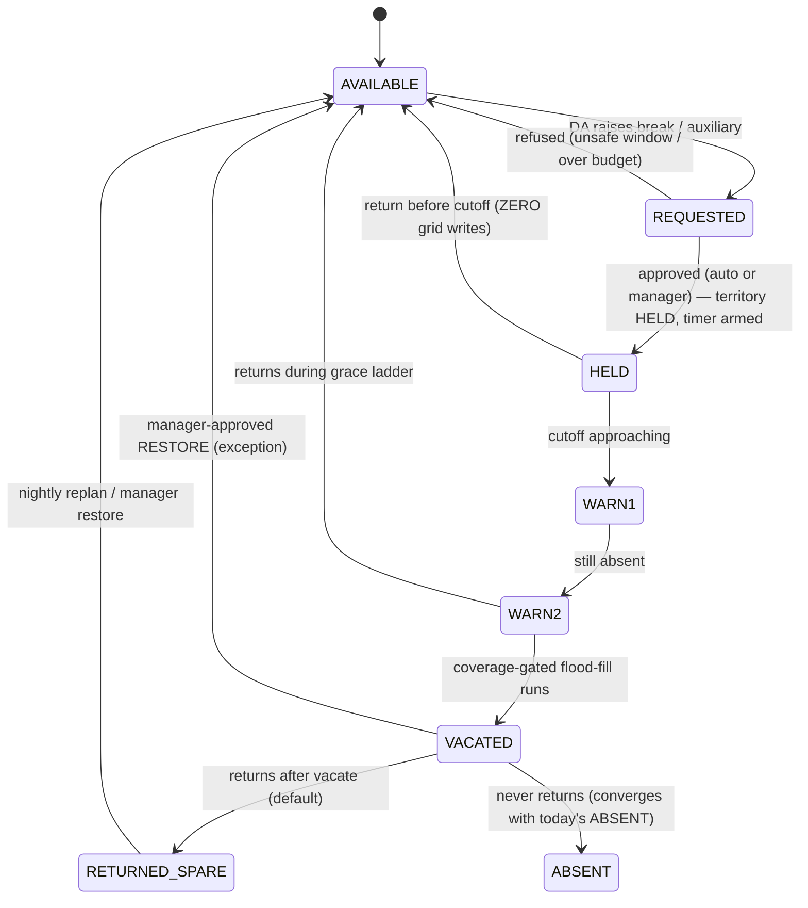

# DA Disposition States & Auxiliary Mode — Design (Recommended Scope)

> **Status:** design doc, no code. Joint build (vii)+(viii) from
> `DISCUSSION-3-FEATURE-SPLIT.md`. This is the **recommended, reframed** scope. The go/no-go analysis of
> the *original* ("DA raises an arbitrary break") framing — and the case for building this slice instead
> of that, or nothing — lives in its companion `DA-DISPOSITION-BUSINESS-CASE.md`. **Read that first if
> the question is still "should we build this at all."**

## 1. Framing — what this actually is

This is **not** "break tracking." Stated as break-tracking it fails its own cost/benefit test (see the
business-case doc). Stated correctly, it is three things the platform genuinely lacks:

1. **Stop wastefully reassigning territory for short absences.** Today a DA who steps away for 20 minutes
   has no good outcome: either the system does nothing and his tasks silently rot until an exception
   fires late, **or** the heartbeat job flips him to `ABSENT` (`AbsentDaDetectionJob`, 15-min default)
   and triggers a **full flood-fill reassignment** (`AbsenceReassignmentPlanner`) plus custody handoffs
   that a human must **manually unwind** when he walks back. Both are bad. We want a "hold, don't
   reassign yet" path.
2. **Make every reassignment coverage-safe.** Reassignment today is reactive and ungated: it will happily
   pile one absent DA's territory onto whoever borders it. Chained across several absences that becomes
   "one DA inherits ten territories, then quits." Reassignment must be gated on whether coverage actually
   survives.
3. **Account for company-pulled DA time honestly.** When the company pulls a DA onto other work
   (auxiliary), that time should not count against his delivery performance. This is a real, legitimate,
   non-self-serving signal — the *company* initiated it.

**Disposition metrics are a byproduct**, derived by reconciling a DA's *claim* against the `da_gps_ping`
trail (§11) — never a trusted self-report. We build the operational machine; the metrics fall out of it.

## 2. Core model — two orthogonal axes + a derived territory disposition

The reason the platform can't express "on a break" today is that it has exactly one status axis,
`DaStatusEnum` (`dispatch/.../domain/DaStatusEnum.java`): `OFFLINE / IDLE / IN_PROGRESS / CRON_LOCKED /
AT_CRON / ABSENT`. That axis is **GPS/operational** — `IN_PROGRESS ↔ IDLE` flips on GPS pings, `ABSENT`
flips on a heartbeat lapse. Cramming "lunch break" into it makes availability fight the GPS transitions.

So we introduce a **second, parallel axis** and leave the operational enum untouched:

| Axis | Owner | Values | Driven by |
|------|-------|--------|-----------|
| **Operational state** (existing) | `DaStatusEnum` | OFFLINE / IDLE / IN_PROGRESS / CRON_LOCKED / AT_CRON / ABSENT | GPS pings, heartbeat |
| **Availability / disposition** (new) | `da_disposition_event` (§5) | AVAILABLE · ON_BREAK · ON_AUXILIARY · RETURNED_SPARE · ABSENT | requests + approvals + timer |
| **Territory disposition** (derived) | grid (`da_hex_assignment`) | HELD · VACATED | a *consequence* of the above, never set by hand |

A DA can be `AVAILABLE + IN_PROGRESS`, or `ON_BREAK` (which freezes the operational machine). Territory
disposition is **derived**: HELD = reserved for the DA, nothing written to the grid; VACATED =
flood-filled to neighbours. Humans set *availability*; the system decides *territory*.

**Why a parallel axis, not an extension of `DaStatusEnum`:** the operational enum is mutated by
GPS-driven code paths (`DaStatusService.updateGps`, `AbsentDaDetectionJob`). A break state added there
would be overwritten by the next ping, or would have to suppress those paths conditionally — spreading
break-awareness across every operational transition. A separate dimension keeps `ABSENT` (heartbeat) and
its immediate-vacate behaviour **exactly as they are today**, and adds break/auxiliary as the *new,
gentler* paths that try HELD before they ever vacate.

## 3. Three grid operations + one control layer

Territory work decomposes into **three grid operations** (things that mutate `da_hex_assignment`) plus a
**control layer** that mutates nothing:

| # | Operation | State today | Notes |
|---|-----------|-------------|-------|
| 1 | **Assign** (nightly plan) | ✅ exists | M3 nightly proposal → APPROVED `da_hex_assignment`. |
| 2 | **Vacate** (flood-fill spread to neighbours) | ✅ exists | `AbsenceReassignmentPlanner` + `AbsenceReassignmentServiceImpl` — balanced region-growing, tasks follow their hex, in-custody → `CUSTODY_COLLECT`, orphan → `DEFERRED`. |
| 3 | **Restore** (hand hexes back to a DA) | ❌ **new** | See below. |
| — | **Hold + timer** (control layer) | ❌ **new** | Writes **nothing** to the grid; defers or avoids vacate entirely. |

**Restore is feasible cheaply because vacate is append-only.** When we vacate a DA today, his APPROVED
`da_hex_assignment` rows are set to `SUPERSEDED`, **not deleted** (`AbsenceReassignmentPlanner.apply` →
`supersedeApproved`). The planner already knows how to *reactivate a superseded slot in place* (the
"bounced away and back" logic, `apply` lines ~250–272). So restore is: reactivate the DA's SUPERSEDED
rows, supersede the receiver's gained rows, and — for tasks — **claw back only `QUEUED` tasks**; anything
already `IN_PROGRESS`/picked-up stays with the receiver who's already committed to it. The hexes are the
easy half; the tasks are the reason restore is the *exception*, not the default (§10).

**Pausing is not a grid operation** — that's the whole point of it. It's a state + timer that sits *in
front of* vacate and, in the happy case, means vacate never runs.

## 4. Lifecycle

The **happy path** — `AVAILABLE → REQUESTED → HELD → AVAILABLE` — touches the grid **zero times** and
performs **zero custody handoffs**. That is the entire value proposition: the wasteful
reassign-then-manually-reverse cycle simply never happens for a short, in-window break.

## 5. `da_disposition_event` — one entity, folding absence

Per the locked decision, absence + break + auxiliary + EV-charge fold into **one append-only entity**,
generalising today's `DaAbsenceEvent` (`dispatch/.../domain/DaAbsenceEvent.java`, `V5_14`). Conceptual
shape (final DDL at build time):

| Field | Purpose |
|-------|---------|
| `id`, `city_id`, `operating_date`, `da_id`(s) | scope (absence keeps its multi-DA list) |
| `type` | `ABSENCE` · `BREAK` · `AUXILIARY` · `EV_CHARGE` |
| `reason`, `requested_duration_min`, `declared_window` | the DA's claim |
| `status` | `REQUESTED → APPROVED → HELD → (RELEASED \| VACATED \| RESTORED \| CANCELLED)` |
| `approved_by`, `auto_approved` | approval provenance |
| `hold_cutoff_at` | deadline-derived cutoff (§6) |
| `warn1_at`, `warn2_at` | grace-ladder audit (§9) |
| `applied_at`, `released_at` | terminal timestamps |

**Absence is a degenerate instance:** `type=ABSENCE`, no HELD phase, immediate vacate — i.e. exactly
today's behaviour. This means the existing absence flow (`AbsenceReassignmentServiceImpl`,
`AbsenceAutoApplyJob`) is refactored *onto* the new entity without any behavioural change, and break /
auxiliary are new `type`s that add the HELD-then-maybe-vacate phase in front.

## 6. Precomputed safe break windows

The CEO's question — "how long a break before we reassign" — is best answered **not in minutes** but as:
*hold until continuing to hold would breach a deadline the territory owns.* And it's better computed
**proactively at shift start** than reactively at request time:

- At shift start, from the DA's planned route + the earliest cron / flight / SLA deadline of the work in
  his hexes, compute the **slack windows** where a break of duration X fits without endangering anything —
  e.g. "up to 30 min between 11:15–12:30, up to 20 min around 14:00." The DA sees these **in the morning**
  and plans his day around them.
- **Meeting-mode matters** (`common/.../MeetingMode`, per-city via `CityMeetingModePort`, routing
  `V6_15`). Our launch cities are **HUB_RETURN**: no mid-route van rendezvous, so the binding deadline is
  *hub-return-before-flight* — generally **more** slack. **VAN_MEETING** cities bind on the cron
  rendezvous, and a missed rendezvous is unrecoverable → **tighter or no** window.
- Windows are **advisory-recomputed** intraday as demand shifts, plus a **hard recheck at request time**
  against live deadlines. A request that would eat into the cutoff is simply **not offered** — this
  structurally prevents the "parcel sitting at a lunch table missing its flight" failure instead of
  catching it late.

Config backstop: a default max-hold (e.g. 30–45 min) when there is no deadline pressure at all, reusing
the `DispatchProperties` pattern (`dispatch.*`).

## 7. Approval + the per-cluster concurrency budget

- **Auxiliary** = self-declared, auto-acknowledged (locked). The manager *sees and reports* it; approval
  is not the gate. It's reconciled against GPS like everything else (§11) and accounted as *productive*
  company time (the 70% engaged band of the DA-utilisation invariant), unlike a personal break (idle).
- **Break** = auto-approved within (quota + a safe window from §6); anything beyond quota, outside a
  window, or during a risky state → **manager approval**. Reuse the auto-approve-timeout pattern from
  `DispatchProperties.Absence.autoApproveTimeoutMinutes` + `AbsenceAutoApplyJob`.
- **Per coverage-cluster concurrency budget — the primary cascade guard.** Only *N* DAs in a set of
  mutually-adjacent territories may be HELD/out at once; the (N+1)th request is **queued or refused**
  ("too many of your neighbours are already out"). This alone kills the domino (business-case §3.1):
  the system cannot reach a state where everyone in a cluster is out and one DA inherits all of it.
- **State guards:** a break request is **disallowed or deferred** while the DA is `CRON_LOCKED` / `AT_CRON`
  (mid van-meeting or hub-return) — he can't vanish from a rendezvous a van is waiting on.

## 8. Coverage-gated vacate

Vacate must be **coverage-gated, exactly like M5's cron-feasibility gate** (a hard constraint elsewhere in
the platform). Before we vacate — and before we approve a break that would *lead* to vacate — we check:
*can the remaining live DAs actually absorb this territory within cron/SLA?*

- **Yes** → proceed with the existing flood-fill.
- **No** → **do not vacate.** Raise an **understaffing alert** to the station manager (reuse the
  `AttendanceAlert` shape from the exceptions module) and let a human decide.

The system must be **structurally incapable of silently handing one DA ten territories.** The relief pool
(§10) is the other half of this: overflow flows to spares, not onto one crushed receiver.

## 9. Two-notification grace ladder before any vacate

No silent vacate, ever. Before territory is taken:

1. **warn-1** — "your window is closing / you're overdue — return in X or your area is reassigned."
2. **warn-2** — final: "reassigning in Y."
3. **vacate.**

Delivered via `common/.../port/NotificationPort` (+ `NotificationEventType`, as `ShipmentEtaServiceImpl`
does for `SHIPMENT_DELAYED`), mirroring the existing attendance-cutoff alert cadence. Beyond fairness,
`warn1_at` / `warn2_at` on the event give an auditable "we told him twice" trail and make the vacate a
consequence of *his non-response*, not a system pounce. **Open risk:** push delivery is best-effort — a
DA whose phone is off never gets warned; we need delivery-receipt handling before treating a vacate as
"warned" (see business-case §3.14).

## 10. Return: spare by default, restore by exception, backed by a real relief pool

Once we've paid the reassignment cost (neighbour travel + custody handoff), paying it *again* to reverse
is usually net-negative. So:

- **Default → `RETURNED_SPARE`:** the DA gets no territory back; neighbours keep the hexes until the
  nightly replan resets everything cleanly. This is also the honest answer to the CEO's "is he just a
  backup?" — **yes, by default.**
- **Restore is the manager-approved exception**, worth it only with lots of shift left and little
  in-flight churn, and even then claws back **QUEUED tasks only** (§3).
- **The minimal relief-pool consumer (v1, locked).** A spare DA is only useful if something *draws* from
  him — otherwise "spare" is a dead label. The spare pool becomes the home for exactly the problems
  vacate already creates: **orphan / `DEFERRED` tasks** (which today dead-end at `DEFERRED` → manual
  escalation) and **receiver overflow**. So the relief pool **also fixes the existing orphan-escalation
  gap**, independent of breaks — which is why it earns its place in v1. Mechanism: a simple "nearest spare
  gets the deferred/orphan task" rule + manager hand-assign from a spare list in the station console.

This closes the loop with §8: coverage-gated vacate refuses to over-load a receiver, and the relief pool
is where the overflow it refuses actually goes.

## 11. Trustworthy metrics via GPS reconciliation

The disposition state is a **claim**, not a measurement. Ground truth is the **`da_gps_ping` breadcrumb
trail** — append-only, one row per 12–15s ping, indexed `(da_id, recorded_at)`, retained **30 days**
(`V5_8`, `DaGpsPingRepository.findByDaIdAndRecordedAtBetweenOrderByRecordedAtAsc`,
`DispatchProperties.Gps.trailRetentionDays`, purged by `DaGpsPingRetentionJob`). So we never trust "he
said 30 minutes"; we read the trail for the declared window and produce a **three-valued verdict**:

- **Confirmed** — movement/idleness matches the claim.
- **Contradicted** — trail shows him active/elsewhere (or idle far longer than declared).
- **Unverifiable gap** — no pings for the window (dead phone, no signal, *or* gaming) — itself a flag if
  habitual.

The trustworthy metric is the **reconciled** one (declared vs GPS-observed), and the *discrepancy* feeds
the DA risk score — the same mechanism the DA-app anti-abuse hardening already uses.

> **Dependency call-out (honest):** `GpsPlausibilityService`, `DaIntegrityService`, and the integrity
> console (`/dispatch/integrity/das`) live in the **unmerged** sibling feature repo `od-da-hardening/`
> (branch `feat/da-app-hardening`, PR'd not merged), not in mainline. So full reconciliation either lands
> **after** that merges, or v1 reads `da_gps_ping` **directly** for a coarse confirmed/contradicted/gap
> verdict in the interim. This is a real sequencing constraint, not a nice-to-have.

## 12. Reuse map (build clones patterns, not greenfields)

| Need | Reuse |
|------|-------|
| Vacate / flood-fill | `grid/.../AbsenceReassignmentPlanner.java` (superseded-rows-survive → restore), `dispatch/.../AbsenceReassignmentServiceImpl.java` (preview→apply, `CUSTODY_COLLECT`, `DEFERRED` orphans) |
| Auto-apply lifecycle | `AbsenceAutoApplyJob`, `DispatchProperties.Absence.autoApproveTimeoutMinutes` |
| Entity to generalise | `DaAbsenceEvent` + `V5_14` → `da_disposition_event` |
| GPS trail | `da_gps_ping` (`V5_8`), `DaGpsPingRepository`, `DaGpsPingRetentionJob` |
| Detection / status | `AbsentDaDetectionJob`, `DaStatusEnum`, `DaStatusService` |
| Cron ordering | `QueueReorderService.reorder` (beyondCron parking), `TaskStatus`, `DispatchQueue` |
| Notifications | `common/.../NotificationPort` + `NotificationEventType` (see `ShipmentEtaServiceImpl`) |
| Shift lifecycle | `ShiftLoadJob` (shift start), `ShiftEndJob` (defers QUEUED, preserves other shift) |
| Alerts | `AttendanceAlert` (exceptions), `AttendanceServiceImpl.onGpsFix`, `AttendanceController`, `V5_16` |
| Custody | `TaskType.CUSTODY_COLLECT`, `dispatch/.../DaTaskServiceImpl.recordCustodyCollect` |
| Meeting mode | `common/.../MeetingMode`, `CityMeetingModePort`, routing `V6_15`, `HubReturnScheduleService` |
| Events | `DaEventType`, `DaEventProducer` → `oneday.da.events` (add disposition event-types) |
| Anti-abuse (unmerged) | `od-da-hardening/`: `GpsPlausibilityService`, `DaIntegrityService`, `DaIntegrityController` |
| Consoles | `oneday-web/apps/station/app/(console)/absence/*`; `oneday-driver-app/src/screens/work/WorkScreen.tsx` |

## 13. Cross-cutting surfaces

- **Backend (`dispatch`, `grid`):** the new axis, `da_disposition_event`, restore grid op, coverage gate,
  window computation, grace-ladder job, relief-pool draw.
- **Web station console (`oneday-web/apps/station`):** extend the existing `absence/` page into a
  **disposition board** — who's out, why, declared return, hold-cutoff, warn-ladder state — plus a
  break-window / quota admin surface and a spare-pool list to hand-assign from.
- **Driver app (`oneday-driver-app`):** a **disposition picker** (break / auxiliary / EV-charge), the
  **morning safe-window display**, and the **"I'm back" tap**, alongside the existing attendance card and
  `CUSTODY_COLLECT` screen in `src/screens/work/WorkScreen.tsx`.

## 14. Phasing

**v1 (this build):** parallel availability axis · `da_disposition_event` (folding absence) · hold+timer ·
precomputed safe windows · self-declared auxiliary · per-cluster concurrency budget · coverage-gated
vacate · two-notification ladder · spare-by-default + **minimal relief-pool** · coarse GPS reconciliation
(direct `da_gps_ping` read).

**Later:** full GPS-reconciled disposition dashboard once `od-da-hardening` merges · EV-charge as a
first-class *scheduled* break (station-anchored, duration-known) rather than a discretionary one ·
restore automation heuristics.

## 15. Non-goals (explicit)

- **No self-reported break-time treated as source of truth.** The only trusted numbers are GPS-reconciled.
- **No labor/payroll time-tracking** — that carries compliance obligations we are deliberately not taking
  on (business-case §3.15).
- **No change to the `ABSENT` heartbeat path or the outcome-based exception model** — those stay; this
  adds a gentler path in front of them.

## 16. Open questions / risks

- **Extension creep** — a DA extending a break in small increments could hold territory indefinitely under
  the cutoff. Needs hysteresis / a hard cumulative cap per shift.
- **Notification-delivery guarantees** — vacating a DA who never received warn-1/warn-2 → dispute. Needs
  delivery receipts before a vacate counts as "warned."
- **Write contention with the existing absence flow** — both absence and disposition-hold mutate
  `da_hex_assignment` / `dispatch_queue`. Folding into one entity + one service is the mitigation; needs a
  clear single-writer discipline and reconstruction/audit story.
- **Hardening dependency** — trustworthy metrics are gated on `od-da-hardening` merging (§11).
